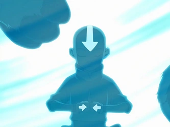

## *תקציר:*
קטארה וסוקה מוצאים את אנג בקרחון מביאים אותו הביתה זוקו רואה במשקפת ומתכנן לתקוף את 
הכפר

## *סיכום במשפט:*
סקי עם פינגווינים

## *ראוי לציון:*
העולם מעוצב יפה, אני אוהב את הקטע שסוקה הגבר האחרון שנשאר בשבט ושהוא מאמן את הילדים ברצינות תהומית

## *פחות התחברתי:*
לא קרה הרבה בפרק אבל מניח שזה בסדר יחסית לפיילוט

## *ה-MVP של הפרק:*
gran gran

## *עתידות:*
אני הולך לשנוא את סוקה