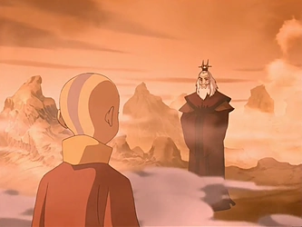

## *תקציר:*
טסים לאומת האש כדי לדבר עם אווטאר רוקו. זוקו עוקב אחרי אנג, וז'או עוקב אחרי זוקו. רוקו מספר שבסוף הקיץ יעבור השביט של סוזין, שאמור לחזק מאוד את כשפי האש ולאפשר לאומת האש לסיים את המלחמה. לכן אנג צריך ללמוד את שאר הכשפויות דחוף בהול. לבסוף גם החבואווטאר וגם זוקו מצליחים לברוח.

## *סיכום במשפט:*
זה אחד המצורים הימיים המרשימים שראיתי

## *ראוי לציון:*
מקדש האש מעוצב מגניב. 

## *שמתי לב:*
האובססיה הלא בריאה של זוקו לתפיסת האווטאר מגיעה לשיא חדש כשהוא מוכן להסתכן בפלישה למקום שנידה אותו. מעבר להשגת המטרה שלו באיזה אמצעי שיהיה - כמו שהיה עד עכשיו - זו כבר פזיזות וחוסר הפעלת שיקול דעת. מעניין אותי לגלות מה הרקע שם ומקווה שנקבל את זה בקרוב.

## *קצת מוזר:*
אנחנו לאט לאט מתחילים לקבל הצצות לסדר הגודל של צבא אומת האש. נראה שיש להם אמצעים מרובים, צבא ענק, צי ימי פסיכי וטכנולוגיה צבאית מפותחת - לפחות ביחס לשאר האומות. בעולם ריאליסטי נראה לי מוזר ששאר האומות נתנו להם ככה לצמוח בפער ושהמלחמה הזו תפסה אותם בהפתעה.

## *פחות התחברתי:*
גנרל ז'או הזה לא נבל מעניין במיוחד, אני חייב לומר.

## *ה-MVP של הפרק:*
זוקו

## *עתידות:* 
ז'או מייצג כרגע את אומת האש אבל כאמור הוא נבל די מעפן, לכן לתחושתי הוא לא הולך להמשיך איתנו לעונות הבאות, או לכל הפחות יציגו לנו בנוסף נבלים חדשים יותר מעניינים.