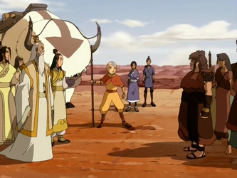

## תקציר:
חוצים את מכתש רמון, אבל יש גם שני שבטים בלתי נסבלים שכל הזמן רבים
## סיכום במשפט:
מזרחים ואשכנזים מסרבים להיות אויבים
## ראוי לציון:
לפני רגע ביקשתי לראות עוד על התפקיד של האווטאר בעולם הזה, והנה אנחנו מקבלים פרק שלם שהנושא שלו הוא תפקידו של האווטאר בתור בורר ומגשר. ביסוס נחמד מצד הסדרה. 
## פחות התחברתי:
לא אהבתי שום דבר אחר בפרק הזה. הפרק הכי חלש בסדרה עד עכשיו. זה לא היה רע, פשוט הרבה מתחת לסטנדרט. אם זה הכי רע שיש לסדרה להציע, המצב ממש טוב.
## ה-MVP של הפרק:
אנג
## דירוג הפרק:
לא משהו
## עתידות:
אף אחת מהדמויות החדשות שהוצגו בפרק לא הולכת לחזור