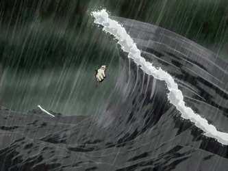

## תקציר:
סופה גדולה מתקרבת, וזה זמן טוב לשבת במקום חמים ולספר סיפורים. ועוד לא סתם סיפורים - סיפורי הרקע של אנג ושל זוקו.

## סיכום במשפט:
"You're a horrible old man. Yip yip!".

## איזה יופי של מבנה:
לפני שנדבר על החומר המרכזי של הפרק (סיפורי הרקע) אני רוצה להתעכב קצת על המסגור של הפרק ועל עלילות המשנה.

אם הפרק הזה היה נטו הפלאשבקים, הוא עדיין היה פרק מצוין, אבל זו לא ממש הייתה חכמה כי הוא פשוט היה נותן לנו מידע שרצינו במשך הרבה זמן. אבל זה לא המצב כאן. הפרק ממסגר את הפלאשבקים בצורה מאוד חכמה בעיני, על ידי התמקדות במטען המרכזי שכל אחת מהדמויות (אנג וזוקו) סוחבת איתה בעקבות מאורעות העבר: במקרה של אנג זו אשמה. עבור זוקו זה כבוד.

הטריגר של אנג לפלאשבק הוא ההיתקלות בדייג, וההאשמות שלו - "איפה היית כשאומת האש תקפה". הטריגר של זוקו הוא העימות מול אחד מסגל הספינה - "אתה נסיך מפונק ואין לך טיפה של כבוד".

עלילות המשנה והמסגור של הפרק מאפשרות לשניהם לקבל עד סוף הפרק הזדמנות לתיקון קטן שמתכתב עם המטען שהם סוחבים - אנג מספיק להגיע בזמן אל סוקה והדייג ולהציל אותם, זוקו בוחר להסתכן כדי להציל אחד מחברי סגל הספינה.

אלו לא תיקונים מאוד גדולים, וזה לא שאנג וזוקו נפטרים מעול המטענים שלהם באותו הרגע. אבל בעיני יש כאן איתות מאוד ברור מה הולכת להיות הקשת העלילתית המרכזית של כל אחד מהם להמשך הסדרה. וזה בעיני מה שהופך את הפרק הזה לאפילו טוב יותר בכמה רמות. העיקר פה הוא לא סיפורי העבר, אלא להבין מה מניע כל אחת מהדמויות ואיך הולך להיראות המסע שלהן.
באמת שיופי של כתיבה.
## הסיפור של אנג:
אז כמו שזה נראה אנג נולד בתור האווטר (או לכל היותר סומן ככזה בגיל מאוד צעיר). האבחון - על ידי הבחירה שלו כילד בצעצועים שהיו חפצים של אווטארים קודמים - מאוד מעניין לדעתי, ומתחבר לי לאספקטים הרוחניים יותר שהסדרה הציגה (האווטאר סוחב איתו את התודעה והזכרונות של כל האווטרים הקודמים). האנקדוטה הקטנה הזו העלתה לי אסוציאציות של כמה סיפורים מיתיים אחרים. אני לא חושב שיש פה הרמז ספציפי ומכוון של הסדרה, אבל זו עדות לזה שהסדרה עושה עבודה לא רעה בלהציג את העבר של אנג כסיפור מיתולוגי.

אנג הילד מצטיין בכשפות ביחס לשאר הילדים ואי אפשר לפספס את זה. אבל הוא משתלב ביניהם יפה. עד שמנהיגי אומת האוויר מחליטים להפיץ בטרם עת את עובדת היותו של אנג האווטר. כנראה כי הם מרגישים את המלחמה מתקרבת ואת הצורך בו.

מהרגע הזה מתחילה להיערם מעין "עוגת חתונה" של תובנות, בחומרה עולה, שגורמות לאנג אובדן עשתונות: 
1. אתה לא יכול יותר להשתלב בחברה כאחד האדם (אתה טוב מדי בשביל לשחק איתנו אז פשוט אל תשחק איתנו)
2. אתה חשוב מדי לעולם מכדי שתתעסק בדברים שהם לא אלטרואיזם (מה אתה מבזבז את הזמן במשחקים במקום ללמוד כשפויות)
3. יש לך אחריות כבדה לדאוג לשלום האנושות כולה (עיקר קיומך הוא להציל את כולנו יום אחד מגורל נורא)

אנג לא מסוגל לקבל על עצמו את האחריות הכבדה, בורח אל תוך סופה ונלכד בתוך הקרחון. היצירה של הקרחון מוצגת כמשהו שלאנג לא הייתה שליטה עליו אבל כמובן שהסאבטקסט הוא שזו טמינה של הראש בחול, באופן מכוון על ידי התת מודע.
## פירוש חלומות
כל זה מתחבר אל הסצנה שפותחת את הפרק - ליטרלי החלום של אנג, כל מה שהוא רק רוצה:

אנג חולם שהוא עף ביחד עם סוקה וקטרה - הוא רוכב על אפה, סוקה בדאון, קטרה על גרסה ענקית של מומו, משה בחצוצרה והמה הרחוב.
* הם ביחד ("אנחנו צריכים אותך" - "גם אני אתכם") - אנטיתזה לקומה 1 בעוגת החתונה.
* הם עושים כיף ונהנים - אנטיתזה לקומה 2.
* וכמובן שהתעופה היא סימבול לחופש, חירות וקלילות - אנטיתזה לאחריות הגדולה שהיא קומה 3 בעוגת החתונה.
מהר מאוד החלום משתנה, כל השכבות האלו מתרסקות ואנג מתעורר למציאות הכואבת.
## הסיפור של זוקו:
זוקו הילד הוא נסיך האש, הבן של הפיירלורד. נראה שאיירו מנסה לחסוך מזוקו הילד את נטל המלחמה, או לפחות לדחות את הרגע. אבל זוקו נלהב ורוצה להשתתף בקבינט המצומצם. אז איירו מרשה לו בתנאי שיהיה בשקט ולא ידבר.

אבל מה, זוקו הילד הוא אידאליסט. הוא לא יכול לעבור בשתיקה על התכנית הצבאית של אחד הגנרלים - להקריב בכוונה כיתת טירונים בתור פעולת הסחה. הוא מתרעם על זה, אבל מתברר שאומת האש היא פטריארכיה מטורללת עם אובססיה לכבוד, ולכן זוקו הילד צריך להתעמת בדו קרב עם מי שהוא חילל את כבודו. רק שמתברר שבגלל שזה קרה בנוכחות הפיירלורד מי שהוא צריך להתעמת מולו זה אבא שלו (??) למרות שהביקורת הייתה מופנית לגנרל בכלל.

אז זוקו מסרב להילחם באבא שלו, ומנגד אבא שלו מצטט את חברים בחווה - "שברת תכלים אז שרפתי לך תפרצוף". ואז מגיע הציטוט היותר חשוב - "אתה תלמד מה זה כבוד, והכאב יהיה המורה שלך". משפט די חזק האמת, וזו בבירור קללה שהולכת לרדוף את זוקו לכל המשך הסדרה. חרא אבא.

אבא של זוקו מגלה אותו מאומת האש ושולל ממנו את הכבוד, אבל שולח אותו למשימה בלתי אפשרית: "אתה מוזמן לחזור לפה רק אם תביא לי את האווטאר". דבר שזוקו בהחלט מנסה לעשות ומכאן מגיעה האובססיה. מסכנון.

## פרספקטיבה:
אחד האספקטים בפרק שפחות קופצים מהר לעין זה עניין הפרספקטיבה - את הסיפור של אנג הוא מספר לקטרה בעצמו, מבחירתו ומהפרספקטיבה שלו, ברגע די אינטימי של שניהם.
את הסיפור של זוקו מספר בכלל איירו, מהפרספקטיבה הצדדית שלו, בלי שזוקו יבחר בזה, בתור ניסיון לייצר אמפתיה לזוקו בקרב סגל הספינה. זוקו בכלל לא נמצא בסיטואציה ואין פה אינטימיות. זה לא מקרי בכלל, להיעדרו של זוקו מהסצנה ולנוכחות של איירו יש משמעות מאוד גדולה (שעכשיו הבנתי) וארחיב עליה בהמשך.
## פחות התחברתי:
משהו קטנטן. בחלק של הפלאשבקים העריכה הייתה לי קצת קופצנית מדי. הקפיצות בין הסיפורים של אנג וזוקו היו קצת תדירות מדי.
## ה-MVP של הפרק:
גיאטסו
## בלבולי שכל של שיעור ספרות:
קודם כל כמובן שהסופה היא סימבול המייצג את האתגרים והקשיים שצופן העתיד ובלה בלה בלה זה לא מאוד מעניין.

בנוסף, אני חושב שבכל מיני מובנים הדמויות של אנג ושל זוקו מונגדות אחת אל השנייה - מעבר לטיעונים הברורים (אנג הגיבור הראשי וזוקו כביכול הנבל הראשי, הסדרה בחרה לספר את הבקסטורי של שניהם באותו פרק) המטענים הרגשיים שמניעים אותם די מנוגדים: בכל מיני מובנים אני יכול לראות איך אשמה היא ההפך של רדיפת כבוד - מעבר לזה שאשמה היא רגש אלטרואיסטי ורדיפת כבוד היא אגואיסטית, אשמה היא תחושה שלאנג כבר יש אצלו והוא רוצה להיפטר ממנה, ואילו יראת כבוד זה משהו שלזוקו אין אצל אנשים אחרים והוא רוצה להרוויח.

בעוד שהמסע העלילתי של אנג - להתבגר, להתפתח, לקבל על עצמו את האחריות וללמוד להתמודד עם האשמה - הוא חיובי וחינוכי, המסלול של זוקו - להשיב את הכבוד האבוד בכל אמצעי ולרצות את האבא הרעיל שלו - הוא ממש לא חיובי או חינוכי. זה, ביחד עם המעורבות של איירו בחיים של זוקו, גורם לי להבין שהארק האמיתי של זוקו הוא אחר לגמרי. מה שמביא אותי ל...

## עתידות:
אז ככה. איירו הוא איש מבוגר, זקן מצחיקי וקליל כזה, שנרמז לנו שסוחב איתו עבר קשה מאומת האש. זוקו נכווה גם הוא מאומת האש (מילולית), ומחפש להשיב את הכבוד ולרצות את אבא שלו, על ידי השתתפות באלימות האינהרנטית של אומת האש. חשדתי בזה כבר כמה זמן אבל עכשיו אני בטוח שהסדרה מסלילה את זוקו למעין redemption arc, שבו הוא יצטרך ללמוד שהוא לא צריך לחפש את יראת הכבוד מאחרים אלא בראש ובראשונה לכבד את עצמו. ואיירו כמובן בתפקיד איש החינוך שיעשה לו מנטורינג - אנרגיות חיוביות ולשחרר וכל זה. מתוך ההזדהות שלו והכאב שהוא גם חווה מאומת האש. כזה don't repeat my mistakes. מה שמביא אותי לשורה התחתונה, הסיכום של כל הפרק הזה:
## השורה התחתונה:
איירו הוא הצ'יינג' מייקר!!!!!
## דירוג הפרק:
אדיר