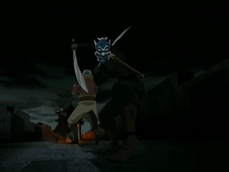

## *תקציר:*
סוקה וקטרה חולים, ואנג הולך לחפש להם תרופה. בדרך הוא נתפס על ידי גנרל ז'או (שעכשיו קודם לאדמירל) ויחידת הקשתים המובחרת שלו. לכאורה אין אף אחד שיכול לחלץ אותו, אבל למזלו דמות מסתורית עם מסיכה כחולה נחלצת לעזרתו.

## *סיכום במשפט:*  
"Wait! My friends need to suck on these frogs!"

## *ראוי לציון:*  
- אני אוהב את פתיחת הפרק, הצגת יחידת הקשתים של אומת האש מבוצעת ממש טוב. זה גם כיף לראות את האינטריגות בין בכירי אומת האש. מוסיף לבניית העולם.
- בעבר כתבתי שז'או נבל דרדלה, ובפרק הזה קור הרוח שלו והרוע קצת שיפרו את זה
- אמנם החשיפה שזוקו הוא הרוח הכחולה לא הפתיעה אותי, אבל זה דווקא טוויסט שבנוי די טוב. בעיקר בגלל שהרוח הכחולה מוצגת עוד ממש בתחילת הפרק, לפני שאנחנו אפילו רואים את זוקו.
- היו פה סצנות אקשן ממש טובות, למעשה הכי טובות שהיו בסדרה עד עכשיו. יש פה כמה קטעים די מקוריים ומגניבים, והדבר הכי מורגש בהן זה האלתור של אנג וזוקו והשימוש בסביבה שלהם. זה גורם לאקשן להרגיש מאוד קליל ואורגני.
- עד עכשיו לא התייחסתי למוזיקה בסדרה. אני מאוד אוהב את ה-cue המוזיקלי של אומת אש, ובפרק הזה היה גם פסקול טוב בצורה יוצאת דופן משאר הפרקים.

## *פחות התחברתי:*  
לא הצלחתי לחשוב על משהו כזה

## *הצחיק אותי ממש:*  
החלק שקטרה מבקשת ממומו שיביא להם מים, ואז אנחנו עוברים ל-POV שלו והיא מדברת ג'יבריש. זה גאג מטומטם ממש אבל הוא תפס אותי כל כך לא מוכן. 

## *שמתי לב:*  
זו פעם ראשונה שהסדרה מדגימה באמת כמה שזוקו לוחם קרייזי שיט

## *בקשה מהסדרה:*  
תלמדו אותי את החוקים של שש-בש לוטוס

## *ניתוח:*
- עיקר הפרק הוא כמובן היחסים בין אנג וזוקו. זה כבר פרק שני ברצף שהסדרה מקשרת ביניהם בצורה כזו או אחרת. אין פה צירופי מקרים - אני בטוח שהצגת סיפורי הרקע שלהם גב אל גב בפרק הקודם, ושיתוף הפעולה שלהם בבריחה בפרק הזה, אמורות להצביע על איזו שותפות גורל שהשניים האלה חולקים. אנחנו עדיין לא יודעים איזה מין גורל ואיזו סוג של שותפות.
- ממש בסצנה לפני האחרונה יש רגע קטנטן ואדיר, שזוקו מביט לשנייה בדגל אומת האש שתלוי לו בחדר בספינה, ומסיט ממנו מבט בעייפות. ואז המצלמה מתמקדת על הדגל. גם זה לא מקרי, ואני מפרש את המחווה הזאת כמעין אמירה של הסדרה - "לבחור הזה יש יחסים מורכבים עם אומת האש ועוד לא גירדנו את קצה הקרחון"

## *ה-MVP של הפרק:*  
הרוקחת

## *עתידות:*  
במיוחד על רקע הדגשת שותפות הגורל של אנג וזוקו, אי אפשר להתעלם מאמירות כמו "יכולנו להיות חברים טובים". לדעתי זה כמובן רמז מטרים והם יסיימו את הסדרה כ"חברים"

## *דירוג הפרק:*  
מגה זורד