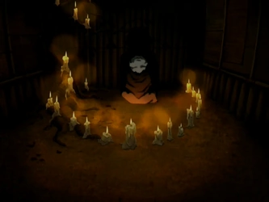

## *תקציר:*
מגיעים לכפר של אומת האש ומסתננים לפסטיבל. מהר מאוד נתפסים אבל מצליחים לברוח באמצעות איש מסתורי שעקב אחרי טים אווטאר. האיש הזה מתגלה כעריק שברח מאומת האש, והוא מוביל את אנג וחברים אל ג'ונג ג'ונג - מאסטר כשפות אש שהוכרז בתור העריק הראשון אי פעם מאומת האש.

אנג מבקש מג'ונג ג'ונג ללמד אותו כשפות אש, אך הוא מהסס ומסרב בתחילה, מתוך פחד מכוחה ההרסני של האש, וכי לדעתו אנג לא בשל לכך עדיין. עם זאת, לאחר התערבות של הרוח של אווטאר רוקו, ג'ונג ג'ונג מסכים להתחיל ללמד את אנג. המטלות של מאסטר האש מתמקדות בשליטה עצמית ובסבלנות, אבל לאנג אין סבלנות. לבסוף אנג מצליח לזמן להבות, אך בטעות גורם לקטרה להיכוות, דבר שמזעזע אותו וגורם לו להישבע שלא יבצע יותר כשפות אש.

אדמירל ז'או מגיע לתקוף. אנג מבין את החשיבות של הדברים שג'ונג ג'ונג ניסה ללמד אותו כשהוא שם לב שלז'או אין איפוק או שליטה עצמית. אנג מביס אותו ללא כל תקיפה, בכך שהוא גורם לו לשרוף לעצמו את הספינות

## *סיכום במשפט:*  
הכוח הפנימי

## *ראוי לציון:*  
- אני מאוד מחבב את כל הקטע של "האש מכלה". נראה כאילו ג'ונגי קצת מגזים עם כמה אש היא נוראית (מסיבותיו שלו), אבל זה אספקט נהדר של כשפות האש שנותן עומק. מעבר לצורך שהוצג בפרק לפתח סבלנות ושליטה עצמית, אני רואה איך זה בקלות מתרחב לכך שכשפי אש צריכים ללמוד להתגבר על יצר הזעם והנקמנות שטבוע בהם. בעיקר כי זה משהו שעשוי לבוא לידי ביטוי בהמשך הארק של זוקו.
- עוד על ג'ונג ג'ונג - אני חושב שהוא דמות די מעניינת. בהתחלה נראה שהוא נע איפשהו בין פחד לאשמה, אבל כשהוא אומר לקטרה שהלוואי שהוא היה נולד כשף מים ולא כשף אש - פה כבר יש אלמנטים של רחמים עצמיים שלא ציפיתי להם. 
- אני מאוד אוהב את איך שהסדרה בונה את הדמות של אנג. בקלות הסדרה יכלה לעשות אותו מושלם וקדוש, אבל מראים לנו שוב ושוב שיש לו גם מגרעות ומזכירים לנו שהמסע האמיתי שלו בדרכו להיות האווטאר הוא לא ללמוד את הכשפויות (דבר שבינתיים בא לו מאוד בקלות) אלא להתבגר.
- יכולות הריפוי של קטרה - מעניין מאוד. יכול להתפתח לכל מיני כיוונים טובים.

## *פחות התחברתי:*  
- הפתיחה של הפרק עם פסטיבל האש היא בניית רקע די נחמדה של אומת האש אבל זו דרך מטומטמת ממש מצידם להיתפס. ובכללי כל ההתנהלות שלהם שם ממש דבילית.
- איפה זוקו?
## *ה-MVP  של הפרק:*  
אנג

## *עתידות:*  
לפעמים קצת קל לשכוח שגם קטרה כשפית ושגם היא בעקומת למידה. ג'ונג ג'ונג ציין שיכולות הריפוי שלה הן "נדירות". בינתיים חוץ מהתגלית הזו, לא כל כך ראינו שהיא משתפרת. לדעתי בשלב מסוים היא תהפוך להיות overpowered וחזקה ממש, ומעניין אם זה יקרה כבר בעונה הזו (ספר המים אחרי הכל) כשנגיע (אני מקווה) לקוטב הצפוני, או שזה ייקח יותר זמן.

## *דירוג הפרק:*  
מעולה