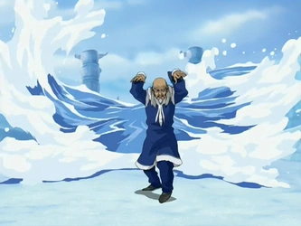

## *תקציר:*
- בשעה טובה ומוצלחת הגענו לקוטב הצפוני, והוא מרהיב. טים אווטאר זוכים ליחס של אורחי כבוד ונערכת להם קבלת פנים חגיגית. אנחנו פוגשים את מאסטר פאקו, שאחראי ללמד כשפות את בני שבט המים. והמילה בני קריטית, כי הבנות מוסללות ללמידה של כשפות ריפוי בלבד. קטארה זועמת כי פאקו לא מוכן ללמד אותה, ובסופו של דבר מאתגרת אותו לדו-קרב; קרב שבו היא מן הסתם לא מנצחת אבל מצליחה להרשים את פאקו מאוד. יש גם כל מיני דרמות שקשורות לעבר של gran gran (קאמבק מבורך) אבל זה לא מאוד מעניין. כל זה גורם לפאקו לשנות את דעתו וללמד את קטארה.
- ברקע יש גם את תחילת הרומן הקטן של סוקה ויואה, נסיכת שבט המים הצפוני. זה ממש חמוד.
- באותו הזמן, אדמירל ז'או מבין שטים אווטאר הגיעו לקוטב הצפוני ללמוד כשפות מים, ומחליט להוביל פלישה של אומת האש אל שבט המים הצפוני כדי לתפוס את אנג. בשביל זה הוא מנסה לגייס את דוד איירו, ובאותה הזדמנות מצליח להבין שזוקו הוא הרוח הכחולה. הכעס שלו מוביל אותו להזמין התנקשות בזוקו (😡) מהפיראטים (🤬🤬🤬). כן, הם חזרו לצערי. בסוף הפרק מגלים שאיירו חזה את זה, הספיק להציל את זוקו, וכעת הוא מסכים לשתף פעולה עם ז'או, אבל רק לכאורה.

## *סיכום במשפט:*  
blink and you'll miss it

## *ראוי לציון:*  
- העיצוב של שבט המים מרהיב.
- ז'או קצת תופס אופי. העימות שלו עם זוקו היה קול. מי יודע אולי אנחנו לא באמת ניפטר ממנו כל כך מהר.
- ערב ההווי של סגל הספינה של זוקו.
- בונים פה יפה את התרבות של שבט המים.
- סצנת הקרב של קטארה ופאקו ממש טובה ונראה שהושקעה הרבה מחשבה בנראות של כשפות המים.
## *פחות התחברתי:*  
- שובם של הפיראטים. איכס.
- הפרק עמוס בטירוף בהתרחשויות וזו הפעם הראשונה שבה אורך הפרק הקצר מורגש כמגבלה. ה-pacing של הפרק הזה מטורלל והעריכה ברוטאלית. כל העלילות של הפרק היו עובדות הרבה יותר טוב אם היה להן יותר זמן לנשום, וההתפתחויות היו מרגישות טבעיות ומוצדקות יותר.
- קו העלילה עם פאקו הוא החוליה החלשה בפרק הזה, בעיקר כי כמעט כל נקודה בה קורית מהר מדי, מוקדם מדי ובלי מספיק הצדקה. קטארה פתאום מכירה מלא moves שהיא לא הכירה לפני (אבל אני מסספנד את זה בקלות כי זעם אז מילא), אין שום הסבר למה פאקו לא מוכן ללמד נשים, והוא משנה את דעתו מהר מדי ובקלות מדי. אפשר גם לטעון שהגילוי על gran gran אפילו אמור להביא לתוצאה ההפוכה. מה גם, שפחות או יותר עסקנו בנושא הזה כבר בפרק 4 עם לוחמות הקיושי, ושם הביצוע היה הרבה הרבה יותר טוב. לסיכום, קו העלילה הזה סובל מאוד מזירוז ומזמן מסך קצר מדי.

## *ה-MVP  של הפרק:*  
קטארה. Duh.

## *עתידות:*  
- כיף ממש לראות את קטרה נהיית כשפית מים חזקה, ובהמשך לתחזית הקודמת שלי לדעתי הכיוון היה נכון. לאור הקפיצה המטורפת שראינו בפרק הזה, לדעתי עד סוף העונה היא הולכת להיות overpowered.
- כשזה נוגע לתרבות יפן ולשפה היפנית אני אחד הבורים. אבל אחד הדברים היחידים שאני כן יודע זה שהמילה היפנית "יואה" משמעותה "ירח" (ראיתי סאקורה לוכדת הקלפים, ושם היה עם זה קטע שלם). זה ביחד עם הסצנה של יואה וסוקה בסוף הפרק על הגשר, כשברקע הירח מפריד ביניהם (מאוד מאוד דומיננטי), גורם לי לחשוב שגם בסדרה הזו מנסים לסמל לי משהו שקשור לזה.

## *דירוג הפרק:*  
אחלה