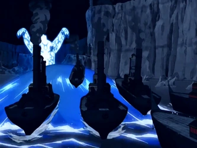

## תקציר: 
- סוקה, קטארה ויואה יוצאים לחפש את אנג, ואומת האש ממשיכה בפלישה לקוטב.
- בינתיים, זוקו מתקשה לסחוב את גופו חסר התודעה של אנג בקור המקפיא ובסופות של שממת הקרח, אך לבסוף מוצא מערה לנוח בה. הוא קושר שם את הגוף של אנג ומתחיל לדבר אליו, למרות שאינו שומע. זוקו משווה את אנג לאחותו (????) ואומר שהכל בא לה בקלות. 
- בזמן שזוקו סוחב את אנג בשממות הקוטב, הרוח של אנג בעולם הרוחות מוצאת את אווטאר רוקו. הוא מבקש מרוקו שיכווין אותו למצוא את רוחות הירח והאוקיינוס, ורוקו מנחה אותו לדבר עם הרוח קוה, אך מזהיר אותו לא להפגין רגשות בפניו, אחרת קוה יגנוב את פניו. המפגש של אנג וקוה הוא קטע מטורף, ובסופו אנג מבין שהרוחות של הירח והאוקיינוס הן הדגים שבגינת הירק בקוטב (הרוחות בדגים). לבסוף אנג חוזר לעולם הגשמי. 
- בינתיים חיילי האש מצליחים לפלוש אל שבט המים, אך איירו מזכיר לז'או שכל עוד הירח בשמיים, כשפי המים מתחזקים ונלחמים ביתרון. ז'או חושף שיש לו תכנית להיפטר מבעיית הירח. מתברר שלפני שנים רבות, הוא גילה בטריטוריה של אומת האדמה ספרייה סודית ובה ספר אשר חושף את סודות רוחות האוקיינוס והירח. הוא מתכנן למצוא אותן ולהרוג אותן, ובכך לנטרל את הירח ולהחליש את כשפי המים. איירו מזהיר אותו שמסוכן להתעסק עם רוחות הטבע, ושהוא עשוי להפר איזונים עדינים.
- בחזרה אל המערה, אנג שחוזר לגופו מצליח להתגבר על זוקו בדיוק כשטים אווטאר מגיעים עם אפה. קטארה מכסחת את זוקו והוא מתעלף. אנג מתעקש לקחת את זוקו איתם ולמעשה להציל אותו מסופות השלגים.
- ז'או מגיע לגינת הירק ומוציא מהבריכה את הדג הלבן (רוח הירח). באותו רגע הירח הופך לאדום וכשפי המים מאבדים את כוחם.
- יואה נהיית חיוורת, ומסבירה שחייה קשורים עם הירח מאז שנולדה ומכך נגזר גם שמה. טים אווטאר מגיעים לגן הירק ומפצירים בז'או לא להרוג את דג הירח. אנג אומר שרוח הירח חשובה לכולם ולא רק לכשפי המים. לפתע איירו מופיע, ומצדד באנג. הוא מאיים: "מה שאתה תעולל לרוח הזו, אני אשחרר עליך פי 10". איירו מורה לז'או לשחרר את הדג, ומתכונן לקרב. ז'או הורג את הדג, והירח נעלם מהשמיים. איירו תוקף את ז'או ושומריו ומצליח לגבור על כל השומרים, אך ז'או מצליח לברוח.
- אנג נכנס למצב האווטאר ומתחיל לזרוח. הוא ממזג לתוכו את הדג השני (רוח האוקיינוס) ותופס צורה של דג ענקי. אנג דג יוצאים להילחם בצבא האש, ואזרחי שבט המים כורעים ברך בפניו במעין יראה משולבת בפחד. דג אנג מעיף את כל חיילי האש מרחבי העיר ומנקה אותה מפולשים. לאחר מכן הוא נכנס לים ומשמיד את ספינות צבא האש.
- בינתיים בגינת הירק יואה מחליטה להקריב את עצמה כדי להציל את הירח, כי יש בתוכה חלק מרוח הירח. זה באמת רגע עצוב. רחמים על סוקה. הירח חוזר ואיתו הכוחות של כשפי המים.
- ז'או שברח נתקל לפתע בזוקו, שמתעמת איתו. ז'או חושף שהוא ידע שזוקו הוא הרוח הכחולה, ומקנטר אותו. הם נלחמים, ולפתע דג אנג מופיע ומרים את ז'או באוויר. זוקו ברגע מפתיע של חסד מושיט אליו יד ומנסה להציל אותו, אך ז'או מסרב. הוא מעדיף למות ולא לקבל עזרה מזוקו. ואכן ז'או מת בטביעה.
- הקרבות מסתיימים ושבט המים מתחילים לחזור לשגרה. מאסטר פאקו מצהיר שהוא ייסע לקוטב הדרומי כדי לסייע לשבט הדרומי ולחזק אותם. הוא קורא לקטארה "מאסטר קטארה".
- זוקו ואיירו הצליחו לברוח. הם על ספינה קטנה, ואיירו אומר לזוקו שהוא מופתע שהוא לא מרוכז כרגע בלתפוס את האווטאר. זוקו עונה שהוא עייף וצריך לנוח.
- העונה מסתיימת כשבאומת האש, השמועה על הבגידה של איירו והכישלון של זוקו לתפוס את האווטאר מגיעה אל אוזני הפיירלורד. הוא מטיל על מישהי משימה מיוחדת. זאת אחותו של זוקו. היא מחייכת חיוך מלחיץ.

## *סיכום במשפט:*  
טירופובוס

## *מידע חדש שגילינו:*
- לזוקו יש אחות! ועוד מתברר שהיא האחות המוצלחת יותר. אבא שלהם היה אומר - "היא נולדה עם מזל, לזוקו היה מזל שהוא נולד". זה די מבעית, כי אפשר רק לשער כמה תחושת הנחיתות שאחותו ואבא של זוקו נתנו לו, השפיעה על מי שהוא גדל להיות. כבר ראינו כמה זוקו לוחם וכשף אש מוצלח, וכמה הוא מונע מכעס וטינה. אם אחותו "מוצלחת" יותר בעיני אביהם, אפשר רק לשער איזו דמות קיצונית היא.

## *הצחיק אותי ממש:*
האן מופיע משום מקום על הספינה של ז'או, רץ לתקוף אותו אבל נופל לים. איירו וז'או מתעלמים. לא רואים אותו יותר בהמשך הפרק. ככל הידוע לנו הוא מת.

## *ראוי לציון:*    
 - כיף מאוד שהקונספט של עולם הרוחות חזר. אני כל הזמן מדבר על זה שאני מסוקרן מהפן הרוחני של הסדרה, והביצוע הפעם היה מצוין.
 - כמו כן העיצוב של קוה מטורף, וכל הסצנה איתו מרגישה כמו משהו שהגיע מסדרה אחרת לגמרי. אגדיל ואומר שלפחות לי (אולי זה יהיה שנוי במחלוקת) הוא נתן וייב של דמות של מיאזאקי. מאוד שונה משאר הסדרה.
 - אני ממש אוהב את התאורה האדומה כשז'או מוציא את הדג מהבריכה. אפקט ממש מגניב
 - ובכללי ז'או הורג את הירח זה רגע מטורף. עשוי ממש טוב. ז'או מתחיל את הסדרה בתור נבל נחנח, לאט לאט צומח ומסיים אותה בתור משוגע עם תעודות שפועל מתוך זעם, אימפולסיביות ושיגעון גדלות. סך הכל במותו הוא צמח להיות נבל לא רע. ועדיין הוייב הוא שאלו לא בדיוק השיאים שהסדרה עוד תגיע אליהם.
 - כמו בפרק הקודם אני ממש אוהב את חילופי הדברים בין קטארה וזוקו. האמת שבמקום מסוים הבנתי עכשיו שאני די תומך בשיפ של שניהם. אבל בבירור הסדרה עדיין חותרת לכיוון של אנג וקטארה.
 - פאקו מסיים את העונה סך הכל בסדר. כשראינו אותו לראשונה הוא היה בלתי אבל איכשהו אני עכשיו קצת סולח לו.
 - עוד נקודה קטנה על איירו. זה לא מחדש הרבה, אבל אנחנו מקבלים עוד ראיה לכך שהמלחמה של אומת האש והאינטרסים שלה לא מעניינים אותו בשיט. כשהוא מסביר לז'או שרוח הירח חשובה לכולם, אנחנו מבינים שמה שמעניין אותו זו התמונה הגדולה - כאילו כל החלוקה הזו לאומות וליסודות של כשפויות היא חארטה אחת גדולה מבחינתו, והוא מסתכל על העולם כעל משהו שיותר גדול מזה. אני ממש ממש אוהב. כמו כן יש חלק בפרק אחרי שהירח מת, שהוא פשוט עומד ביחד עם טים אווטאר ואין שום אווירה של אויבות ביניהם. כמובן שתפיסת האווטאר לא מעניינת אותו בשיט, מה שמעניין אותו זה לתמוך בזוקו ולהיות המנטור שלו.

## *ה-MVP  של הפרק:*  
יש פה הרבה מועמדים. כל הדמויות ראויות לתואר הזה הפעם, אבל מבחינתי זה יהיה קוה.

## *עתידות:*  
אחות של זוקו (לא ברור עדיין מה שמה) הולכת להיות הנבלית הגדולה של עונה 2.

## *דירוג הפרק:*  
מגה זורד