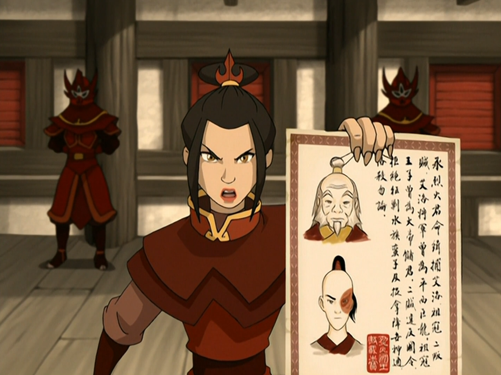

## *תקציר:*
- לאחר אירועי עונה 1, טים אווטאר בדרכם חזרה לאומאשו (YAY) כדי שקינג בומי ילמד את אנג כשפות אדמה. הם מגיעים למוצב של אומת האדמה, שם נמצא גנרל פונג, דמות חדשה. פונג שמע על הקרב בקוטב הצפוני, ועל איך שאנג הביס את כל צבא האש בעודו במצב האווטאר. הוא טוען שבמצב זה אנג יכול כבר עכשיו להביס את אומת האש ולסיים את המלחמה, מה שמעלה את הדילמה האם אנג צריך לנסות ללמוד את שאר הכשפויות "לפי הספר" או להתאמן בשליטה על מצב האווטאר. פונג מתעקש שהאופציה השנייה חייבת לקרות, תחת הטיעון המוצלח שבכל יום שעובר המלחמה גובה עוד ועוד קורבנות. לאחר ניסיונות רבים ומטופשים של פונג להפעיל את מצב האווטאר אצל אנג, הוא מצליח לעשות את זה על ידי איום על חייה של קטארה. אנג מאבד שליטה תחת מצב האווטאר והאירוע מסתיים במזל ללא נפגעים. טים אווטאר מחליטים להמשיך זריז לאומאשו.

- במקביל, איירו וזוקו זוכים לביקור מפתיע מאחותו. מתברר שקוראים לה אזולה. היא מטורפת בדיוק כמו שציפינו. אזולה מודיעה לזוקו שאביהם רוצה לקבל אותו חזרה הביתה בידיים פתוחות. תחילה זוקו מאמין לזה ואיירו לא, אך לבסוף מתברר שכוונתה האמיתית של אזולה הייתה ללכוד אותם ולאסור אותם. זוקו ואיירו מצליחים לברוח, והופכים לעריקים נמלטים.

## *סיכום במשפט:*  
אזולה מטורפת.

## *ראוי לציון:*  
- הפרק עושה עבודה טובה בלתקצר את אירועי העונה הקודמת, ולהשלים את הפערים בין העונות
- לומדים מידע חדש ומעניין על מצב האווטאר, ועל כך שמוות במצב האווטאר קוטע את ה-Avatar Cycle.
- כמו כן הצגת הדמות של אזולה נעשית ממש טוב - הן הדינמיקה שלה מול זוקו ובמיוחד ההתנהלות שלה אל מול חייליה. במיוחד השיחה על הגלים החזקים.
- סיום הפרק, בו איירו וזוקו חותכים את שיערם, היה רגע מאוד חזק בעיני. זה סימבול מאוד ברור - הם מתכחשים לקשר שלהם אל אומת האש, ומקבלים על עצמם סטטוס חדש - מעתה הם עריקים נמלטים.
- הדילמה על ההתמקדות בלמידת שאר היסודות או בשליטה במצב האווטאר נותנת פרספקטיבה חדשה ומעניינת. עד פרקי הסיום של עונה 1, המלחמה הייתה מעין דבר שקורה ברקע. מעתה היא הולכת להיות נוכחת מאוד לאורך כל המשך הסדרה

## *פחות התחברתי:*
- העלילה עם פונג שמנסה לאלץ את מצב האווטאר מתוך אנג די חלשה לטעמי. די צפוי, לא מאוד מעניין, ובעיקר טיפשי מצידו לא לחשוב קדימה מה הוא יעשה במידה ויצליח.

## *ה-MVP של הפרק:*  
אזולה

## *עתידות:*
פונג לא יחזור יותר לעולם.

## *דירוג הפרק:*  
אחלה