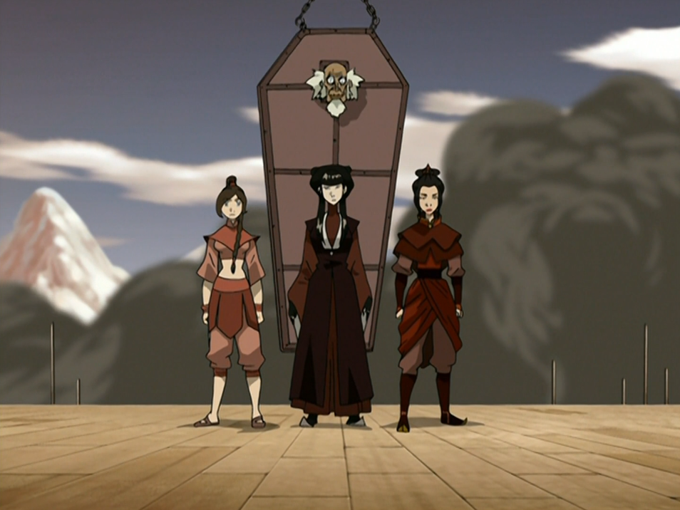

## *תקציר:*
- טים אווטאר מגיעים אל אומאשו הכבושה ומהר מאוד מוצאים את הנהגת המחתרת של העיר. ביחד מחליטים שהסיכוי לכבוש את העיר בחזרה הוא אפסי, ועדיף להשקיע את המאמצים בלהבריח את כל התושבים מהעיר. עושים את זה באמצעות הערמה על חיילי האש על ידי זיוף של מגפה וזה מצחיק. ביחד מצליחים לפנות את כל תושבי העיר אבל בטעות גם את הבן התינוק של נציגי אומת האש הממונים על העיר. טים אווטאר מגלים שקינג בומי בן ערובה בעיר ומחליטים לבצע עבורו עסקה מול נציגי האש בעד החזרת התינוק.
- במקביל אזולה מגייסת שתי חברות עבר כדי לצוד איתן את זוקו ואיירו. כשהן חוזרות לאומאשו הן שומעות על העסקה המסתמנת, מבטלות אותה ונלחמות בטים אווטאר. מתברר שבומי בכלל לא היה זקוק לחילוץ, יכל להשתלט על שוביו בעצמו, ופשוט חיכה לרגע הנכון להגיב.
- הפרק מסתיים כשהתינוק חזר להוריו, אזרחי אומאשו במקום מבטחים אך העיר עדיין תחת שליטת אומת האש.

## *סיכום במשפט:*  
בומי המלך

## *ראוי לציון:*  
- אז זה הפרק שבו בומי חוזר. בומי הוא דמות מאוד אהובה ואני בטוח שהרבה צופים ציפו שיחזור, ושיוצרי הסדרה יודעים את זה. ולמרות זאת - באותו פרק ממש הסדרה בוחרת להציג לנו שתי דמויות חדשות, ואפילו יש לה את החוצפה לתת להן הרבה יותר פוקוס וזמן מסך מאשר לבומי. בעיני זו עדות לביטחון העצמי ולאומץ של היוצרים, כאילו הם אומרים - "גם אנחנו אוהבים את בומי, הנה קחו עוד קצת ממנו. אבל אנחנו לא מסתכלים אחורה והנה משהו שאנחנו מבשלים לכם ולדעתנו יהיה מגניב יותר". אני מאוד מעריך את זה.
- ואכן שתי הדמויות החדשות האלה מאוד מעניינות אותי ולדעתי גם הוצגו בצורה מצוינת, ואופיינו היטב.
- המגפה המזויפת היא רעיון מאוד חמוד ומקורי בעיני
- ובאופן כללי, הרעיון שעדיף לקדש את חיי האזרחים ולברוח מאשר לחרף נפש עבור העיר, הוא מאוד בוגר ומרענן בעיניי. זה באמת משהו ממש יפה לכלול בסדרת ילדים.
- ההסבר של בומי על סוגי ג'ינג היה מעניין. זה לא משהו שעסקנו בו בעבר, ומעניין אם זה קונספט שיחזור בסדרה.

## *פחות התחברתי:*
שום דבר

## *מידע חדש שגילינו:*
- השם של הפיירלורד זה אוזאי

## *ה-MVP של הפרק:*  
בומי. האמת שמאוד רציתי לתת את זה לטיי לי, אבל אני יוצא מנקודת הנחה שנראה אותה בעתיד הרבה יותר מאשר בומי.

## *עתידות:*
זה פחות תחזית ויותר משאלת לב - בבקשה שטיי לי ומאי יהיו מעכשיו דמויות קבועות.

## *דירוג הפרק:*  
מעולה

