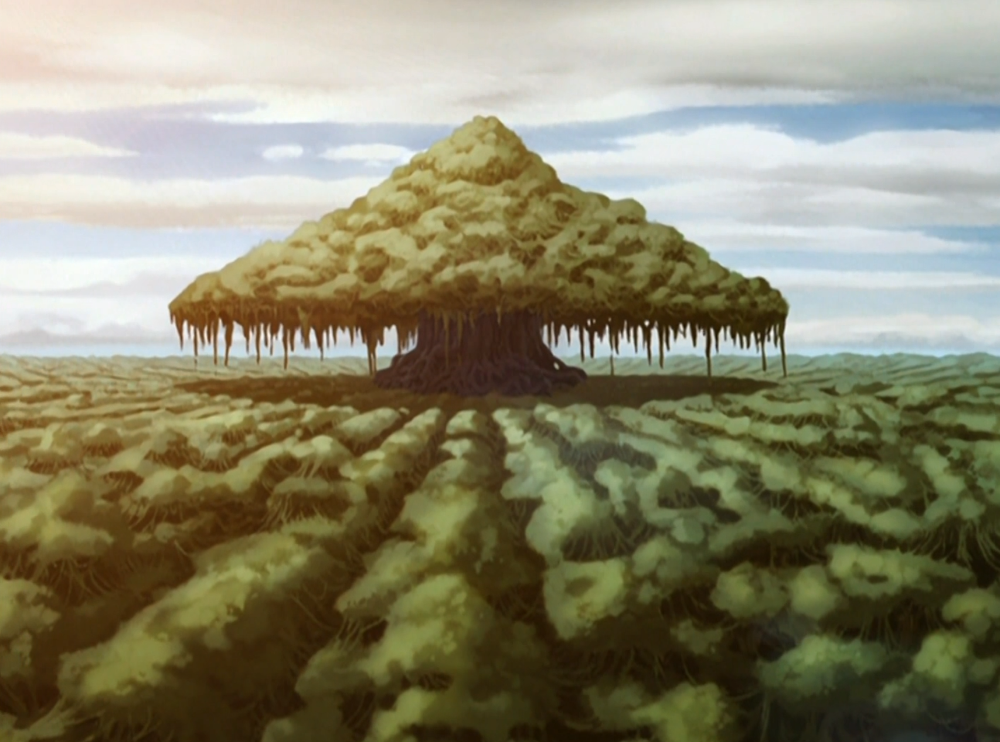

## *תקציר:*
- טים אווטאר מוצאים עצמם בתוך ביצה מסתורית לאחר שאנג מתעקש שהיא קוראת לו. בביצה הם רואים חזיונות של אנשים מעברם - קטארה מבחינה בחיזיון של אמה המנוחה, וסוקה רואה חיזיון של רוחה של יואה. לעומתם, אנג רואה חיזיון של מישהי שהוא בכלל לא מכיר. לבסוף הם פוגשים את יו, המשתמש בכשפות המים שלו כדי לשלוט על הצמחייה בביצה. יו מסביר להם שהביצה היא ישות מחוברת ושכולם קשורים זה לזה, ממש כמו עץ אחד עם ענפים רבים. 
- במקביל, זוקו ודוד איירו ממשיכים לשוטט כנוודים. דוד איירו מנסה לקבץ נדבות, ומהר מאוד זה מתדרדר למופעי רחוב. את זוקוש זה מאוד מכעיס כי הוא מרגיש מבוזה, ולכן מעדיף לגנוב כדי לשרוד.

## *סיכום במשפט:*  
It's all connected

## *ראוי לציון:*  
- כרגיל, אני אוהב את ההתמקדות בחיבור לרוחניות ולכוחות הטבע. נראה שעונה 2 מגבירה משמעותית את העיסוק בזה.
- גם בפרק הזה סוקה נתקל בקשיים כשהוא לא מאמין בקיומם של "כוחות מיסטיים", כלשונו. אני אוהב את הארק הזה.
- שמחתי לקבל תזכורת לאובססיה של זוקו לכבוד. הפעם הסדרה מרחיבה את הרעיון הזה, כשלא מדובר רק בכבודו כנסיך האש והכבוד מאבא שלו, אלא גם בפגיעה בכבוד האישי שלו מהיותו עני וחסר כל. כרגיל כיף לראות את ההתייחסות של איירו לזה, ואת השיעור שהוא מנסה ללמד את זוקו.

## *פחות התחברתי:*
- אנשי הביצות. אמנם כיף לראות סוגים חדשים של אנשים ומושבות בעולם הזה, אבל הם הרגישו לי כמו הכלאה בין ההיפים של פרק 202 והפיראטים הידועים לשמצה מעונה 1.
- כשלעצמם אין לי בעיה עם פרקי "פילר", אבל הפרק הזה בפני עצמו היה יחסית חלש בעיני ולא מאוד מעניין. על הנייר הפרק הזה בסדר גמור אבל באופן אישי משהו בו לא הקליק לי.

## *שמתי לב:*
- פרק עם מבנה עלילתי מעניין. בדרך כלל בסדרה אנחנו רואים את ה-A Plot, ה-B Plot ולפעמים אפילו C Plot שזורים זה בזה באופן אחיד. הפעם אנחנו מקבלים עלילה אחת יחסית רציפה, ורואים את זוקו ואיירו פעם אחת בתחילת הפרק ופעם אחת בסופו. הסיפור של אפה ומומו הוא בעיני לא עלילה בפני עצמה אלא runner. 

## *ה-MVP של הפרק:*  
אפה

## *עתידות:*
גבירותי ורבותיי, לזוקו יש חרבות עכשיו.

## *דירוג הפרק:*  
לא זכיר

