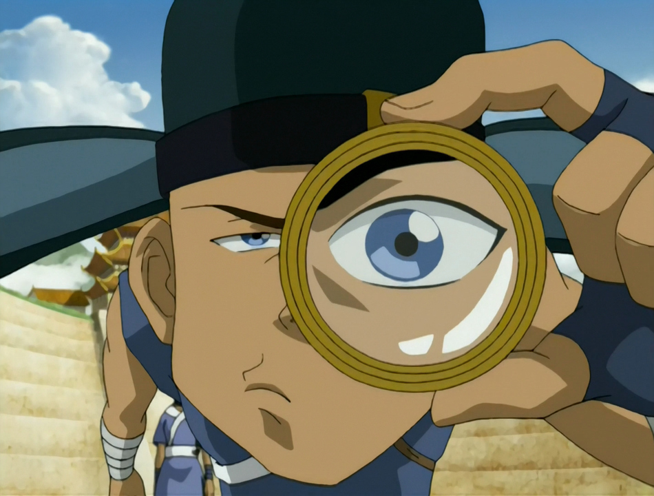

## *תקציר:*
- טים אווטאר מגיעים לעיר בה חוגגים את "יום האווטאר", אך להפתעתם החגיגה לא נועדה לכבודו של האווטאר, אלא להפך - האנשים שונאים אותו, והחגיגה כוללת שריפה של פסלי האווטארים לדורותיהם. תושבי העיר מספרים שאווטאר קיושי ביצעה פשע שגרם למות מייסד העיר, ולכן הם רואים באווטאר אויב. כתוצאה מכך, אנג נעצר ונשפט בעוון הפשע. כדי להוכיח את חפותו, סוקה וקטרה חוקרים את הקייס ומבינים שהאירועים היו שונים ממה שתושבי העיר מאמינים. כל זה לא מאוד משנה, כי מערכת הצדק באותה עיר שבורה לחלוטין. לבסוף קיושי עצמה מתגלה דרך אנג ומתוודה שהיא אכן גרמה למותו של מייסד העיר, אך לא מתוך כוונה רעה אלא בהגנה עצמית ובמאבק על אדמתה. בעקבות כך התושבים מבינים את האמת ומחליטים לסלוח לאנג.
- בינתיים, זוקו מחליט להתפצל מדוד איירו ומתחיל לפעול לבדו, בתואנה ש"אף אחד מהם כבר לא משיג כלום מכך שהם בורחים יחד"

## *סיכום במשפט:*  
"This is by far the worst town we have ever been to".

## *ראוי לציון:*  
- כיף לחזור לאי הקיושי. איפה סוקי??
- שוב פעם פרק שמתמקד בסוקה. כמעט כל הפרקים בעונה עד כה מתעסקים בו באופן עיקרי.
- סוקה שרלוק זה גאג טוב, אבל מבחינתי יש איזו אמת עמוקה יותר ברעיון שמספיק לו לאבד את הבומרנג כדי לחוות משבר זהות ולהצטרך מקטרת ומשקף כדי שיגדירו אותו. מאמין שזה בין היתר נובע מהעידר הכשפות שלו. מצפה לראות איך בהמשך הסדרה סוקה יגבש זהות יציבה וימצא מי הוא.
- היו הרבה גאגים טובים. גם אם זה פרק פילר שלא קורה בו כלום, הוא עדיין מאוד מבדר.

## *פחות התחברתי:*
- שוב, כשלעצמם אין לי בעיה עם פרקי "פילר", וזה אכן היה פרק הרבה יותר טוב מאשר קודמו. אני חושב שהבעיה הפעם היא שאין לנו כרגע lead להמשך העונה. במשך כל עונה 1 ה-lead שלנו היה שאנחנו נוסעים לקוטב הצפוני ללמוד כשפות מים. בעונה הזו חשבנו שאנחנו נוסעים לאומאשו ללמוד כשפות אדמה, אבל אז בעצם מתברר שלא. ודווקא בנקודה הזו, כשאנחנו תלויים באוויר, הסדרה בוחרת להכניס שני פרקי "פילר". מאמין שאם היה לנו lead כללי להמשך העונה, שני הפרקים האלה היו יורדים בגרון הרבה יותר טוב. 

## *ה-MVP של הפרק:*  
סוקה

## *עתידות:*
מאמין שבפרק הבא נחזור למסלול

## *דירוג הפרק:*  
אחלה
