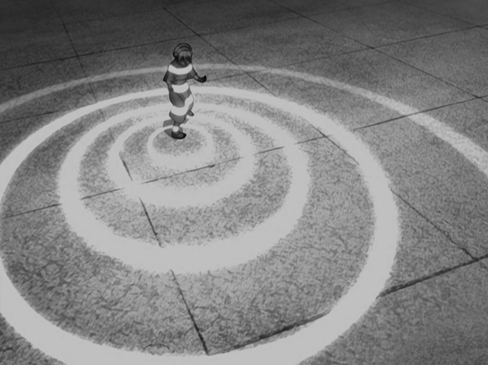

## *תקציר:*
- אנג וחבריו ממשיכים בחיפושם אחר מורה כשפות אדמה לאנג. הם מגיעים לעיר בה פועלת זירת תחרויות לחימה בלתי רשמיות של כשפים. בתחרות, אנג מתמודד עם לוחמת מסתורית המכונה "השודדת העיוורת" – ילדה שהיא כשפית אדמה חזקה במיוחד למרות (ואולי בזכות) עיוורונה. לאחר שאנג צופה ביכולות המדהימות שלה, הוא מזהה שהיא הכשפית שהוא חיפש מתוך חזיונותיו הקודמים. עם זאת, לאחר עבודת בילוש קטנה מתברר ששמה הוא טוף ושהיא בת למשפחה עשירה ושמרנית, והוריה מגוננים עליה יתר על המידה ואינם מודעים לכישוריה האמיתיים. הם חושבים שהיא חלשה ופגיעה בגלל העיוורון שלה.
- אנג פונה אל טוף ומבקש ממנה ללמד אותו כשפות אדמה, אך היא מסרבת בתחילה, מכיוון שהיא חוששת מהתגובה של הוריה. לאחר שטוף עוזרת לאנג ולחבריו להילחם ביריבים שמנסים לחטוף אותו, היא מתעמתת עם הוריה ומחליטה לברוח מהבית כדי להצטרף לאנג ולהיות מורתו.

## *סיכום במשפט:*  
ההורים NPCs

## *ראוי לציון:*
- טוף נראית כמו דמות מאוד מעניינת רק מפרק אחד שבו ראינו אותה עד כה, וזה הישג לא מבוטל של הסדרה. מבחינת tropes היא דמות מאוד ייחודית בעיני - כשלעצמן כל אחת ואחת מהתכונות של הדמות, כולל סיפור החיים שלה, הן כאלה שכבר ראינו הרבה במקומות אחרים, אבל משהו בקומבינציה שלהן ביחד יוצא מאוד מרענן וייחודי. כמו כן היא כתובה מצוין ומאופיינת היטב, ויחד עם משחק קולי מצוין של המדבבת מתקבלת דמות שמרגישה חד פעמית. אני מצפה לראות עוד הרבה ממנה.
- הבחירה להציג את טוף במסגור של זירת הלחימה הייתה מאוד טובה בעיני. אני חושב שהבחירה היותר טבעית אולי יכלה להיות לתת לה להילחם באנג ישירות מתוך אלמנט סיפורי, אבל הזירה היא גם משהו שמגניב לגלות שקורה בעולם של הסדרה, וגם מאפשרת לטים אווטאר להיות "צופים מהצד". הם אלה שבוחרים להכניס את טוף לחייהם, ולמעשה עד סוף הפרק היא בכלל לא מעוניינת בזה. כמו כן ההתחרות של טוף בזירה גם מאוד בונה את הדמות שלה - קצת כמו ספיידרמן, רק שהיא לא נלחמת כדי להרוויח כסף אלא כי זו הדרך היחידה שלה להתאמן בכשפות אל מול אויבים אמיתיים.
- כמו כן הויזואליות שבה מוצגת יכולת החישה של טוף עשויה מצוין, ומצליחה "למכור" באופן מאוד משכנע את היכולת, ולמה זה דבר שהגיוני בעולם של הסדרה.
- מעניין לחשוב על העובדה שטוף למדה כשפות אדמה לגמרי לבדה (חוץ מהאמירה המעורפלת של הסדרה על גיריות-חפרפרת). עד עכשיו כל הדמויות שהכרנמו בסדרה למדו את הכשפות שלהם ממאסטר אחר, וזו הייתה הדרך המאוד ברורה ומקובלת לעשות את זה. בעיני זה נובע מהצורך הקיומי של טוף ללמוד את הכשפות על מנת לפצות על עוורונה.
- ובכלליות, מאוד לא מובן מאליו שהסדרה בוחרת לשלב דמויות עם מוגבלויות בפוזיציות מרכזיות לסיפור (לא פעם ראשונה ומרגיש לי שגם לא אחרונה). מעניין אותי כמה הסדרה באמת תתחייב לכך שטוף עיוורת, והאם בהמשך הסדרה (בהנחה שנראה את טוף עוד הרבה) זאת תמשיך להיות תכונה דומיננטית בדמות או שהסדרה לא מאוד תתייחס לזה.
- בפרק הזה אנחנו רואים הרבה מובים של כשפות אדמה, וזה מדהים. כרגע מבין כל הכשפויות, כשפות אדמה היא האחת עם הויזואליזציה הכי מקורית, מגוונת ומעניינת.

## *פחות התחברתי:*
- אחרי שכמעט כל פרק בעונה הזו הראה את סוקה מתבגר ומתחבר לצדדים אחרים של עצמו, פתאום בפרק הזה הוא עובר רגרסיה מטורפת לגיל גנון. ומילא אם זה היה מצחיק כמו שאנחנו רגילים ממנו. אבל זה לא. זה בעיקר מפריע לסיפור.

## *ה-MVP של הפרק:* 
טוף

## *עתידות:*
לא ברור אם טוף הצטרפה אל טים אווטאר for good או שזה יהיה עניין של רק כמה פרקים. אני חושב שזה הולך להיות עד סוף הסדרה. 

## *דירוג הפרק:*  
אדיר