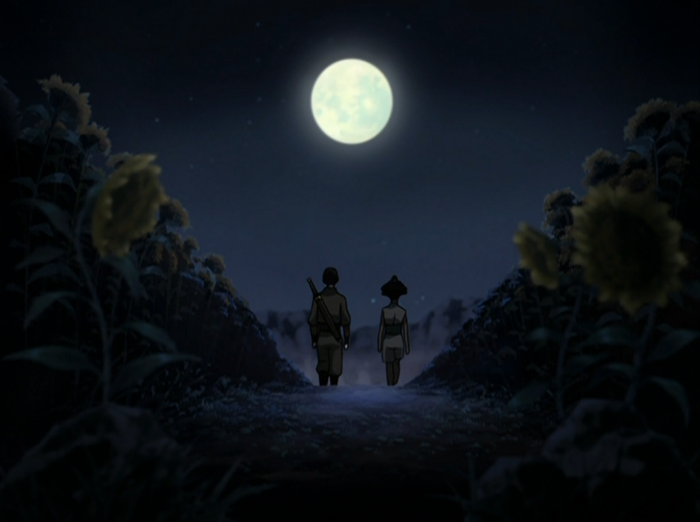

## *תקציר:*
זוקו ממשיך במסעו לבדו לאחר שנפרד מדוד איירו. בעודו נודד ברחבי אומת האדמה, הוא מגיע לעיירה קטנה הסובלת מהתנכלויות של חיילים מושחתים של אומת האדמה. זוקו שומר על זהותו בסוד ומתמודד עם התנאים הקשים של חיים כאדם פשוט, הרחק מחייו כנסיך לשעבר.
במהלך שהותו בעיירה הוא מתחבר עם ילד בשם לי ומשפחתו, המציעים לו אוכל ומקום לינה. הקשר עם לי מעורר בזוקו זיכרונות כואבים מילדותו, על יחסיו עם אמו האוהבת ועם אביו האכזרי, וכן על הקושי שבלגדול עם אזולה. דרך פלאשבקים אלו נחשף הסיפור הכואב של זוקו, כולל הרגע שבו אמו נעלמה באופן מסתורי כדי להציל אותו מאכזריותו של אביו ואחותו.
כשמגיעה אל זוקו הידיעה שחיילי אומת האדמה פוגעים בלי, זוקו מחליט להתערב ולהגן על העיירה. הוא נלחם באומץ ומביס את החיילים, אך כאשר תושבי העיירה מגלים את זהותו כנסיך אומת האש, הם דוחים אותו ומסרבים לראותו כגיבור. לבסוף, זוקו עוזב את העיירה, בודד מתמיד, וממשיך במסעו בחיפוש אחר משמעות וזהות.

## *סיכום במשפט:*  
😢

## *ראוי לציון:*
-  הכל

## *פחות התחברתי:*
- כלום

## *דברים חדשים שאנחנו מגלים:*
- הגבות של אוזאי. קצת מגוחך להתייחס לזה, אבל בגלל שהסדרה בכוונה מסתירה מאיתנו את החזות של אוזאי כמה שהיא רק יכולה, מרגיש נכון לציין שראינו ממנו קצת יותר הפרק.
- אזולון הוא אבא של אוזאי ואיירו. עד עכשיו לא הכרנו את הדמות הזו, ומעניין לראות אותה.
- אמא של זוקו. לא חושב שנאמר מה שמה, בכל מקרה זו הפעם הראשונה שהיא בכלל מוזכרת, ואנחנו מקבלים הרבה ממנה.

## *משפחת המלוכה הגרעינית:*
- בפרק אנחנו רואים את הקשיים של זוקו בלגדול לצד אזולה - מעניין לגלות כמה זוקו היה ילד רגיש, ולראות אותו גדל לצד אחותו הקטנה והמשוגעת שנולדה עם כוחות הרבה יותר חזקים ממנו. זוקו עובד מאוד קשה כדי להתחרות בה וכדי להיראות, וזה פשוט לא מספיק כי נראה שאוזאי צדק ואזולה אכן נולדה עם כשרונות רבים. כואב לראות איך הבית הרעיל שבו גדלו הסליל את זוקו ואזולה ליחסים של איבה ותחרות.
- מאוד בולט שאמא של אזולה לא מבינה אותה. עם אמירות כמו "מה לא בסדר עם  הילדה הזאת", אני מקבל את הרושם שהיא באמת רוצה לאהוב את הבת שלה, אבל מתקשה להבין אותה ואפילו קצת נרתעת ממנה.
- יחסי הכוחות במשפחה הזו מאוד ברורים - זוקו ילד של אמא, היא אוהבת אותו, קשורה אליו וקרובה אליו; אזולה ילדה של אבא, יש לה מזג חם כמוהו, היא מחפשת כוח ורוצה להרשים אותו. כמו כן נראה שאוזאי ממש משתף את אזולה במזימות שלו ובסודות שלו, דבר שגורם לאזולה להיות תמיד צעד אחד לפני זוקו ואמא.
- לא ברור לגמרי מה היה העניין הזה עם אוזאי שביקש להקריב את זוקו, ומה בדיוק אמא שלהם עשתה כדי להגן עליו, או לאן היא נעלמה ומה קרה איתה. אבל בבירור היא הקריבה את עצמה כדי להגן על זוקו.
- ממש קשה לי לדמיין איך נראו החיים של זוקו מאז ועד שאנחנו פוגשים אותו שוב בתחילת הסדרה. החיים שלו היו ממש קשים וקשה להישאר אדישים לדמות הזו ולמסע שלה.

## *עוד על איירו:*
- זו הפעם הראשונה שמחברים לנו את כל הנקודות בסיפור הרקע של איירו: הוא היה האח הבכור לשושלת האש, הבן של אזולון. הוא נשלח להוביל את המתקפה של אומת האש על בה סינג סה, מתקפה משמעותית ביותר שהייתה אמורה להביא את המלחמה לסיומה ולניצחון אומת האש. בחזית הזו נופל הבן של איירו. זה מאורע שמערער אותו קשות, והוא בוחר לוותר על הובלת המתקפה ולחזור הביתה להתאבל.
- ככל הנראה המזימה של אוזאי ואזולה הייתה להתנקש באזולון, ולזייף את בקשתו האחרונה - שאוזאי יירש את כס האש, ולהשתמש בתבוסה של איירו כמניע מזויף לבקשה זו, בתואנה שהוא לא כשיר להוביל את אומת האש.
- מעניין לראות את איירו של פעם - מזהים בו הרבה מהתכונות של איירו הזקן החכם של ימינו, אבל יש בו גם נאמנות מעט פנאטית לאומת האש. נראה שמות בנו והדרישה ממנו להישאר להוביל את חזית הקרב היא המסמר האחרון בארון שגורם לו לחוש בניתוק מאומת האש, ולחפש את המשמעות שמחוץ לשושלת הזו.
- סצנת הענקת המתנות לאזולה וזוקו היא אחד הקטעים הכי מרתקים בפרק הזה בעיני. מתנהל פה שיח קולוניאליסטי של ממש, בהתלהבות של איירו מתרבות אומת האדמה. למרות הגוון הקולוניאליסטי של מכתבי איירו, זה גם אומר המון על האהבה שלו לסוגי אנשים אחרים, לתרבויות אחרות, ולהנאות הקטנות שבחיים. מאוד החזיר אותי לאיירו חובב העתיקות בפרק עם הפיראטים הידועים לשמצה. כמו כן ניתן ללמוד הרבה על היחס של איירו אל זוקו ואזולה לפי המתנות שהוא נותן להם: זוקו מקבל סכין שעליה כתוב "לעולם אל תוותר ללא קרב", דבר שמראה על חיבור בין איירו לזוקו ועל רצון מאוד מוקדם של איירו להיות מעורב בחינוך שלו ובהפיכתו לאדם טוב יותר ושלם יותר. לעומת זאת אזולה מקבלת ממנו בובה, מתנה שהיא סופר גנרית ו go to של כל דוד, וגם מראה כמה הוא לא באמת מכיר את אזולה, שמספיקות שתי דקות של שיח איתה כדי להבין שבובות לא מעניינות אותה.

## *מאי וטיי לי:*
- מעניין לראות שמגיל מאוד צעיר החברות של אזולה עם מאי וטיי לי היא מתעללת ורעילה. אזולה מאוד פוגענית כלפיהן, אך לדעתי בעיני אזולה ככה באמת נראית חברות. וזו חברות שממשיכה אפילו עד ימינו באותם דפוסים.
- אזולה משדכת בין מאי וזוקו. זה קטע של חצי דקה אבל יש לי תחושה מאוד חזקה שלא ראינו את זה סתם והולך להיות שם משהו בהמשך הסדרה.

## *עלילת ההווה:* 
- מעניין לראות את זוקו "רואה עולם" ומגלה את זוועות המלחמה, הפעם מהצד של אומת האדמה. הוא מבין עוד יותר כמה שמלחמה זה חרא.
- כל המחוות של זוקו בעלילת ההווה כל כך עדינות שקל מאוד לפספס אותן. הרגע שהכי תפס אותי היה בתחילת הפרק, כשזוקו מסרב לקבל אוכל ומחסה בחינם אבל מסכים לכך כשמתאפשר לו לעבוד בשבילו. זה מראה על מעין מוסר עבודה אצלו. מה שקצת מצחיק זה שכמה פרקים מוקדם יותר ראינו אותו גונב אוכל ונלחם עבורו, ועם זה הוא היה בסדר, מה שמרמז שמבחינתו גם זו נחשבת עבודה.
- מרגש לראות איך זוקו מתמלא חמלה עבור משפחה שהוא לא פגש מעולם - רק בגלל שהילד בה מזכיר לו את עצמו. כמו כן, האופן שבו הילד מחפש בזוקו את אחיו הגדול היה פשוט קורע לב.
- מגניב לראות שחיילי האדמה מזהים את הצלקת של זוקו ומכירים את הסיפור על נסיך האש המגורש והמנודה.
- זוקו נותן לילד את הסכין שקיבל מאיירו זה רגע אדיר בעיני - מעין מטא קומנטרי אירוני בטירוף של הסדרה. בעודו בורח מאיירו, זוקו רוצה להיות עבור הילד הדמות החינוכית שאיירו בשבילו, ועושה את זה על ידי הדהוד של אקט נתינת הסכין. רק שלאחר מכן האמא בהלם שהוא נתן לילד שלה סכין, ולמעשה מזכירה לנו שלתת סכין במתנה לילד זה מעשה דפוק שאפשרי רק בטרלול של משפחת מלוכת האש.

## *שם הפרק:* 
הפרק נקרא "זוקו לבדו", והוא נכון בשלושה רבדים:
1. ההתייחסות הברורה ביותר, והראשונה שחושבים עליה, היא העובדה הטכנית שזה הפרק היחידי בסדרה עד כה שבו טים אווטאר לא מופיעים בכלל. הפרק כולו מלווה את זוקו, כשהלבד הוא יותר במשמעות של בלעדיות.
2. הרובד השני הוא שעלילת ההווה תופסת את זוקו בנקודה במסע שלו שבה הוא בחר להתפצל מדוד איירו ולנדוד לבדו. זה מאוד סימבולי בעיני, כי רק היותו לבד מאפשרת לזוקו לחפש את עצמו, להבין את עצמו, ואפילו להיות בן אדם אחר ממה שהוא רגיל להיות ליד אנשים שמכירים אותו.
3. הרובד האחרון הוא מילולי לחלוטין - זוקו פשוט לבדו. כל חייו. הפרק הזה מראה לנו כמה שבדידות היא תחושה שמלווה את זוקו כל חייו, בלי אף דמות שתאהב אותו לאורך זמן ותהיה שם בשבילו. וכשדוד איירו מנסה להיכנס למקום הזה בשבילו, זוקו מתקשה מאוד להכניס אותו.

## *ה-MVP של הפרק:* 
זוקו

## *עתידות:*
אין

## *דירוג הפרק:*  
אדיר