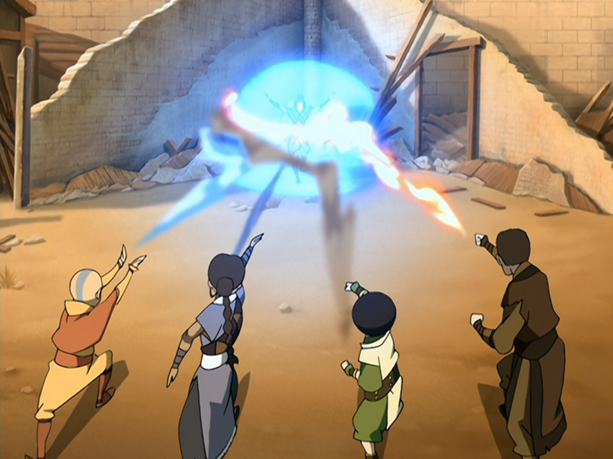

## *תקציר:*
סוף סוף אנחנו חוזרים אל טים אווטאר בתוספת טוף, ומעניין מאוד לראות איך הצטרפותה לחבורה משפיעה על הדינמיקה הקבוצתית. התשובה - פיצוץ בינה לבין קטארה, כאשר טוף מסרבת לעזור במטלות המחנה. העובדה שאזולה ובנות לוויתה רודפות אחריהם באינטנסיביות לא עוזרת, שכן המרדף הבלתי פוסק מאלץ את החבורה להיות בתנועה מתמדת, ומצבם הנפשי והפיזי מתדרדר בשל חוסר השינה והלחץ.
בסופו של דבר, אנג מחליט להתמודד עם אזולה לבדו כדי להגן על חבריו. הקרב ביניהם מגיע לשיא כשהוא נתקל גם בזוקו, שגם הוא מחפש את אזולה מתוך שאיפה ללכוד את אנג. במפגש טעון זה, כולם מתעמתים זה עם זה, אך אזולה מצליחה לברוח לאחר קרב עז.
הפרק מסתיים בכך שהחבורה מתאחדת מחדש עם טוף לאחר שלמדו להתמודד עם המתחים הפנימיים שלהם, במיוחד לאור האיום של אזולה שנהיה ממשי וברור יותר ויותר. 

## *סיכום במשפט:*  
הולי שיט

## *ראוי לציון:*
-  יש פרקים שהם טובים בזכות העובדה שהם נהנים מפריבלגיות בעקבות מיקומם בסדרה - בין אם זה חשיפה של פרט מידע חדש וחשוב לעלילה, חשיפת סיפור רקע, צומת עלילתית משמעותית או שיא סיפורי. הפרק הזה לא נהנה מאף פריבילגיה שכזו, ועם זאת הוא מתברג בעיני בראש רשימת הפרקים החזקים של הסדרה - והוא עושה את זה אך ורק "בכוחות עצמו"
- טוף היא דמות מאופיינת היטב עם אופי ברור וחד משמעי, והסדרה לא מחפפת בהצגת ההשתלבות שלה בין הדמויות הראשיות. הקונפליקט מול קטארה הוא לא רק דרמה מתבקשת שמעניין לצפות בה, אלא גם דרך לחזק מאוד את בניית הדמות של שתיהן על ידי הצגת השוני והניגוד ביניהן - ויחד עם זאת גם הדמיון.
- אחד הדברים שאהבתי לראות בפרק הוא את הפסיביות של אנג בויכוח וקור הרוח שלו נשברים לרסיסים ברגע שבו מאשימים את אפה בחשיפת המיקום שלהם, גם אם זו האשמה מוצדקת והגיונית. אנג הוא אדם עם שקט נפשי וקור רוח, אך כשזה נוגע להגנה על חברים שלו או על החלש - אש בעיניו.
- וכמובן מזכירים לנו גם את החשיבות של סוקה בקבוצה, בשמירה על מורל, שלום בית וחשיבה לוגית.
- עד עכשיו, איך שראיתי את אזולה היה בתור דמות חזקה מאוד, אשר לוקה בטירוף ובפנאטיות. הפרק הזה הדגיש תכונה אחרת שלה שפחות ראינו באה לידי ביטוי עד כה, והיא דבקותה של אזולה במטרה. היא פשוט לא מוותרת ושום דבר לא עוצר אותה, וזה בעיניי הופך אותה להרבה יותר מסוכנת מאשר החוזק שלה או השגעון.
- הסצנה של טוף ואיירו היא מהמפתיעות שהיו בסדרה, ויחד עם זאת גם מהמרגשות. אלו שתי דמויות שלא דמיינתי שהולכות לשבת לשיחת נפש ולספר זו לזו את אשר ליבן, וזה היה רגע יפהפה. זו פעם ראשונה שאנחנו רואים את איירו מדבר בפירוש על איך שהוא רואה את התפקיד החינוכי שלו בחיים של זוקו, ועל כמה כואב לו לראות את הקשיים שזוקו עובר.
- בעיני הרגע שבו טיי לי שואלת את מאי אם לדעתה סוקה חמוד היא רגע אדיר.
- אווטאר היא סדרה שבה כמעט כל הדמויות החשובות הן ילדים, ויחד עם זאת הסיטואציות בהן הדמויות נמצאות הן כאלו שמעטים המבוגרים שנאלצים לחוות בימי חייהם. קל לשכוח שאלה ילדים, ולכן פעם בכמה זמן הסדרה דואגת להזכיר לנו את זה. בפרק הזה העובדה הזו ניכרת מאוד לכל אורכו, ואין צורך לתזכר.
- הקרב בסוף הפרק הוא סיקוונס אדיר ומהאהובים עליי בסדרה.
- בסדרה הזו אפילו הרגעים הכי קטנים עקביים עם האופי של כל דמות. דוגמה לכך היא הרגע שבו אנג מנסה לשטות באזולה ולגרום לה ליפול אל תוך מבנה ללא רצפה. אזולה לא נופלת בפח אבל מיד אחריה זוקו מתפרץ לדלת המבנה ודווקא כן נופל במלכודת, בלי שהיא בכלל הייתה מיועדת אליו. זה כמובן מדגים את האימפולסיביות שלו, בשונה מאזולה, וכמה שהוא מונע מרגש - במיוחד זעם. וגם חמוד לראות את המבט הנבוך של אנג כשהוא רואה את זה.
- השיא של הפרק הוא הרגע שבו כולם מכתרים את אזולה - אנג, קטארה, טוף, זוקו, איירו וסוקה. זה לצד זה, כנגד אויב משותף. זה קטע מטורף כי אזולה מצליחה להתגבר על כולם יחד, אבל בעיני יש פה יותר מזה. אני חושב שמדובר ברמז מטרים - כדי להביס את אזולה נדרש שיתוף פעולה של כשפים מארבעת היסודות וגם של לוחמים מחוסרי כשפות.

## *פחות התחברתי:*
- כלום

## *ה-MVP של הפרק:* 
כולם ללא יוצא מן הכלל. 

## *עתידות:*
דוד איירו יהיה בסדר. 

## *דירוג הפרק:*  
מגה זורד