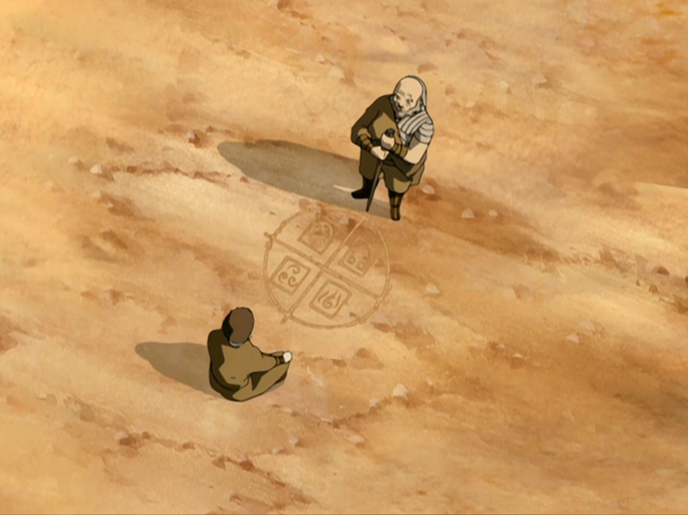

## *תקציר:*
פרק זה הוא מעין מונטאג' אימונים ארוך של שתי דמויות שונות במקביל. שתיהן מאוד מתקשות ללמוד את המיומנות שהן צריכות כיוון שהיא מנוגדת לטבען, ומכאן שם הפרק.
- טים אווטאר מתמקדים בלימודי כשפות האדמה של אנג, בהדרכת טוף. טוף מנסה ללמד את אנג כיצד להתחבר לכוח ולנחישות הנדרשים כדי לשלוט באדמה באמצעות סגנון הוראה נוקשה, בניגוד לטבעו הרגוע והזורם. אנג מתקשה להתמודד עם הגישה הקשוחה של טוף ועם הדרישות הרגשיות של כשפות האדמה, שדורשת עמידה איתנה מול האתגרים, דבר שאינו טבעי עבורו שכן אדמה הוא היסוד ההפוך לאוויר.
- לאחר העימות עם אזולה בפרק הקודם, זוקו מחליט שהוא חייב ללמוד זימון ברקים כדי להתמודד מול אזולה. דוד איירו מסכים ללמד את זוקו, אך מהר מאוד מתברר שאין לזוקו סיכוי ללמוד את הטכניקה בגלל הזעם התמידי שאצור בו ומפריע לטכניקה. במקום זאת איירו מחליט ללמד את זוקו טכניקה אחרת שהוא בעצמו פיתח בהשראת כשפי מים - תיעול אנרגיה שלילית להפניית ברקים, טכניקה העשויה לעזור לו להתמודד מול אזולה.
- יש גם עלילת משנה משעשעת של סוקה, שמסתבך בתוך חור בסלע לאחר שניסה לצוד חיה. הוא נאלץ להתמודד עם ייאושו ועם חוסר האונים שלו, ומקבל שיעור על סבלנות ונחישות.

## *סיכום במשפט:*  
"I know what you're going to say - she is my sister and I should be trying to get along with her"
-"No. she's crazy, and she needs to go down".
## *ראוי לציון:*
- כשפות האדמה פשוט מגניבה
- העלילה של סוקה חמודה
- אני אוהב שהפרק סובב סביב תמה אחת שרלוונטית לכל העלילות
- דוד איירו נותן בפרק הזה הופעה מהטובות שלו, ומלמד אותנו הרבה מידע חדש על היחסים בין היסודות והכשפויות, ואיך הן באות לידי סינרגיה בטבע.
- מאוד מעניין לגלות שאיירו יודע גם הוא לזמן ברקים. 
- הרעיון שאיירו פיתח טכניקת כשפות בעצמו, ועוד בהשראה של כשפי מים, פותח דלת מאוד משמעותית אל עבר עולמות חדשים. האם יש עוד טכניקות שכשפים מסוימים פיתחו ואנחנו לא מכירים? האם כשפות הצמחים של אנשי הביצות וכשפות העננים של אנג וקטארה בפרק של מגדת העתידות נחשבות? זה גורם לי לחשוב על עניין הכשפות כעל קונספט הרבה פחות מקובע מאיך שראיתי אותו עד כה. 

## *פחות התחברתי:*
- אולי היה אפשר קצת לקצץ מהעלילה של סוקה, בעיני הגאג טיפה מיצה את עצמו לקראת סוף הפרק

## *ה-MVP של הפרק:* 
איירו

## *עתידות:*
בסוף הרדמפשיין ארק של זוקו, הוא יצליח לזמן ברקים וזה יוביל לקרב קליימטי שלו מול אזולה.

## *דירוג הפרק:*  
מעולה