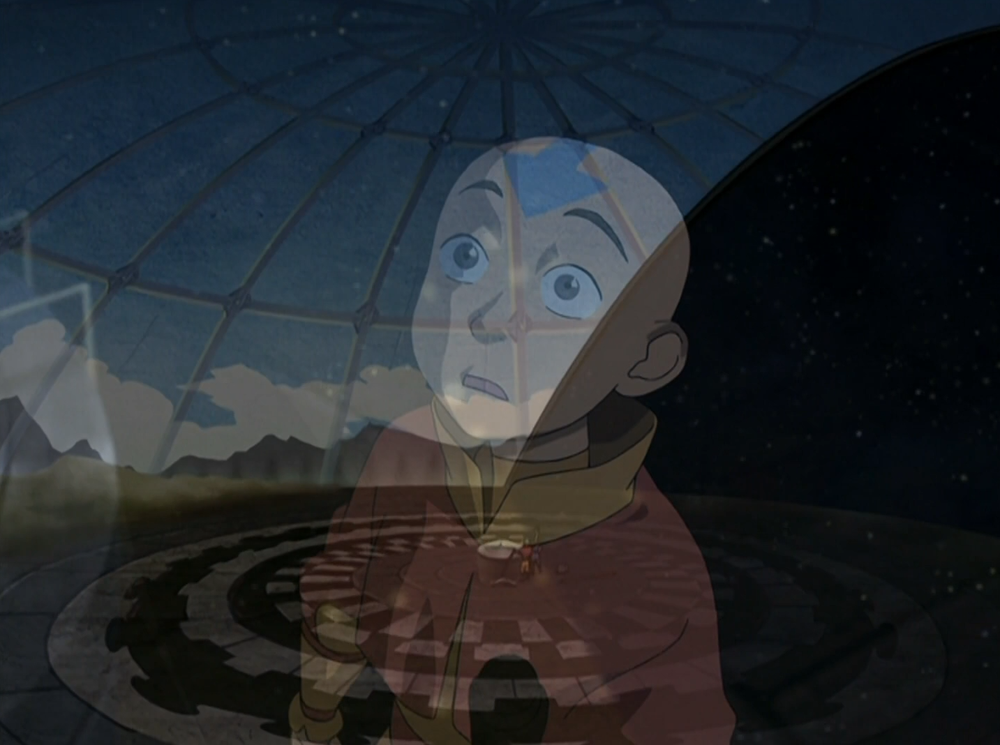

## *תקציר:*
- טים אווטאר צריכים חופשה, אבל במקום זה הם יוצאים למסע למציאת מידע שיוכל לעזור להם להביס את אומת האש. הם פוגשים פרופסור בשם זאי, שמתלהב ממסעותיהם, והוא מספר להם על ספרייה מיתולוגית בשם וואן שיטונג, הממוקמת במדבר. זו גם הספרייה שבה ז'או מצא את המידע על רוחות הירח והאוקיינוס בעונה הקודמת.
- החבורה מגיעה לספרייה הענקית, שקבורה למחצה בחול המדבר. הספרייה נאצרת על ידי ינשוף ענק שאוסף ידע מכל העולם אך מתנגד לשימוש בו למטרות מלחמה. כדי להיכנס לספרייה, החבורה משכנעת אותו שהם מעוניינים בידע לשם למידה ולא לשם הרס. בזמן שהם חוקרים את הספרייה, סוקה מגלה לוח שנה עתיק שמספק מידע חשוב: התאריך של ליקוי חמה מתקרב שיחליש זמנית את כשפי האש, הזדמנות חשובה לתקוף את אומת האש. אולם, וואן שיטונג מגלה את כוונותיהם האמיתיות ונעשה זועם. הוא מנסה לכלוא אותם בספרייה כעונש על ניסיונם להשתמש בידע לצורכי מלחמה.
- במקביל, אפה נלכד על ידי אנשי מדבר, בעוד טוף מנסה לשמור על הספרייה שלא תקרוס לתוך החול, מבלי שתוכל לעזור לאפה. החבורה מצליחה להימלט מהספרייה עם המידע החיוני, אך הם יוצאים למדבר ומגלים שאפה נעלם.

## *סיכום במשפט:*  
ביזון ורעמסס

## *ראוי לציון:*
-  הינשוף מלחיץ
- הספרייה מעוצבת מגניב ומצליחה להעביר את התחושה העתיקה והעוצמתית שהיא אמורה
- אני אוהב את זה שמתברר שיש רוטציה בין חברי טים אווטאר מי בוחר את הריזורט הבא, כאילו שבין הפרקים היו להם חופשות שלא ראינו.
- אהבתי מאוד את המונטאז' שבו אנג וסוקה מחפשים את התאריך בפלנטריום
- ציפיתי שהפרק הזה, בהיותו נקודת אמצע העונה, יסתיים בקליף האנגר. להיעלמות של אפה לא ציפיתי, כנראה כי לקחתי את הקיום שלו כמובן מאליו - פתרון תסריטאי להתניידות ממקום למקום בין הפרקים, ואתנחתא קומית במהלך הפרק. ועכשיו כשהוא אינו, פתאום הוא מרגיש ממש חסר. לכן המתח כפול - מה יקרה לו והאם הוא יהיה בסדר? ואיך טים אווטאר יציליחו להחלץ מהמדבר?

## *פחות התחברתי:*
- הפרק הזה ניסה להגיד לי משהו לגבי שימור ידע, אבל בעיני האמירה הייתה די מבולבלת ולא יצאתי עם מסקנה קונקרטית. האם הסדרה לוקחת את הצד של הינשוף, ה-gatekeepr-י ? או שיש פה מסר שהידע צריך להיות נחלת הכלל? או שרק מי שמוכן להקריב ולצאת למסע בעד הידע זכאי להחזיק בו? ומה לגבי הדמות של הארכיאולוג - הוא בחר למות בשביל לדעת, ליטרלי הסקרנות הרגה את החתול. האם הידע הזה שווה משהו אם לא תהיה לו הזדמנות להשתמש בו או להעביר אותו הלאה? בקיצור, סמטוחה.
- באופן כללי יותר, משהו בפרק הזה לא לגמרי הקליק לי. אפילו קצת השתעממתי בו, למרות שאני מרגיש שיש לו את כל המרכיבים בדרושים כדי להיות פרק חזק מאוד.

## *ה-MVP של הפרק:* 
טוף

## *עתידות:*
בפרק הבא נצא לחלץ את אפה

## *דירוג הפרק:*  
אחלה