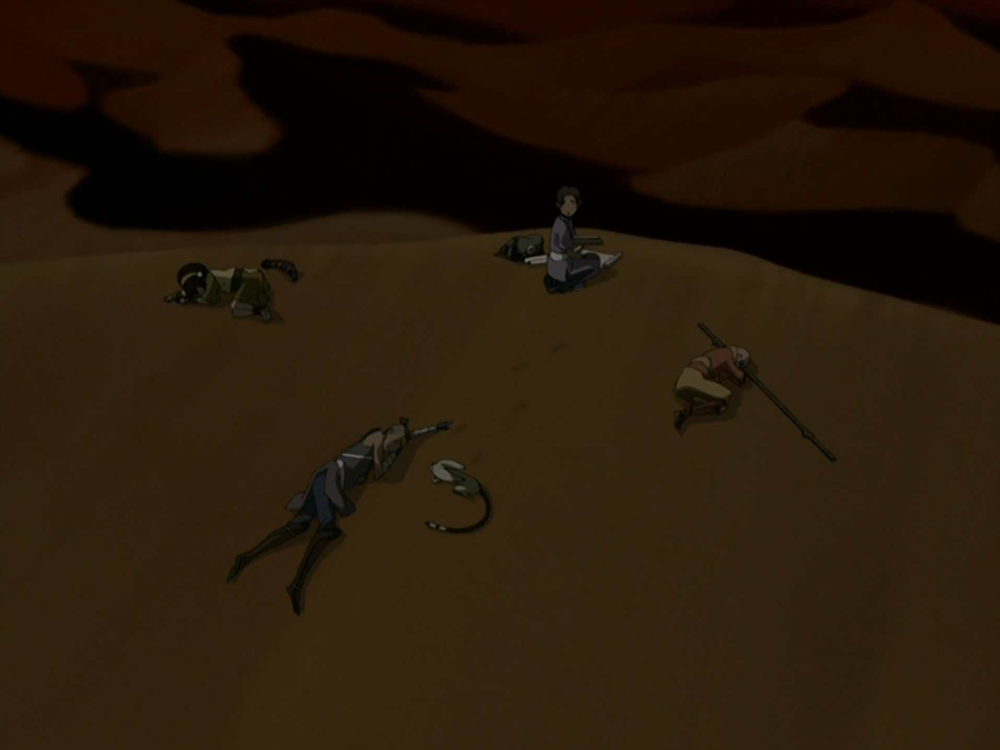

## *תקציר:*
- טים אווטאר מתמודדים עם אובדן אפה ומנסים לנווט במדבר הלוהט והמסוכן. אנג, שנסער מכך שאפה נחטף, מתקשה לשלוט בכעסו, מה שמוביל לעימותים בינו לבין שאר החבורה. סוקה, לאחר שמתמסטל ממיץ קקטוס מוזר, הופך למבולבל ומתנהג בצורה מוזרה, מה שמוסיף למתחים ולכאוס. טוף מתוסכלת מכך שחושיה לא מתפקדים בחולות המדבג, בעוד קטארה לוקחת על עצמה את תפקיד המנהיגה בהיעדר מנהיגות אחרת, שומרת על אחדות הקבוצה ומכוונת אותם לכיוון יציאה מהמדבר.
- במקביל, זוקו ואירו מוצאים מקלט בבית תה במדבר, שם אירו חושף קשרים ישנים עם "מסדר הלוטוס הלבן," ארגון סודי שחבריו עוזרים להם לברוח מציידי ראשים.
- אנג מתעמת עם נוודים שטוף מזהה כאחראים לחטיפת אפה, אך הם טוענים שמכרו אותו למישהו אחר בבה סינג סה. אובדן אפה והיעדר תשובות מכניסים את אנג למצב של זעם וחוסר שליטה, מה שמוביל אותו להיכנס ל"מצב האווטאר" באופן בלתי נשלט. קטארה מצליחה להרגיע אותו ולהחזיר אותו לעצמו באמצעות חמלה ותמיכה.
- הפרק מסתיים כאשר החבורה מצליחה לצאת מהמדבר ולהגיע ליעד הבא שלה, אך עדיין כואבת על אובדן אפה ומלאת דאגות לעתיד. 
## *סיכום במשפט:*  
בייסיקלי זה הספר במדבר של הסדרה

## *ראוי לציון:*
- פרק מאוד מעניין. כל הדמויות הראשיות רצוצות והתחושה היא של אבדון. אנג זועם (מתוך תסכול וייאוש), טוף שאנחנו רגילים לראות זחוחה ובטוחה בעצמה בחוסר אונים מוחלט, אפילו הסטלה של סוקה שאמורה להיות מצחיקה, בעיקר הופכת את הסיטואציה למאיים יותר. ועם זאת, קטארה מנהיגה את החבורה בקור רוח, שקט ואיפוק. היא שומרת על כולם, בידיעה שאם היא לא תעשה את זה אף אחד אחר לא. היא ממש התבגרה לנו. 
- איירו בבונים החופשיים. זה מאוד מגניב, ולא מגיע משום מקום כי תמיד יש תחושה שיש עוד דברים על איירו שאנחנו לא יודעים. וגם callback מגניב לעונה הקודמת עם החייל שש בש לוטוס.
- זוקו ❤️

## *פחות התחברתי:*
- אנימציה קצת פחות טובה הפרק

## *ה-MVP של הפרק:* 
קטארה

## *עתידות:*
הולכים לבה סינג זה אעאעאעעעעע ידעתייייייייי

## *דירוג הפרק:*  
אחלה