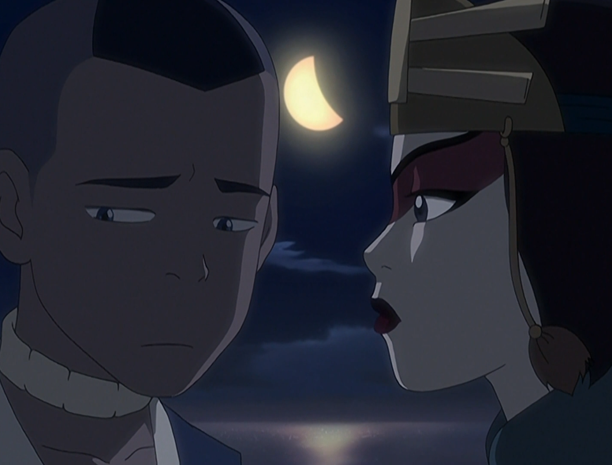

## *תקציר:*
- טים אווטאר עושים את דרכם אל בה סינג סה, עיר הבירה המוגנת של ממלכת האדמה, מתוך תקווה למצוא מקלט ולהשיג מידע על אפה. בדרך הם פוגשים שוב את סוקי, וגם זוג פליטים בהריון ומחליטים לעזור להם לחצות את מעבר הנחש המסוכן. המסע במעבר הנחש רצוף סכנות, כולל איתני טבע, כשפים ויצורים ימיים אימתניים, ובמיוחד נחש ענק שמאיים על חייהם. במהלך המסע, אנג מתמודד עם רגשותיו לגבי אובדן אפה ומתחיל למצוא בתוכו תקווה חדשה, בעיקר בזכות תמיכתה של קטארה. ברגע דרמטי, האישה ההרה מתחילה ללדת, והחבורה מסייעת לה להביא את התינוק לעולם. האירוע מביא רגע של שמחה, ומסמל תקווה חדשה עבור כולם.
- במקביל, זוקו ואיירו ממשיכים את מסעם לעבר בא סינג סה, כשהם מתחזים לפליטים על המעבורת. איירו שומר על גישה אופטימית, בעוד זוקו נאבק ברגשות של תסכול ובושה. על המעבורות אנחנו פוגשים שוב את ג'ט, שטוען שהוא "חזר בתשובה". ג'ט מזהה את זוקו ולמרות זאת שניהם מצתוותים ופועלים יחד. 
- בסיום הפרק, מגיעים ממש לשערי בה סינג סה, רק כדי לגלות שהעיר מותקפת על ידי דחפור ענק.

## *סיכום במשפט:*  
פגישת מחזור

## *ראוי לציון:*
- וואו איזה פרק. באופן חד משמעי זה פרק שעוסק בעיקר בתהליכים של הדמויות, כאשר כמעט כל דמות מתמודדת עם קושי שהיא סוחבת על ליבה, ועד סוף הפרק מגיעה להשלמה ומפתחת תקווה לגבי העתיד.
- לא האמנתי שג'ט הולך לחזור שוב, אבל ה-team up שלו ושל זוקו הוא לא פחות ממבריק. ג'ט רודף הצדק וזוקו רודף הכבוד מספקים לנו מרד קטן ודבילי, ובעיקר כיפי לצפייה, נגד קפטן המעבורת. הקיצוניות של שניהם משעשעת, הם חייבים לפעול נגד הסדר החברתי שעל המעבורת אפילו אם זה להפלגה של כמה שעות ותו לא. מעבר לזה, מה שבאמת מחבר ביניהם הוא הצורך של שניהם בכפרה, ודוד איירו מסכם את זה היטב ברגע קטנטן ומרגש - המצלמה מתמקדת על פניו בעוד הוא אומר שהוא מאמין גדול בהזדמנות שנייה.
- בנוסף, עצם העובדה שזוקו מסכים לחבור לאדם זר ופועל בשיתוף פעולה היא התקדמות משמעותית מבחינתו.
- איירו נותן התייחסות זריזה מאוד למטעני העבר שלו כלפי בה סינג סה. זה רגע שחולף בזריזות, אבל נראה שהסדרה לא מקלה בכך ראש. אני מאמין שמצפה לנו בהמשך חווית סגירת מעגל משמעותית בשביל איירו. הכינו את הממחטות.
- ביקורת הדרכונים ברציף המעבורת היא פרט קטן שמאוד אהבתי. זה אלמנט משעשע שעוזר מאוד לבנות את העולם של הסדרה, את ההסתכלות על אומת האדמה כעל מדינה, ועל הדרך נותן איזו עקיצה קטנה בנוגע ליחס לפליטים.
- יש גאג קטן בתחילת הפרק עם חקייני אווטאר. מעבר לבדיחה, הרגע הזה (ותכלס גם הפרק "יום האווטאר") פתאום גרם לי לקלוט איזו דרך עברנו. בתחילת הסדרה אף אחד לא יודע מי האווטאר, איפה הוא ואיך הוא נראה. מאז אנחנו מלווים את טים אווטאר כל הדרך, אבל מתברר שבזמן שאנחנו מבקרים כל מיני כפרים, הידיעה על האווטאר ובני לוויתו מתפשטת מפה לאוזן.
- איזו מלכה סוקי חיימשלי.
- העיסוק של הפרק באשמה שסוקה סוחב איתו על מותה של יואה נעשה בבגרות וברגישות, והסדרה לא מנסה לסחוט מאיתנו רגש בכוח. הכל מאוד מאופק וכמעט לחלוטין ברמת הסאבטקסט. הסצנה הכנה של סוקה וסוקי לאור הירח פשוט יפיפייה.
- אנג מתמודד עם האשמה על אובדן אפה, הדאגה אליו והגעגוע. בעזרת קטארה ובהשראת הזוג ההריוני, עד סוף הפרק אנג מפתח שוב תקווה.
- טוף ממש מותק בפרק הזה. כיף לראות עוד צדדים שלה.
- יצאתי מהפרק הזה כשהסדרה מאוד הרשימה אותי עם אהבת האדם הכנה והאינהרנטית שבה

## *פחות התחברתי:*
- איפה פיפסקוויק?

## *ה-MVP של הפרק:* 
סוקי

## *עתידות:*
המון זמן לא ראינו את אזולה. וייב שהיא תחזור בפרק הבא.

## *דירוג הפרק:*  
אדיר