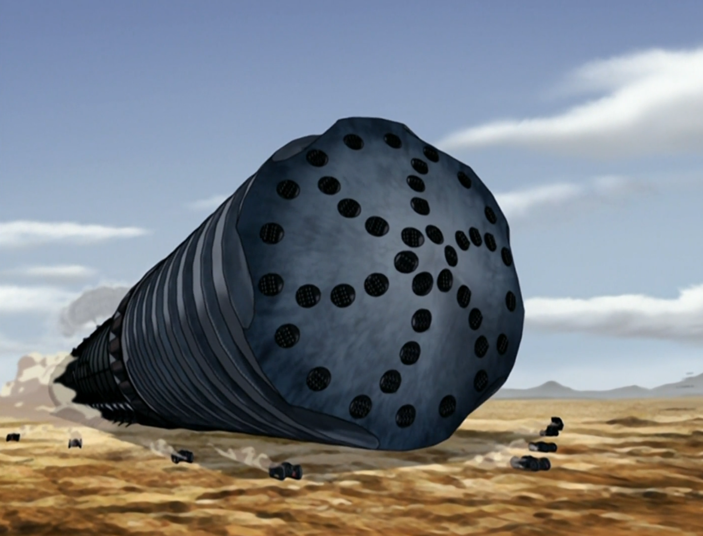

## *תקציר:*
- בשעה טובה טים אווטאר מגיעים לבה סינג סה סיטי במטרה לחפש את אפה. עוד לפני שהם מספיקים לעבור את חומות העיר החיצוניות, מתגלה איום חדש ומיידי על העיר - מקדחת מתכת ממונעת וענקית, המפוקדת על ידי אזולה וחברותיה, מנסה לחדור את החומות. בהנהגת סוקה, טים אווטאר מצליחים להשבית את המקדחה מבפנים רגעים בודדים לאחר שהיא באה במגע עם החומה החיצונית.
- בו בזמן, ג'ט מנסה לגייס את זוקו לצוות לוחמי החופש שלו. לאחר שזוקו מסרב להצטרף, ג'ט מבחין באיירו מחמם את ספל התה שלו באמצעות כשפות. ג'ט מבין שזוקו ואיירו מקורם באומת האש, וזה לא בא לו בטוב. בכלל. 

## *סיכום במשפט:*  
מזל שאומת האש לא השכילו לשכור מכונת TBM מסין

## *ראוי לציון:*
- אהבתי
- מגניב שהפתרון לאיום המקדח היה אסטרטגי ו"הנדסי" הרבה יותר מאשר קרבי. וגם המסקנה ששווה לעשות מעט נזק בהרבה מקומות מאשר הרבה נזק במקום אחד.
- הרגע הזה שמאי מסרבת לקפוץ לתוך הסליים. מעניין לראות שהיא לא לגמרי מצייתת לאזולה בעיוורון.
- איירו מפלרטט עם הפקידה בביקורת הגבולות

## *פחות התחברתי:*
- איירו קצת פזיז וזה הרגיש OOC

## *ה-MVP של הפרק:* 
סוקה

## *עתידות:*
אין לי מושג לאן הסדרה לוקחת אותנו. הגענו העירה בשלב מאוד מאוד מוקדם בעונה. מה כבר יכול להיות??

## *דירוג הפרק:*  
מעולה