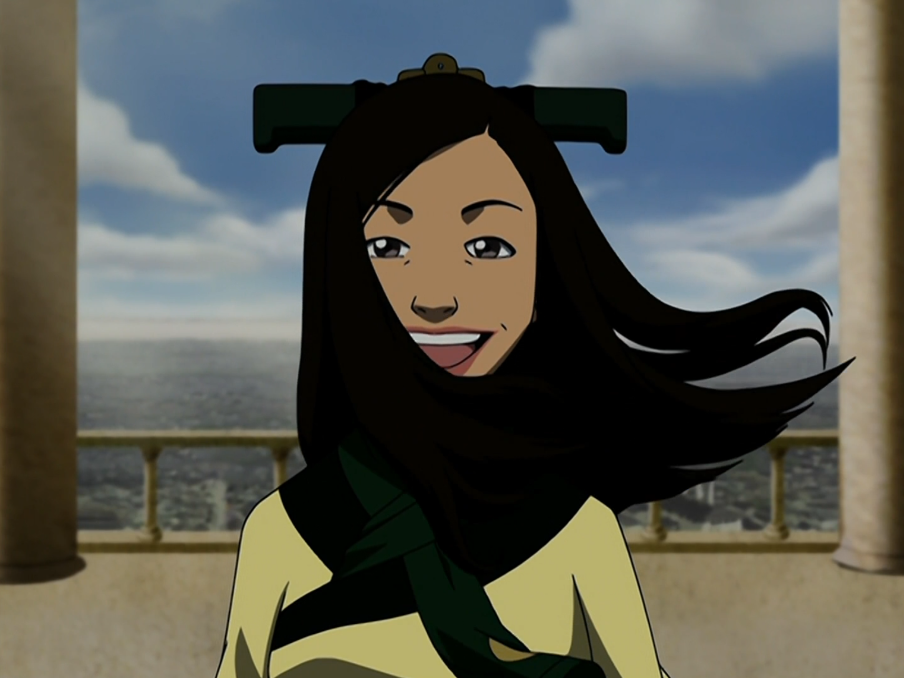

## *תקציר:*
- טים אווטאר זוכים לאירוח מפנק ולהרבה כבוד בבה סינג סה. האמנם? למרות החומות המגוננות, הם נתקלים במציאות מטרידה - מתברר כי בה סינג סה שרויה תחת משטר טוטליטרי, הבא לידי ביטוי בשליטה הדוקה, מידור, והשתקת מידע על ידי ה"דיפ סטייט" שמוביל ארגון ה"דאי-לי", שמתואר בתור "הסמכות התרבותית בעיר" אך הלכה למעשה משמש בתור משטרה חשאית. 
- החבורה מנסה להיפגש עם מלך האדמה כדי ליידע אותו על ליקוי החמה הקרוב ועל תוכניתם להביס את אומת האש, אך הם נתקלים בקשיים: התושבים המקומיים מסרבים לדבר על המלחמה, והשלטונות מנסים להעמיד פנים שהכל תקין. הם פוגשים את ג'ו די, נציגה מטעם העיר, שמפקחת עליהם ומונעת מהם לחרוג מהכללים.
- בינתיים, זוקו ואיירו מתאקלמים בעיר תחת זהותם החדשה כפליטים. אירו מתחיל לעבוד בבית תה ומתחבב על המקומיים, בעוד זוקו נאבק לקבל את חייו החדשים ושוקל האם עליו לשוב למטרתו המקורית.
- ג'ט פוקח עליהם עין, ונחוש להוכיח את זהותם ככשפי אש. חבריו זונחים אותו בטענה שהוא לא מסוגל להשתחרר מדרכיו הישנות, ועשוי לפגוע בהם.
- בסיום הפרק, החבורה מתעמתת עם לונג פנג, מנהיג הדאי-לי, וזה מאיים עליהם שלא להפר את חוקי המשטר. בנוסף, כאשר הדאי-לי אוסרים את ג'ט לאחר שתקף את זוקו ואיירו (וכשל להוכיח את זהותם), מתברר כי הדאי-לי מבצעים "חינוך מחדש" באזרחים המהווים סכנה למשטר. 

## *סיכום במשפט:*  
באיזו סדרה אני צופה

## *ראוי לציון:*
- וואו העיצוב של העיר משגע. סיקוונס הכניסה לעיר ברכבת נהדר. עבודה טובה מעצבים!
- אז אחרי המון תהיות לאיזה כיוון הסדרה תקח אותנו, מגיעה תשובה חלקית - הקרב על בה סינג סה לא הולך להיות רק נגד צבא האש, אלא גם נגד המשטר הטוטליטרי שבפנים. זה כיוון מאוד מאוד מעניין שתפס אותי לא מוכן בכלל, ונראה שהסדרה הולכת להתחייב אליו למשך לא מעט פרקים. בחירה מרתקת. 
- עיר החומות והסודות - אני אוהב את הסימבול הזה. החומות והסודות, שמתחברים מאוד עם תכונות האדמה הנוקשות, נועדו להגן על העיר מפני איומים חיצוניים - אך עוד יותר מפני איומים על המשטר מבפנים.
- ההצגה של ג'ו די ממש קריפית וטובה. סחתיין על המוזיקה ועריכת הסאונד. הצגת הדיסוננס בין חדירות המטרה של סוקה וההתעלמות של ג'ו-די מועברת נהדר באמצעות העריכה הברוטלית.
- הבדלי מעמדות בין חלקי העיר - הפרק לא מתעכב המון על הרעיון של חלוקת העיר למחוזות על פי קבוצות סוציו אקונומיות, ואכיפת תנועה ביניהם. אבל יש פה כמובן אסטרטגיית "הפרד ומשול", אמירה על הבדלי מעמדות וכו'. אין לי כל כך כוח להתעכב על החלק הזה, אבל הוא שם.
- החלק שבו זוקו אומר לאיירו שזו עיר נוראה ושהוא לא מעוניין להשתקע בה ולחיות בה כבדרך קבע, אך איירו עונה לו:"life happens whenever you are, whether you make it or not". לא יודע זה הכה בי גלים.
- איירו וזוקו עובדים בחנות התה זה ממש חמוד. אני לגמרי בעניין.
- טים אווטאר נתקלים בבירוקרטיה על מנת לפגוש את המלך, וזה כמובן נועד למנוע מהם לעשות את זה. עוד סממן חזק של משטר מדכא, ומשהו שלא ציפיתי למצוא בסדרה הזו.
- אנשים מפחדים לדבר. אין חופש ביטוי. סממן נוסף למשטר טוטליטרי וכו'. 
- בעיר לא מדברים על המלחמה. מכחישים אותה, כי בה סינג זה היא אוטופיה. אין שום דבר שקורה בחוץ. סממן נוסף למשטר טוטליטרי וכו'.
- הדוב הרגיל זה גאג טוב.
- החברים של ג'ט נוטשים אותו כי הוא לא משחרר, זה קטע שמאוד אהבתי. הרגיש לי שזה מעמיק קצת את ג'ט והטרגדיה האישית שלו - מעין חסד אחרון לדמות לפני שהסדרה בוחרת "לשרוף" את העומק האנושי שלו כדי להשתמש בו ככלי עלילתי. כלומר, מכאן והלאה לדעתי אנחנו לא נראה יותר את ג'ט כדמות שמציגה איזושהי מורכבות אישיותית, אלא כדמות שמדגימה את הרוע של משטר הדאי-לי. ואחרי הרגע הקטנטן האחרון הזה שהסדרה נותנת לו מול חבריו לשעבר, אני יחסית בסדר עם זה.
- הקרב של ג'ט מול זוקו, סיקוונס מגניב וכיפי שמביא איתו קאמבק אדיר של "לזוקו יש חרבות". זה מחזיר אותי לקרב בפרק "זוקו לבדו", שבסופו זוקו משתמש בכשפות ולמעשה חושף את זהותו. הפעם הוא הצליח לא להשתמש באש.
- הצגה מעניינת וטובה של לונג פנג, מפקד הדאי לי. לונג פנג הוא המלך דה פקטו, שכן הוא אחראי על הצבא וכל שאר משאבי העיר. המלך האמיתי הוא בסך הכל דמות ציבורית, פנים, שכן כל המידע מוסתר ממנו. הולך להיות כיף.
- הגענו לסוף הפרק, וחשבתי שראוי לדבר על בחירת עריכה מאוד משמעותית שנעשתה בו. הדבר האחרון שמראים לנו לפני שחותכים לקרדיטים הוא מה שאיתו הסדרה שולחת אותנו להמתין בציפייה לפרק הבא. הפרק מסתיים בסיקוונס של מונולוג האיום של לונג פנג, שערוך לסירוגין עם שטיפת המוח של ג'ט. זה סיקוונס מאוד חזק לטעמי, שלגמרי השאיר עליי רושם. הפרק יכל להסתיים בזה, וזה היה סיום נהדר. אבל אז מונחתת עלינו עוד תגלית אחת אחרונה - ג'ו די מוחלפת באישה אחרת, כיוון שנכשלה במשימתה למנוע מטים אווטאר להגיע אל הנשף. והאישה החדשה הזו טוענת שהיא בכלל ג'ו די בעצמה ולא השתנה בה כלום. מעניין מאוד שבמקום לסיים עם החשיפה שהדאי לי מבצע שטיפת מוח לאזרחים, בוחרים לסיים את הפרק עם החשיפה שהדאי לי מפגין אלימות בראש ובראשנה כלפי חברי הארגון, עוד לפני האלימות כלפי האזרחים. וכמובן, שג'ו די היא רעיון יותר משהיא אדם.

## *פחות התחברתי:*
- אז הפרק מתחיל ופתאום אנשים כבר לא כזה עפים על בה סינג סה. עונה וחצי מספרים לנו כמה העיר נפלאה ומדהימה, אבל ברגע שנכנסנו אליה טוף פתאום טורחת לספר שהיא אף פעם לא אהבה את העיר הזו בגלל המדיניות הנוקשה, ואנג מספר שהוא לא אוהב את העיר בגלל ההפרדה בין אוכלוסיות. ופתאום גם זוקו טוען ש-"העיר הזו היא כלא" עוד לפני שהוא חווה ממנה משהו, כלומר הוא מכיר את הבעיות עוד מבעוד מועד. סלחו לי, אבל איפה הייתם עד עכשיו עם הדעות האלו? כלומר, אין פה איזו סתירה או חור עלילתי, אף אחת מהדמויות הספציפיות האלו לא התייחסה לעיר מפורשות לפני זה. ועדיין, לא חיבבתי שהמידע הזה מגיע רק עכשיו כשמתאים. מרגיש טיפה retcon.
- ההתפלחות לנשף ולמידת נימוסים - קטע קומי חביב כשלעצמו, אך לא מאוד מעניין בהינתן המסגור הרחב של הפרק. בעיני זה פחות התאים פה.  

## *ה-MVP של הפרק:* 
ג'ו-די

## *עתידות:*
אין לי מושג קלוש. אני כבר לא יודע שום דבר.

## *דירוג הפרק:*  
אדיר