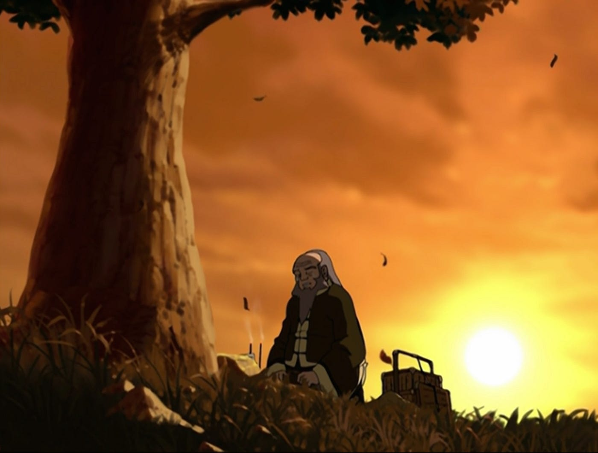

## *תקציר:*
טים אווטאר, זוקו ואיירו מתרגלים לשגרת החיים בתוך חומותיה של בה סינג סה.
הנה סיפור אחד מהעיר עבור כל דמות.

## *סיכום במשפט:*  
אפשר עוד מזה?

## *הסיפור של טוף וקטארה:*
טים אווטאר כבר תקופה בבה סינג סה והתרגלו לחיים העירוניים.
טוף וקטרה יוצאות ליום כיף בספא, מעמיקות את החברות ביניהן ומנהלות שיחה קצרה על נשיות והצורך באישור מבחוץ. זה כל מה שקורה בסיפור הזה, הוא קצר וחמוד.

## *הסיפור של איירו:*
איירו מסתובב ברחוב, נהנה מיום יפה ומפיץ טוב בכל מקום שבו הוא נמצא.
- תחילה הוא קונה זר פרחים, כשהמוכר מציע לו זר לפיקניק רומנטי איירו מסביר לו שזה לא למטרות רומנטיות אלא ל"אירוע מיוחד". לפני שהוא ממשיך בדרכו, איירו מייעץ למוכר עצה טובה לגבי הטיפול באחד מסוגי הפרחים שברשותו.
- בהמשך היום, איירו מתבונן בחנות לכלי מיתר. לפתע, מאחוריו ילד מתחיל לבכות ואימו מתקשה להרגיע אותו. איירו לוקח אחד מהכלים ומנגן ושר בפני הילד שיר קטן. זה שיר די מלנכולי אך הביצוע של איירו שמח ומלא חיים, והילד נרגע.
- לאחר מכן, איירו נתקל בחבורת ילדים שמשחקת כדורגל ברחוב, ובטעות שוברת חלון של אחד הבתים: "בדרך כלל כדאי להודות בטעויות מיד אחרי שהן קורות", איירו משתף. כשבעל הדירה מתעצבן ומתחיל לרדוף אחר הילדים איירו מסייג: "אך לא הפעם. ברחו!"
- מיד אחר כך, איירו נופל קורבן לניסיון שוד ברחוב. התגובה של איירו היא לייעץ לשודד לשפר את היציבה שלו, אבל שבעצם הוא לא כל כך נראה כמו הבן אדם שישדוד. בגילוי לב, השודד מספר לאיירו שהוא במצוקה, ואיירו עוזר לו להאמין בעצמו ולראות את דרכו בעולם.
- לבסוף, עם שקיעת השמש איירו מגיע לגבעה עם עץ בודד עליה, הרחק מהעיר. כשהוא משעין על העץ תמונה של בנו המנוח ומדליק קטורות, אנחנו מבינים שזו כנראה הנקודה המשוערת שבה בנו נהרג בניסיון הפלישה של אומת האש לבה סינג סה, ושאיירו הגיע לכאן כדי להתאבל. איירו מאחל לבנו יום הולדת שמח, ומתנצל בפניו שלא הצליח לעזור לו (בניגוד לשאר האנשים להם עזר במהלך היום). במילה "לעזור", אנחנו משערים שהכוונה היא לשחרר את בנו מהרדיקליזציה והפנאטיות שאומת האש השתיתה בו, בה הוא וכנראה שגם איירו עצמו היו מצויים באותה העת. וכמובן שאת התיקון לזה איירו עושה בכך שהוא מנסה להציל את זוקו בדיוק באותו האופן. הסיפור מסתיים כשאיירו שר בדמעות את השיר מתחילת הסיפור:
leaves from the vine
falling so slow
like fragile tiny shells
drifting in the foam
little soldier boy
come marching home
brave soldier boy
comes marching home

כעת השיר מקבל הקשר אחר לגמרי (ובעיני זה השיר הכי יפה שהופיע בסדרה בינתיים) ואנחנו מבינים שזו בעצם קינה. זה הרגע הכי מרגש שראינו בסדרה עד כה, והאימפקט משמעותי. המשחק הקולי של איירו ראוי לציון פה, הופעה עם הרבה נפח ועומק.

## *הסיפור של אנג:*
משהו עם חיות. האמת שלא מעניין במיוחד (חוץ מהופעה נוספת של מוכר הכרובים)

## *הסיפור של סוקה:*
סוקה הולך ברחוב. הסוף.
סתם לא באמת, רציתי שזה יהיה כמו הפרק האבוד של בובספוג.
בפועל, סוקה מוצא את עצמו במועדון הספוקן וורד העירוני ונקלע לדו-קרב הייקו.
זה ממש חמוד ומטומטם, ומבחינתי זה סבבה לקבל הפרק רק מסוקה החמוד והמטומטם אחרי העומק הרגשי והרצינות שקיבלנו ממנו בפרקים הקודמים.

## *הסיפור של זוקו:*
נערה שמבקרת בבית התה שבו איירו וזוקו עובדים מזמינה את זוקו לדייט. למרבה ההפתעה זוקו באמת מופיע, ובחלקו הראשון הדייט חמוד וקרינג'י. חלק בי ממש חשב שזוקו הולך להצליח עם הג'אגלינג. לבסוף, זוקו מצליח להיפתח, להשתחרר ולהתמסר לדייט. הוא אפילו נותן אמון בנערה הזרה הזו ומדליק בשבילה את הנרות סביב המזרקה (כשעיניה מכוסות). הם מתנשקים, ומיד לאחר מכן זוקו נרתע, מתנצל וחוזר הביתה לאיירו.
אפשר להניח שזוקו לא מעוניין לסכן אותה בקירבה אליו (עריק מבוקש על ידי אומת האש ואויב של אומת האדמה) ושיותר מזה, עמוק בתוככו זוקו לא מאמין שמגיעה לו אהבה, או אפילו בכלליות יותר שיקרו לו דברים טובים. אף על פי כן, בסיפור הזה בפרט ובתקופה של זוקו בבה סינג סה בכלל, אנחנו עדים לכך שהתהליך האישי שלו צובר תאוצה, ונעשית התקדמות בקצב הרבה יותר מהיר מאי פעם לפני כן: הוא נותן אמון בנערה זרה שהרגע פגש, עושה ניסיונות לחיות חיים רגילים, וממעיט להתעמת עם אנשים כל עוד הוא לא נדרש להגנה עצמית. עוד ראיה לכך היא שכשזוקו חוזר הביתה לאחר הדייט ואיירו שואל אותו איך היה הערב שלו, תחילה הוא נכנס לחדרו וטורק את הדלת בלי לענותף באופן די אופייני לו. אך מיד לאחר מכן הוא מתחרט, פותח את הדלת ועונה ברכות שהיה לו ערב די נחמד למען האמת.
זה פשוט תענוג לצפות בזוקו ובתהליך האישי שהוא עובר, ומעניין לראות איך בסדרה לילדים, הדמות שעוברת את התהליך הכי משמעותי ומעניין היא דווקא הדמות שסומנה תחילה בתור הנבל, ולאו דווקא אחת מהדמויות הראשיות.
הגיוני מאוד שהתהליך הזה מואץ במהלך השהות של זוקו בעיר, כשהוא חי בשגרה רגילה של עבודה בבית התה, מוקף באנשים, נהנה מהאורבניות של העיר, ובכללי מוריד הילוך מהמלחמה ומחיפושי האווטאר. 
הערה נוספת שפחות קשורה תמתית - בסוף הסיפור איירו קורא לזוקו, אחיינו, "הנסיך זוקו" כשהם לבדם. פתאום הבנתי שזה קורה הרבה, ומראה כמה שאיירו עושה מאמצים כדי לבוא לקראת האגו השביר של זוקו בכך שהוא משתמש בתואר שלו כנסיך האש. הרי אין שום סיבה שהוא ישתמש בתואר הזה כשהוא מדבר ישירות עם אחיין שלו, במיוחד לאור העובדה ששניהם כבר מזמן בחרו להתכחש למעמדם ולארצם.

## *הסיפור של מומו:*
מומו מתגעגע לאפה.
יש גם היתקלות קטנה בחתולים-פנתרים אבל זה לא מאוד מעניין.
בסוף הסיפור אנחנו מגלים טביעת רגל של אפה בתוך העיר - עדות לכך שהוא היה בסביבה, ולא מאוד מזמן.
מעבר לפרט הזה שנועד לקדם עלילה, זה הסיפור הכי מפתיע בעיני, ומהסיפורים שהכי אהבתי בפרק. לא טרחתי אף פעם להקדיש מחשבה לרגשות של מומו, בטח שלא לחברות שלו עם אפה מעבר לזה שהם צמד חמד קומי. בגעגוע הזה יש עצב גדול, כי בעצם עד עכשיו הספקתי כבר לשכוח שאפה חסר לנו, ושהנוכחות שלו הייתה משמעותית מעבר לפן התחבורתי שבה.
וגם יש קאמבק מבורך של המומו POV

## *רשמים כלליים:*
- הפרק הזה מספק לנו הזדמנות יחסית נדירה לראות כל אחת מהדמויות לבדה, ללא שאר הדמויות הראשיות. זה לא דבר שאנחנו מקבלים בדרך כלל. 
- הפרק הזה עושה עבודה מעולה בלהציג לנו את העיר בה סינג סה כדמות. בפרקים הקודמים ראינו רק את החרא של הדאי לי, אבל פתאום אנחנו נחשפים לקסם של העיר שקיים עם זה במקביל ובאין מפריע. לא סתם פגשנו הרבה דמויות עם סנטימנטים מאוד חיוביים כלפי העיר הזאת. הפרק הזה מבסס את בה סינג סה כמקום אורבני, מקום בו יש מפגשים בין אנשים, מקום בו יש סיפורים בכל פינה. בקיצור, מקום שיש בו חיים. חיים מורכבים, עם החרא והקסם שבעיר. אחלה דרך לבדל את בה סינג סה משאר הכפרים בהם ביקרנו בעבר.

## *ה-MVP של הפרק:* 
מומו

## *עתידות:*
זוקוווווווווווווווווווווווווו

## *דירוג הפרק:*  
אדיר