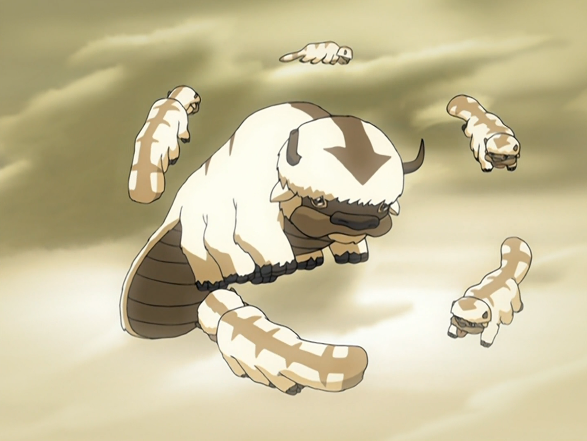

## *תקציר:*
הפרק נגלה מה קרה לאפה מאז שנחטף על ידי פרחחי המדבר בפרק "הספרייה", ועד ההווה. 
- לאחר שנחטף, אפה נמכר לקרקס של אומת האש, שם מתייחסים אליו באכזריות, בהשפלה, ומנסים לאלפו - דבר שגורם לו לפתח פחד טראומתי מאש. הוא מצליח להימלט בעזרת ילד קטן שמזכיר לו את אנג.
- משם אפה מנסה לחפש את אנג, אך נאלץ להתמודד עם סכנות רבות בדרכו, כולל מפגשים עם חיות בר ומצבים שמעמידים את כוחו הפיזי והנפשי במבחן. לאורך המסע, אפה חווה געגועים עזים לאנג ולחבורה, וזיכרונות מהקשר שלו עם אנג משמשים כמוטיבציה להמשיך הלאה. 
- בשלב מסוים, אפה נתקל בלוחמות הקיושי. סוקי ושאר הלוחמות מטפלות באפה ומנסות להגן עליו, אך מותקפות על ידי אזולה וחברותיה. אפה נאלץ לברוח שוב כדי להימנע מליפול לידיים הלא נכונות.
- אפה חוזר לבית ילדותו במקדש האוויר המזרחי, שם גודל עם שאר אחיו הביזונים על ידי אימם. הוא מופתע למצוא שם את גורו פאטיק, נצר נוסף לנוודי האוויר שהצליח לשרוד. פאטיק מספר שלפני שנים רבות קיבל חיזיון לפיו הוא עתיד לפגוש את האווטאר ולעזור לו. מאז הוא מחכה לאנג במקדש האוויר המערבי. פאטיק מנחם את אפה ומראה לו היכן למצוא את אנג - בבה סינג זה כמובן - לא לפני שהוא משאיר אצל אפה מגילה עם הודעה עבור אנג.
- הפרק מסתיים כשאפה מגיע לבא סינג סה, עייף ופצוע, ומשאיר רמזים לחבורה על מקום הימצאו. עם זאת, הוא נלכד על ידי הדאי-לי.

## *סיכום במשפט:*  
פרק מצוין אבל נוראי

## *ראוי לציון:*
 - הפרק הזה הוא בחירה אמיצה של הסדרה, מכמה סיבות. קודם כל, באפה יש משהו מאוד תמים וטוב. הוא מעולם לא הרע לאף אחד. הסדרה אוהבת את הדמות הזו, ולמרות זאת היא לא מפחדת להעביר אותו סבל ודברים קשים. זה גורם לכך שעל אף שהחוויות הקשות שהוא עובר יחסית מרוככות ולא מאוד מאוד קיצוניות, הפרק עדיין קשה יחסית לצפייה. עצוב לראות אותו סובל. באופן הזה, למרות שגם ככה תמיד הייתי בעד זכויות של בעלי חיים, הסדרה הצליחה לחזק מאוד את העמדה הזו ולהדגיש את החשיבות שלה.
- בנוסף, זו בחירה מאוד אמיצה להראות פרק שלם מנקודת מבטה של דמות שהיא בכלל בעל חיים שאינו מדבר. אפה לא צריך לדבר בשביל שנבין בדיוק מה הוא מרגיש, חושב ורוצה. עבודה טובה של האנימטורים. הפרק הזה גם מבסס את אפה כדמות עם עומקים, ילדות, פחדים, רגשות, קשיים, היסטוריה ומשפחה - אספקטים אצלו שבאמת אף פעם לא מאוד ייחסתי אליהם חשיבות. בעיקר, נפלה אצלי קשה התובנה שאף פעם לא חשבנו על זה שבדיוק כמו אנג, גם אפה איבד את כל החיים שהוא הכיר במהלך מאה השנים בהן היה קפוא בקרחון. גם הוא בודד, וחולק את הסנטימנט הזה עם אנג. למעשה, אצלו המצב אפילו יותר קיצוני, כי עד כמה שאנחנו יודעים אפה הוא האחרון מהמין שלו.
- גם מעניין לראות איך הפרק מציג לנו קצת יותר את מעמדם של ביזוני האוויר בחברת נוודי האוויר. ביזון נייד לכל תלמיד.
- ההופעה של לוחמות הקושי בפרק הזה מאוד מעניינת. כשסוקי אומרת שלהחזיר את אפה לאנג עשויה להיות המשימה הכי חשובה שלהן אי פעם, אני באמת מאמין לה. זה רגע שמאוד מחזק את ההבנה שאנג הוא התקווה הכי גדולה של העולם במלחמה הזו. 
- הקרב של לוחמות הקיושי מול טים אזולה מייצר הרבה נקודות מעניינות. החל מזה שאזולה וחברותיה מביסות את הלוחמות בקלות, וכלה בחילופי הדברים ביניהן והדיאלוגים תוך כדי הקרב. זה גם מאוד מחזק את התחושה שאזולה איום רציני. פתאום היא מופיעה כשממש לא ציפינו לה, ומסבכת הכל. הקיום שלה הוא בעיה.
- גורו פאטיק נראה דמות מאוד מעניינת. הוא עוד ישוב. 
- איירו רואה את אפה בדרך לבה סינג סה, ונלחץ. זה רגע ממש מגניב, עד כמה שידוע לו האווטאר מעולם לא איבד את הביזון שלו, מה שאומר שטים אווטאר גם הם בדרכם לבה סינג סה. איירו לא מעוניין שזה יסיח את זוקו ויפריע לתהליך שלו, ולכן הוא מסתיר את זה ממנו. 
- חרא על לונג פנג. עכשיו זה confirmed שהוא חטף את אפה. נבלה. 

## *פחות התחברתי:*
- לא נהניתי, פרק קשה לצפייה.

## *ה-MVP של הפרק:* 
אפה

## *עתידות:*
בבקשה שנמצא את אפה בפרק הבא

## *דירוג הפרק:*  
מעולה