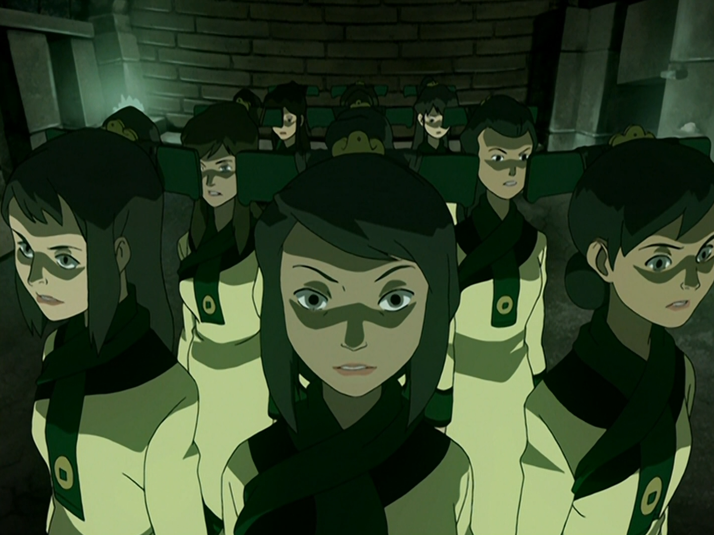

## *תקציר:*
- טים אווטאר ממשיכים לחפש את אפה בבה סינג סה. בעודם מנסים לאתר רמזים, הם נתקלים בג'ט מבלי לדעת שעבר חינוך מחדש בידי מועצת הדאי-לי. למרות המטענים ביניהם, ג'ט מצליח לשכנע את החבורה שהוא מעוניין לעזור להם למצוא את אפה.
- במהלך החיפושים, החבורה מתאחדת עם לוחמי החופש של ג'ט, שכן הם דואגים לו. יחד הם מגלים שהדאי-לי מפעילה מתקן סודי בשם "אגם לאוגאי" המשמש לכליאת אויבי השלטון ולשטיפת מוח של תושבים. ג'ט, שנפל קורבן לשטיפת המוח הזו, נאבק בזיכרונותיו ונקרע בין אמיתותיו לבין הפקודות שקיבל ממועצת הדאי-לי. לאחר מכן החבורה מתעמתת עם אנשי דאי-לי ומגלה שגם אפה מוחזק באגם לאוגאי.
- במקביל, גם זוקו מגלה את מיקום כליאתו של אפה ומצליח להגיע לשם לפני החבורה. בעודו מביט באפה, לפתע מופיע איירו ובפעם הראשונה בסדרה מעמת את זוקו ישירות עם שאלות לגבי הזהות שלו, השאיפות שלו, תפיסתו העצמית ודרכי הפעולה שלו - עימות שמניע את זוקו להחליט לשחרר את אפה.
- בו בזמן אנג מתעמת עם לונג פנג. בקרב המתחולל, ג'ט מקריב את עצמו כדי לאפשר לחבורה להימלט מאגם לאוגאי. מהר מאוד חיילי הדאי-לי מכתרים את טים אווטאר מחוץ למתקן, וברגע האחרון אפה מגיע ומציל אותם. האיחוד בין אפה והחבורה מרגש. עם זאת, התחושה המרירה של אובדן ג'ט והגילוי על השליטה האפלה בעיר משאירים אותם נחושים יותר מתמיד לחשוף את האמת בבה סינג סה ולהתכונן למאבק מול אומת האש.
- הפרק מסתיים כשזוקו מחליט לזנוח את זהותו כרוח הכחולה.

## *סיכום במשפט:*  
מלך האדמה הזמין אותך לאגם לאוגאי

## *ראוי לציון:*
 - זה פרק עם הרבה התרחשות, אירועים וסגירות קצוות, לחלקם חיכינו כבר הרבה זמן
 - הדאי לי מלחיצים רצח, והסדרה מצטיינת בלצייר אותם כמשטר מטורלל וחסר רחמים. האימג' של חדר הג'ו-די (בתמונה) בלתי נשכח. הסדרה מצליחה מצד אחד להפתיע בכמה שהיא הולכת רחוק עם הדאי לי, אבל מצד שני להישאר בתחום ה-PG.
 - בנוסף לדאי לי, אגם לאוגאי עצמו מעוצב מגניב ומרגיש מאוד מקורי, ועם זאת מרגיש כמו מקום שאנחנו לא רוצים להישאר בו אפילו לעוד דקה.
 - אחת ההפתעות שהכי אהבתי היא שהפרק מעניק אחלה סיום עבור ג'ט. הנחתי שהסדרה תזנח אותו, אבל הכותבים הצליחו להתקין במעט מאוד זמן ריצה קלוז'ר מכובד גם לדמות, וגם למטענים הלא פתורים שלו עם שאר הדמויות.
 - עוד אלמנט שאהבתי הוא שיתוף הפעולה של טים אווטאר + טים ג'ט. מתברר שהגיוון בקבוצת הדמויות והדינמיקות החדשות מאוד כיפי.
 - העריכה של סיקוונס הפריצה לאגם לאוגאי מצוינת, וההטעיה המכוונת עם המיקום האמיתי של אפה מעלה משמעותית את מפלס הלחץ ואת תחושת הסיכון. 
 - שמתי לב שבקרב הראשון מול לונג פנג והדאי לי, יש המון דגש על כך שהדמויות מגנות אחת על השנייה מתקיפות. כמה וכמה פעמים הסדרה מתמקדת באירועים כאלה. כיף לראות איך הדמויות לומדות להילחם זו לצד זו כקבוצה. מורגש שיש המון מחשבה על כיאורוגרפיית הקרב.
 - סוף סוף התאחדנו עם אפה. אנחנו בלעדיו שבעה פרקים, כמעט חצי מהעונה. זה פרק זמן מאוד משמעותי מבחינת משך הסדרה, וזה גורם לאיחוד להיות הרבה יותר אמוציונלי ומספק. עם זאת, התחושה בה מסתיים הפרק היא דווקא של מרירות, עכשיו כשאנחנו קולטים מה סדר הגודל של מזימת הדאי לי. 
 - בתחילת הפרק איירו מקבל חנות תה משל עצמו, ואני לגמרי מושקע בזה. אני ממש אוהב כל מה שקשור לאיירו וזוקו בחנות התה, ושרק יתנו לי עוד מזה. 
 - בפרק הזה אנחנו גם מקבלים את הפעם ראשונה בה איירו מתעמת ישירות עם זוקו - לגבי היעוד שלו, הרגשות שלו, ההערכה העצמית שלו והפזיזות שלו. זאת סצנה מטורפת, והיא מקדמת את זוקו צעד נוסף ומשמעותי במסע שלו. היא גם מובילה לסגירת מעגל משמעותית כשזוקו בוחר לוותר על זהותו כרוח הכחולה.
 - עם זאת, למרות ההתקדמות המרשימה של זוקו, התהליך שלו מרגיש מאוד שביר. כאילו כל הפרעה הכי קטנה עשויה להחזיר אותו צעדים רבים אחורנית. יש בזה משהו מאוד אמין אבל גם מורט עצבים.

## *פחות התחברתי:*
- אגרופי האבן של הדאי לי ויזואלית קצת החליקו קשה בגרון.
- זוקו ואיירו פשוט מופיעים בלי בעיה באגם לאוגאי, אחרי שראינו שכדי להיכנס נדרשת עבודה של כשף אדמה

## *ה-MVP של הפרק:* 
באמת שכולם

## *עתידות:*
לונג פנג עדיין at large

## *דירוג הפרק:*  
מגה זורד