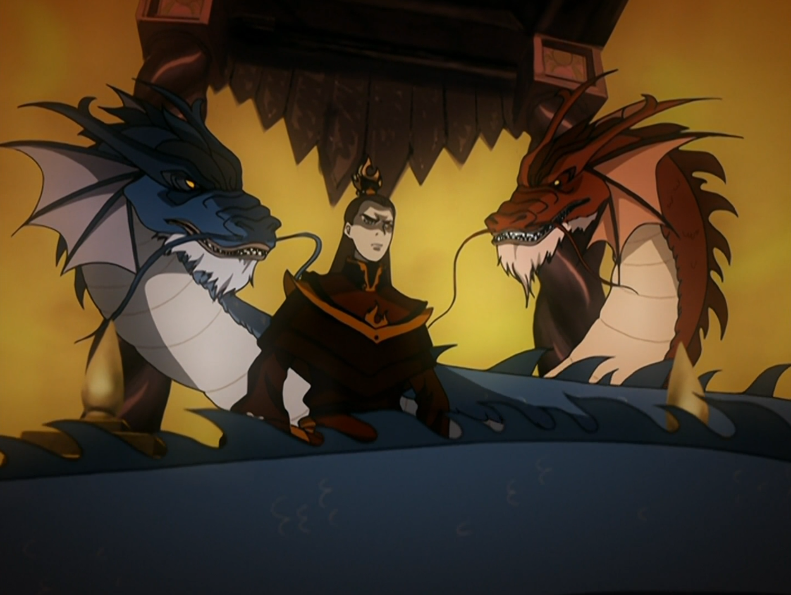

## *תקציר:*
- טים אווטאר מחליטים להתעמת ישירות עם מלך האדמה כדי לחשוף בפניו את השחיתות בעיר ואת השליטה של לונג פנג ומועצת הדאי-לי. לשם כך הם פורצים לארמון המלכותי ונלחמים בכוחות המשמר עד שהם מצליחים להגיע אל המלך. הם מגלים שהוא היה מבודד מהמציאות על ידי לונג פנג, שהסתיר ממנו את המלחמה עם אומת האש.
- רוב הפרק מועבר בכך שהחבורה מנסה לשכנע את המלך לגבי טענותיה, ומנסה לספק הוכחות.
- לבסוף מלך האדמה משתכנע ומורה לאסור את לונג פנג
- במשרדו של לונג פנג מוצאים מכתבים שנשלחו אל החבורה מההורים של סוקה, קטארה וטוף. החבורה מחליטה להתפצל - אנג וסוקה נוסעים עם אפה לחפש את אביהם של סוקה וקטארה, בעוד טוף וקטארה נשארות בעיר - גם כדי לפקוח עין וגם כי במכתב שקיבלה טוף נטען שאימה מחכה לה בעיר.
- עם זאת, מתברר כי המכתב שנשלח אל טוף היה מזויף, והיא נפלה למלכודת שטמנו לה הביריונים שנשלחו על ידי הוריה כדי לחפשה. אמינות המכתב מאבא של סוקה וקטארה עדיין לא ידועה.
- בסיום הפרק מתברר כי מועצת הדאי-לי עדיין נותרה נאמנה אל לונג פנג למרות כליאתו.
- כמו כן, אזולה וחברותיה מגיעות העירה מחופשות ללוחמות הקיושי, ומלך האדמה מכניס אותן לארמון
- במקביל, זוקו עובר משבר זהות עמוק בעקבות חוויותיו האחרונות. לאחר ששחרר את אפה, הוא חווה חום גבוה וחלומות מוזרים, שמסמלים את המאבק הפנימי שלו בין דרכו הישנה לבין חיים חדשים.

## *סיכום במשפט:*
זוקו אכל קוקוס ומוצריו לפני השינה

## *ראוי לציון:*
 - אקשן לא רע בתחילת הפרק. קצת מביך לממלכת האדמה שככה ארבעה ילדודס מתגברים על הצבא ומגיעים עד המלך
 - הטוויסט עם אזולה היה ממש לא צפוי! מצוין.
 - כבר שכחתי מהטמבלים שרודפים אחרי טוף. הסטאפ לזה היה ממש מזמן.
 - אני מאוד אוהב את דימוי המחלה שזוקו חולה בה, בעיקר את איך שזה מחבר בין הנפש של זוקו לבין הגוף - הקונפליקט הפנימי שקורע אות ליטרלי עושה אותו חולה. כדי לבנות מחדש חייבים להרוס קודם את מה שהיה.
 - פתאום קלטתי ש-Azul=כחול. זה כמובן מתחבר עם הברקים והאש הכחולה של אזולה. מעניין שהצבע שמייצג אותה זה הכחול ולא צבע שיותר מזוהה עם אש. זה כאילו האש האדומה מייצגת זעם, כעס ופחד, ואילו האש הכחולה מייצגת רוע טהור ושיטתיות. בחירה מאוד מעניינת של הסדרה, שמבדילה אותה מכשפי אש קלאסיים.
 - באופן כללי, מבחינה סיפורית אלו ממש לא המקומות אליהם ציפיתי שהעונה תיקח אותנו. מאוד מגניב שהסדרה לא מקבעת את עצמה אל פורמט ספציפי, ובוחרת לעסוק בסיפור שיחסית עומד בפני עצמו ושאינו חלק מהתמונה הגדולה, אבל מאוד חשוב עבור ההמשך. זה עושה את בה סינג סה למאוד משמעותית בעולם של הסדרה.
 
## *פירוש חלומות:*
 - בחלום הראשון של זוקו אנחנו רואים אותו בתור הפיירלורד, יושב על כס המלכות בארמון האש. פניו בלי הצלקת ושיערו ארוך. לצידו מצויים זוג דרקונים - כחול ואדום. הדרקון האדום מדבר בקולו של איירו, והדרקון הכחול מדבר בקולה של אזולה (עקבי עם קידוד הצבע שלה אליו התייחסנו קודם לכן). הדרקונים לוחשים מנטרות באוזניו של זוקו, ממש כמו דמויות המלאך והשטן בסרטים מצוירים. הדרקונים מציירים עבורו ייעודים הפוכים: החזון של אזולה - ייעודו של זוקו הוא לרשת את כס האש ולהמשיך את המלחמה והכיבושים. מנגד החזון של איירו - זוקו נועד להיות שליט האש שיבטל את המלחמה ויושיע את אומת האש, ואת שאר העולם, מהסבל. עד עכשיו קיבלתי את הרושם שמבחינת הסדרה, זוקו יצטרך לוותר לחלוטין על תואר המלוכה ולהבין שהמסגרת הרעילה הזו לא מתאימה לו. ועכשיו הבנתי שהכיוון שאליו הסדרה הולכת הוא הרבה יותר דרמטי וחשוב - הייעוד של זוקו הוא בעצם להושיע את אומת האש מהפנאטיות וממנהיגים חמומי מוח.
 - בחלום השני זוקו רואה את עצמו בתור אנג. זה עשוי לסמל שזוקו מבין שכל מה שהעסיק אותו, כל הזהות שהוא אימץ לעצמו, היא תפיסת האווטאר. הוא מבין שהוא איבד את עצמו במרדף אחר האווטאר שהוא למעשה המרדף אחר הזהות העצמית שלו. כל זה מתחבר לאמירות של איירו לגבי זהות - זוקו חייב להבין מי הוא. פרשנות נוספת לכך עשויה להיות שגורלו של זוקו שזור בגורלו של האווטאר, אך לא בהכרח בהקשר בו הוא האמין עד כה.

## *פחות התחברתי:*
- לטעמי מלך האדמה השתכנע בקלות מדי, במיוחד ביחס למישהו שהדאי לי טיפחו את בורותו במשך כל כך הרבה שנים
- כל הקטע שמלך האדמה רוכב על אפה מרגיש כמו מחדל אבטחתי של ממלכת האדמה

## *ה-MVP של הפרק:* 
סוקה

## *עתידות:*
אזולה הולכת לגלות על ליקוי החמה ועל תכניתו של סוקה.
מנגד, בסוף הפרק הבא זוקו כבר יחבור אל טים אווטאר.

## *דירוג הפרק:*  
אדיר