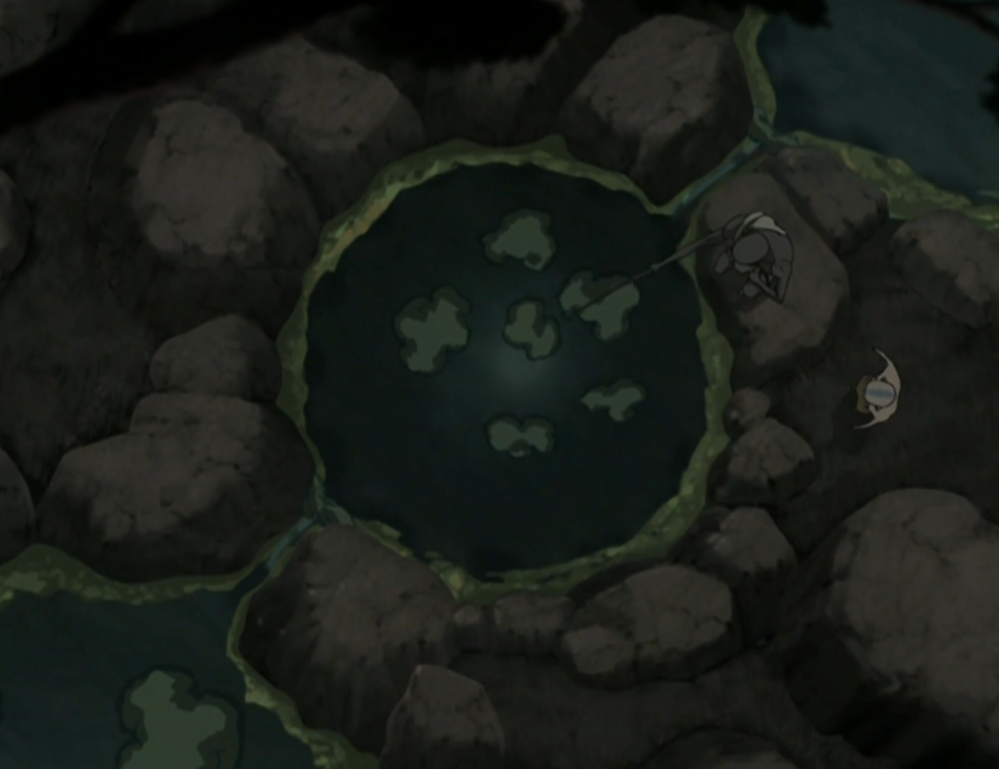

## *תקציר:*
- אנג נפגש עם גורו פאטיק כדי ללמוד לשלוט במצב האווטאר. אנחנו מקבלים את סיקוונס פתיחת שבע הצ'אקרות.
- אזולה מתכננת לכבוש את בה סינג סה מבפנים על ידי ביצוע הפיכה שלטונית - באמצעות השתלטות על הדאי לי. כדי לעשות זאת אזולה משחקת בלונג פנג וגורמת לו להציע לה את הרעיון הזה מיוזמתו.
- סוקה ואביו בזמן איכות משותף, מגלים שהם בעצם די דומים (המצאות מגוחכות והומור עקום)
- חנות התה של איירו משגשגת, וזוקו מאושר מהצלחתו של דודו.
- קטארה מגיעה לחנות התה וכף היא מגלה שזוקו ואיירו בעיר. היא רצה לספר למלך אבל מוצאת בארמון את אזולה וחברותיה בתחפושת הקיושי. היא מספרת להן שזוקו ואיירו בעיר והן בתגובה לוכדות אותה.
- טוף, שנלכדה על ידי הטמבלים שהוריה שלחו כדי להחזיר אותה, ממציאה את כשפות המתכת ומצליחה לברוח מהכלוב שבו הוחזקה.
- אנג רואה חיזיון של קטארה שנלכדה, ולכן לא פותח את הצ'אקרה האחרונה. הוא עוזב מיידית את הגורו כדי לחלץ אותה, ובדרך אוסף את סוקה מהמחנה של לוחמי המים.
- בסוף הפרק אזולה "מופתעת" כשהיא נחטפת על ידי הדאי לי ונלקחת אל לונג פנג. לונג פנג הקלולס "מציע לה" דיל לשתף פעולה כדי לבצע הפיכה בשלטון בה סינג סה.
- ולסיום, איירו הוזמן להגיש תה למלך האדמה וזה כמובן שקר של הדאי לי כדי להביא אותו ואת זוקו לארמון ובכך ללכוד אותם.

## *סיכום במשפט:*
דברים מתנקזים לקראת סיום העונה

## *סוקה וזוקו:*
- הפרק נפתח עם שני איחודים משפחתיים משמעותיים: זוקו ואיירו מצד אחד, וסוקה ואביו, האקודה, מצד שני. זוקו נראה אדם חדש לגמרי — מלא חיים, תקווה, נימוס ושמחה — בעוד חנות התה של איירו משגשגת, מה שממלא את שניהם באושר. החיבור ביניהם מרגש במיוחד, וזוקו אפילו נראה מאושר עבור הצלחתו של דודו, שינוי שיכול להיראות מעט קיצוני  ביחס לפרק הזמן הקצר שעבר, אך משתלב היטב בסיפור.
- במקביל, סוקה מתאחד סוף-סוף עם אביו ברגע שחיכינו לו זמן רב. הם מבלים זמן איכות יחד ומגלים עד כמה הם דומים, במיוחד בחוש ההומור העקום ובהמצאותיהם המגוחכות, מה שהופך את הקשר ביניהם לחזק אפילו יותר. הרגעים הקלילים הללו מאזנים היטב את הדרמה והרגש שבפרק ומוסיפים לו עומק נוסף.
- שתי הסצנות האלו מוצגות אחת אחר השנייה, מה שמדגיש את הניגוד בין מערכות היחסים המשפחתיות של סוקה וזוקו: בעוד סוקה מתקבל בחום וגאווה על ידי אביו, זוקו נושא צלקות מהקשר הרעיל עם אביו. במהלך הסדרה ראינו שתי סצנות כמעט זהות, כאשר שניהם נכנסים לאסיפת מלחמה המנוהלת על ידי אבותיהם — אך בעוד האקודה מקבל את סוקה באהבה ומתגאה בו, אוזאי שורף לזוקו את הפנים.
- נוסף על כך, ישנה הקבלה מעניינת בין סוקה לזוקו גם מבחינת המעמד: בסוף עונה 1, סוקה סיפר לנסיכה יואה שבשבט המים הדרומי הוא סוג של נחשב ל"נסיך" — וכשחושבים על זה, זה די נכון, גם אם לא מרבים לחשוב על זה, שכן האקודה הוא צ'יף השבט. לעומת זאת, זוקו הוא נסיך האש המנודה, אשר נמצא במסע מורכב של חזרה בתשובה. השינוי החיובי שהוא עובר בפרק הזה מעיד על כיוון חיובי.

## *אזולה והדאי-לי:*
- מלך האדמה חושף בפני אזולה את סוד ליקוי החמה, והיא, למרות ההפתעה, מצליחה לשמור על קור רוח ולנצל את המידע לטובתה. היא מנחה את מאי וטאי-לי לדבר בקול רם על תוכניותיהן בכוונה, כדי שהדאי לי ישמעו – חלק מהאסטרטגיה המחושבת של אזולה. היא לא מתכוונת לרדוף אחרי לונג פנג, אלא לגרום לו להגיע אליה, ולהפעיל אותו בצורה שתשרת את מטרותיה.
- כאשר הדאי לי "חוטפים" את אזולה ולוקחים אותה ללונג פנג, היא מגיבה בהעמדת פנים מושלמת – מופתעת ולא מודעת למתרחש, בדיוק כפי שתכננה. לונג פנג, בתמימותו, מציע לה דיל לשיתוף פעולה בהפיכה נגד שלטון בה סינג סה, מבלי להבין שהוא זה שנופל למלכודת.
- התחכום של אזולה מרשים במיוחד – היא לא רק שולטת במצב, אלא גם מסובבת את הדאי לי על האצבע הקטנה שלה. הדרך בה היא מביימת את חטיפתה, גורמת לדאי לי ולונג פנג להרגיש בשליטה, בעוד בפועל היא זו שמושכת בחוטים – מאוד מרשימה. וכל זה כשהיא רק בת 14!

## *קטארה:*
- בישיבת הגנרלים בתחילת הפרק, קטארה חושפת צד קליל והומוריסטי, וזה תענוג לראות אותה כך. הרגעים האלו מוסיפים עומק לדמותה ומאזנים את הרצינות והדרמה שסובבות אותה בדרך כלל.
- מאוחר יותר, היא נכנסת לחנות התה ומגלה שם, להפתעתה, את שני האויבים הגדולים שלה – זוקו ואיירו – מכינים תה בנחת. מצחיק לדמיין מה עבר לה בראש באותו רגע. במקום להתעמת איתם, היא בוחרת באופציה הרציונלית ובורחת, אבל זה דווקא מאכזב מעט—העימותים בינה לבין זוקו תמיד מספקים, והדינמיקה ביניהם היא אחת מהחזקות בסדרה.

## *פתיחת שבע הצ'אקרות:*
למעשה סיקוונס פתיחת הצ'אקרות היא מעין טיפול פסיכולוגי מואץ מאוד שגורו פאטיק מעביר את אנג, תחת הרציונל שהנפש של אנג חייבת להיות שלמה וטהורה כדי שהוא יוכל לשלוט במצב האווטאר. אנחנו מקבלים אפיון פסיכולוגי מקיף מאוד של אנג, כולל התייחסות להרבה דברים שכבר דיברנו עליהם קודם לכן בסדרה:

### *1. צ'אקרת האדמה*
ממוקמת בבסיס עמוד השדרה, מתמודדת עם הישרדות - נחסמת על ידי פחדים:
- זוקו בדמות הרוח הכחולה (כמובן עם שתי החרבות שלו שלופות) מסתער אל עבר אנג (פרק 113)
- קטרה טובעת אל תוך האדמה על ידי גנרל פונג (פרק 201)
- השביט של סוזין מגיע (חיזיון שראינו לראשונה בפרקים 107-108)
- אנג עצמו מאבד שליטה וזורע הרס במצב האווטאר (פרק 201)
- העימות הסופי העתידי מול פיירלורד אוזאי (חיזיון חדש)
על מנת לפתוח את הצ'אקרה, אנג מוכרח לשחרר את פחדיו ולתת להם לזרום החוצה ממנו.

הפחדים של אנג הם בעיקר להיות מאולץ להתעמת עם אנשים ולפגוע בהם, וכן לפגוע בשגגה בקרוביו.

### *2. צ'אקרת המים*
מתמודדת עם עונג - נחסמת על ידי אשמה:
* אנג בורח ממקדש האוויר הדרומי כשהוא מגלה שהוא האווטאר (פרק 112)
- האנשים הרבים שאנג פגע בהם (דוגמה מפרק 201)
על מנת לפתוח את הצ'אקרה, אנג מוכרח לקבל את המציאות שהדברים האלו קרו, שהם נחלת העבר, ולא לתת להם להרעיל את האנרגיה שלו. אם הוא מעוניין להשפיע על העולם לטובה, הוא מוכרח לסלוח לעצמו.

האשמה של אנג היא בעיקר על כך שלדעתו לא עזר לאנשים להם היה מסוגל לעזור - אפילו כשבחלק מהמקרים זה לא באמת נכון.

### *3. צ'אקרת האש*
ממוקמת בקיבה, מתמודדת עם כוח רצון - נחסמת על ידי בושה:
* אנג פוגע בקטארה עם כשפות אש (פרק 116)
אנג מוכרח לקבל על עצמו את היותו האווטאר, ולהשלים עם כך שכפועל יוצא מזה הוא גם כשף אש.

הדברים בהם אנג מתבייש מאוד דומים לדברים מהם הוא מפחד - פגיעה באנשים ובמיוחד בקרוביו. הוא מתבייש בהיותו כשף אש, שכן לדעתו האש ביסודה פוגעת ומכלה.

### *4. צ'אקרת האוויר*
ממוקמת בלב, מתמודדת עם אהבה - נחסמת על ידי אבל:
* אנג רואה חיזיון של כל נוודי האוויר שנטבחו (פרק 103)
אנג מוכרח להבין שלמרות שחווה אובדן רב, האהבה שאותם אנשים אהבו אותו נשארה איתו ליבו ולכן לא נעלמה מהעולם. יתרה הלאה אל אנשים נוספים. מכך, אהבה זו עוברת לידה מחדש כאשר אנג נעזר בה וממשיך לדבר בשפת האהבה - מעביר אותה הלאה.

הרגע שבו פאטיק "פותר" עבור אנג את תחושות האבל שהוא סוחב איתו היה מאוד יפה ומרגש, ואני חושב שאנג היה צריך את זה כבר הרבה זמן.

### *5. צ'אקרת הקול*
ממוקמת בגרון, מתמודדת עם אמת - נחסמת על ידי שקרים:
* אנג לא מספר לחבריו שהוא האווטאר (פרק 101)
אנג מוכרח להבין שהוא לא יכול לשקר לעצמו לגבי טבעו - עליו לקבל את היותו האווטאר

### *6. צ'אקרת האור*
ממוקמת במרכז המצח, מתמודדת עם תובנה - נחסמת על ידי אשליה:
* האשליה הגדולה ביותר בעולם היא אשליית ההפרדה - דברים שאנחנו חושבים שהם נפרדים ושונים, הם למעשה אחד ואותו הדבר - ארבע האומות המפוצלות הן בעצם צבר אנושי אחד. הכל מחובר. אפילו החלוקה ליסודות - הם למעשה ארבעה חלקים של אותו השלם.

זה אלמנט של הסדרה שקצת ציפיתי שנגלה מתישהו. היה מגניב לגלות שזה נכון, אחרי שלאורך כל הסדרה נרמז לנו שכשפים יכולים לזוז מעט ימינה ושמאלה מהתווך היסודי שלהם, באופן שמאפשר כשפות לבה, עננים, קרח, חול, בוץ וצמחים. זה קצת כמו מה שדיברנו עליו בפרק של הביצה, רק שהפעם קיבלנו את זה באופן הרבה יותר אבסטרקטי ויסודי. זו הייתה בחירה מצוינת להדגים את עיקרון זה על ידי הסיקוונס שבו טוף ממציאה את כשפות המתכת.

### *7. צ'אקרת המחשבה*
ממוקמת בקודקוד הראש, מתמודדת עם אנרגיה קוסמית טהורה - נחסמת על ידי חיבור לקרקע:
* מה שמחבר את אנג לקרקע היא האהבה שלו לקטארה
אנג לא מוכן לשחרר את אהבתו לקטארה ובוחר לא לפתוח את הצ'אקרה האחרונה.

הוא רואה חיזיון שבו נראה שקטארה בצרה, והוא עוזב מיידית את מקדש האוויר ואת גורו פאטיק כדי לסייע לה.

## *פחות התחברתי:*
- רק דבר אחד קטנטן - הייתי מעדיף אם סיקוונס פתיחת הצ'אקרות היה רציף. הקאטים ממנו אל שאר הסיפורים די הפריעו, אבל זה באמת סוג של הכרח. 

## *ה-MVP של הפרק:* 
אנג

## *דירוג הפרק:*  
מגה זורד