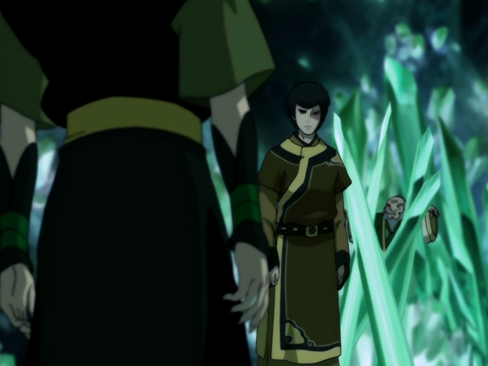

## *תקציר:*
- סוקה ואנג חוזרים לבה סינג סה כדי להציל את קטארה. הם מתאחדים עם טוף
- אזולה מעוררת השראה בקרב חברי הדאי לי באמצעות מנהיגותה וכוחה. מבחינתה הימצאותם של איירו וזוקו בעיר היא "קצה לא פתור"
- איירו וזוקו מגיעים נרגשים לארמון כדי להגיש תה למלך. איירו אומר שדרכיו של הגורל מצחיקות, שכן כעת הוא סוגר מעגל: בפעם הקודמת שלו בעיר הוא ניסה לכבוש אותה ואיבד את בנו, וכעת הוא חי פה בשלווה ויש לו חנות תה משל עצמו, שקיבלה את הכבוד להגיש תה למלך.
- אנג משקר לטוף ולסוקה ואומר להם שהוא הצליח ללמוד לשלוט במצב האווטאר. כזכור, זה לא נכון - הוא עזב את גורו פאטיק לפני שהוא פתח את הצ'אקרה האחרונה.
- איירו וזוקו מחכים בארמון זמן רב לבואו של המלך, ומבינים שמשהו לא בסדר כשחיילי דאי לי מגיעים לקבל את פניהם, ומקיפים אותם. לפתע אזולה מופיעה וחושפת את המזימה - "פגשת כבר את הדאי לי? אמנם הם כשפי אדמה, אבל יש להם אינסטינקט רצחני שהוא כל כך כשפות-אש. אני פשוט אוהבת את זה". איירו נושף עליהם אש והוא וזוקו בורחים מהארמון.
- זוקו מחליט שנמאס לו לברוח מאזולה, ושהגיע הזמן שלו להתמודד מולה בגאון. הוא חוזר אל תוך הארמון. איירו נותן ב-face palm.
- זוקו מאתגר את אזולה לאגני-קאי אבל היא פשוט מתעלמת.
- בינתיים, טים אווטאר מינוס קטארה מנסים לשכנע את מלך האדמה שמשהו חשוד מתרחש, אבל הוא לא יודע מכלום.
- אנחנו מגלים שקטארה מוחזקת בקטקומבות מתחת לבה סינג סה - מערכת מערות ענקית עם קריסטלים ענקיים. ומצוותים אליה את זוקו! איזה תענוג – הם תקועים שם יחד עכשיו.
- איירו מגיע אל הבית של טים אווטאר ומבקש עזרה - להציל את זוקו ואת בה סינג סה כולה. סוקה ואנג זוכרים את איירו ומזהים אותו כאויב - אך טוף מכירה את טבעו האמיתי ומתווכת בינם לבין איירו. לבסוף אנג וסוקה משתכנעים ומסכימים לשתף עימו פעולה.
- איירו הביא איתו לוחם דאי לי כנוע שמספק להם מידע לגבי מקום החזקתם של זוקו וקטארה.
- לוחמי הדאי לי מעדכנים את לונג פנג, בכלאו, בהתקדמות ההפיכה. תחילה הוא משוכנע שהכל מתקתק, אבל הוא מבין לאט לאט שאזולה משרה על חברי הדאי לי השראה ומנהיגות מעבר למצופה - והוא מבין שזה מידע מדאיג.
- קטארה מתעמתת עם זוקו. זה מתחיל כרגיל - קטארה מטיחה בזוקו כעס והאשמות, אך בשונה מעימותים קודמים ביניהם, הפעם זוקו לא עונה ונשאר שקט. מעימות עוצמתי ואגרסיבי, השיחה ביניהם הופכת לחשופה ואינטימית, כשזוקו חושף בפני קטארה את האובדן האישי שהוא ספג בעקבות המלחמה. קטארה מטיחה בו שבגלל המלחמה היא איבדה את אימה, אך למרבה ההפתעה זוקו מתנצל והתגובה שלו לכך רגישה ומכילה. לאחר מכן הוא משתף שגם הוא איבד את אימו בעקבות המלחמה. שניהם חולקים אובדן דומה, והגילוי מקרב ביניהם.
- אנג ואיירו מפלסים ביחד את דרכם אל הקטקומבות. אנג מנצל את ההזדמנות כדי לטכס עצה מאיירו - האם באמת לוותר על קטארה כדי להתחייב לדרישות הרוחניות שמגיעות עם מעמד האווטאר. איירו עונה שלדעתו מצוינות וכוח מוערכים יתר על המידה, ושהוא חושב שאנג נהג בחכמה רבה בבחירתו באושר ובאהבה.
- טוף וסוקה הולכים לארמון כדי להזהיר את המלך מפני ההפיכה, אך מגלים שהם איחרו ושההפיכה כבר החלה - חברי הדאי לי עוצרים את כל בכירי הממלכה במקביל. סוקה לא מזהה שלוחמות הקיושי בחדר המלך הן בעצם מאי וטאי לי, אך טוף העיוורת מבינה. לצערם זה מאוחר מדי, שכן הן גוברות עליהם וכולאות אותם ביחד עם המלך. ואפילו את הדב בוסקו!
- לונג פנג נכנס לחדר ומצווה על חיילי הדאי לי לעצור את אזולה - אך הם לא מצייתים לו עוד, שכן הוא כבר אינו אדונם. הם מצייתים לאזולה - בתצוגת הנהגה מעוותת ומרשימה: "נולדת ללא כלום, והיית צריך להילחם כדי לפלס את דרכך לכוח. אבל כוח אמיתי, הזכות השמימית למלוך, הוא דבר שנולדים איתו".
- השחנ"ש בין קטארה וזוקו מתפתחת: "אני מצטערת שצעקתי מקודם, פשוט תמיד כשדמיינתי את פני האויב, אלו היו הפנים שלך". - "הפנים שלי", זוקו עונה בפגיעות ונוגע בצלקת שלו. "תמיד חשבתי שהצלקת הזו מסמנת אותי, אות קין של הנסיך המנודה שקולל לרדוף אחר האווטאר לנצח. אבל לאחרונה, הבנתי שאני חופשי לקבוע את הגורל של עצמי, אפילו אם לעולם לא אהיה חופשי מהצלקת". קטארה מציעה לרפא את הצלקת של זוקו עם מי הקסם שלה מהקוטב בצפוני - פריט שלא ראינו מאז הסיום של עונה 1. קטארה נוגעת בצלקת של זוקו, דבר שהוא מעולם לא אפשר לאף דמות אחרת לעשות, אבל אנג בדיוק מגיע למערה וקוטע את הרגע.
- איירו מתעמת עם זוקו לקראת הבחירה הגורלית שלו: "אתה לא האיש שנהגת להיות. אתה חזק יותר, חכם יותר וחופשי יותר מאשר אי פעם היית. ועתה הגעת לפרשת הדרכים הגורלית שלך. זה הזמן שלך לבחור,  הזמן שלך לבחור בטוב". באותו רגע אזולה נכנסת למערה גם היא: "עדיין לא מאוחר בשבילך, זוקו, לגאול את עצמך ולהשיב את כבודך. זה יום גורלי עבור אומת האש, והדרך היחידה שלנו לנצח היא ביחד. בסוף היום הזה, כבודך יושב למקומו, תזכה חזרה באהבתו של אבא, ויהיה לך כל אשר תרצה". איירו מתפרץ: "סוג הגאולה שהיא מציעה לך פשוט לא מתאים לך. הבט אל תוך ליבך וחשוב אם זה באמת מה שאתה כמה לו". אזולה משאירה את זוקו לבחור את גורלו, ומתקדמת לרדוף אחר קטארה ואנג.
- הקרב בין אזולה לבין אנג וקטארה מרהיב. אזולה נותנת פייט מרשים מאוד, אבל היא יודעת שזה לא כוחות. ברגע האמת זוקו מצטרף אליה ונלחם לצידה, ואנחנו מבינים שכנגד כל התחזיות, כנגד התהליך המדהים שהוא עבר וההתפתחות האישית שלו, זוקו בחר באזולה. הוא בחר בכבוד.
- כעת הקרב הוא שתיים על שתיים, והסיכון מעלה הילוך.
- באמצעות כשפות המתכת החדשה שהמציאה, טוף מחלצת את עצמה, את סוקה ואת המלך מכלאם. הם מחלצים את בוסקו הדוב ומשם מחפשים את אנג וקטארה.
- אל הקרב מתחת לאדמה מצטרפים גם עשרות לוחמי דאי לי. אנג וקטארה מכותרים, ונלחמים גב אל גב, כשותפי גורל, עבור עתיד העולם - אך בסאבטקסט גם עבור עתידם המשותף. ברגע של התגלות כואבת, אנג מחליט לשחרר את קטארה באופן זמני על מנת להיכנס למצב האווטאר - סיכויים היחידי לשרוד. הוא מצליח לפתוח את הצ'אקרה האחרונה, אך בטרם מספיק להיכנס למצב האווטאר, אזולה מכה בו בברק עוצמתי שמוציא אותו מכלל פעולה. קטארה מצליחה לתפוס את אנג, ואיירו מחפה עליהם בקרב כדי לאפשר להם לברוח. איירו יודע שאין לו סיכוי להציל את עצמו מאזולה, ומחליט להקריב עצמו קרובן כדי להציל את האווטאר - בחירה שכנראה משקפת את ההבנה שלו שהגנה על האווטאר היא עדיפות עליונה. קטארה אשר נושאת את אנג מחוסר ההכרה מצליחה להימלט, והתמונה האחרונה של איירו שאנחנו מקבלים היא המבט המאוכזב שהוא נותן לזוקו.
- קטארה ואנג חברו לשאר טים אווטאר + מלך האדמה + בוסקו הדוב (!!!) על אפה (!!!). אנג נראה במצב פטאלי, וקטארה משתמשת עליו במי הקוטב הקסומים. כשאנג מגיב לריפוי, קטארה עוטה מבט של אושר והקלה. ברגע הזה, גם אנחנו וגם קטארה, מבינים שהרגשות שלה כלפי אנג עמוקים יותר.
- בחדר המלכות אזולה חוגגת את כיבוש בה סינג סה, וזוקו מזועזע מעצמו ומבויש לחלוטין מהבגידה בדוד איירו. אזולה מכריזה בפניו שבמעשיו היום, הוא החזיר לעצמו את כבודו.
- בחזרה לאפה, טים אווטאר בורחים ומשאירים את עיר החומות והסודות מאחוריהם, בעוד מלך האדמה מכריז בייאוש ובאימה טהורים שבה סינג זה נפלה. בכך מסתיימת עונה 2.

## *סיכום במשפט:*
סיום קלאסי של חלק שני בטרילוגיה

## *אזולה והדאי-לי:*
- אזולה צדקה לחלוטין – לונג פנג מעולם לא היה אפילו שחקן אמיתי במשחק שהוא ההפיכה השלטונית בעיר. היא ניצלה אותו לחלוטין, ובסופו של דבר, המזימה שלה הייתה מושלמת מהתכנון ועד הביצוע. עם זאת, יש משהו מעט לא אמין בכך שבתוך יום אחד בלבד היא הצליחה להעביר את כל לוחמי הדאי לי לצד שלה. נכון, היא אסרטיבית, בטוחה בעצמה ומקרינה עוצמה יוצאת דופן, אך עדיין מדובר במעבר דרמטי ומהיר. עם זאת, אפשר להבין זאת בהקשר של הדאי לי עצמם – הם מייצגים את תומכי המשטר הטוטליטרי הקלאסיים, חסרי ערכים וזהות עצמאית, שמוכנים לצעוד אחרי מי שמחזיק בכוח. כשהם זיהו שאזולה היא בעלת הכוח האמיתי ושהיא מגובה על ידי אומת האש, המעבר שלהם לצידה הפך למהלך טבעי. אפילו אם בסופו של דבר, העובדה ששלוש נערות בנות 14 הצליחו להפיל את המשטר של בה סינג סה נשמעת בלתי סבירה, זה חלק מהאופי המהודק והחכם של העלילה.
- מעבר לכך, יש כאן אמירה בוגרת ומרשימה מצד הסדרה: בה סינג סה, שהצליחה לשרוד איומים צבאיים חיצוניים במשך שנים, לא נפלה בגלל כוח צבאי חזק אלא דווקא בעקבות הפיכה מבפנים. זו הדגמה ריאליסטית לאופן שבו אימפריות לא תמיד נופלות בגלל פלישה חיצונית, אלא בגלל קריסה פנימית של המנגנון השלטוני שלהן.

## *זוקו וקטארה:*
- הסצנה שבה קטארה מציעה לרפא את הצלקת של זוקו באמצעות המים הקדושים מהקוטב הצפוני היא לא רק תזכורת תסריטאית לקיומו של הפריט לקראת השימוש בו בסוף הפרק, אלא רגע משמעותי ועמוק בפני עצמו. הדינמיקה בין זוקו לקטארה תמיד הייתה רוויית עוצמות ורגשות מתפרצים, ולכן ההחלטה להציב אותם יחד במערת הקריסטלים היא מהלך מושלם. בדרך כלל, השיחות ביניהם מלאות בעימותים סוערים, אך הפעם, למרות ההתחלה המוכרת של עימות וכעס, הרגע התפתח לחשיפה נדירה של פגיעות ואינטימיות. זוקו כמעט אף פעם לא מאפשר לעצמו להיות חשוף רגשית בפני אחרים, וקטארה גם היא נוטה לשמור על הגנותיה. אך דווקא יחד, הם מאפשרים לעצמם להסיר מחסומים ולתת לאחר לראות אותם באמת. זהו רגע עוצמתי שלא במקרה נקטע על ידי אנג – באופן כמעט סמלי, הוא מפר את הקרבה ההולכת ונבנית ביניהם.
- קיים גם חיבור נוסף בין זוקו לקטארה, המשתקף באופן ויזואלי ומטאפורי בסצנת הסיום של הפרק. קטארה נושאת את אנג הפצוע בין הרס ותנאי סביבה קיצוניים, בדיוק כפי שזוקו עשה בפרק 119, כשהוא עצמו נשא את אנג מחוסר ההכרה. החזרה על דימוי זה יוצרת השוואה לא מודעת בין השניים, ומעמיקה את הקשר הייחודי ביניהם, גם אם בדרכים שונות.

## *איירו ואזולה מנסים לשכנע את זוקו:*
- העימות בין אזולה לזוקו הוא הדהוד ישיר לחלום הדרקונים שזוקו חווה בפרק 218, שבו הוא התמודד עם בחירתו הגורלית. מבחינה טכנית, אזולה הבינה שהיא נמצאת בחיסרון מספרי ושהדרך היחידה שלה לנצח היא לצרף את זוקו לצידה במקום לתת לו להפוך לאויב. לאורך כל הסדרה קיבלנו את הרושם שאזולה לא סופרת את זוקו ושלא באמת אכפת לה ממנו, אך הפעם, נראה שיש משהו נוסף מעבר לאינטרסים הטכניים. לרגע קל אפשר אפילו להאמין שהיא באמת ובתמים רצתה שזוקו יהיה לצידה – אולי היא באמת קיוותה שהם יחזרו הביתה יחד.
- עם זאת, ההבטחות שאזולה מרעיפה על זוקו נשמעות בלתי אמינות לחלוטין. אנחנו יודעים שהיא תמיד משקרת, אבל היא משכילה להשתמש בדיוק במילים שזוקו היה צריך לשמוע כדי להשתכנע.  למרות כל זאת, כשזוקו ישוב לאומת האש, הוא לא יחזור כנסיך מושפל אלא כגיבור מלחמה. הוא לקח חלק מכריע בכיבוש בה סינג סה – ההישג הגדול ביותר במלחמה של אומת האש – ולכן סביר להניח שהציבור יקבל אותו כגיבור אמיתי, גם אם אהבתו של אביו לא מובטחת לו.
- תחת ההנחה שלאזולה לא באמת איכפת מזוקו, עולה השאלה – למה בכלל להזמין אותו לארמון? אם כל מה שרצתה היה שהוא לא יפריע, היא יכלה פשוט להתעלם ממנו והוא לא היה יודע על ההפיכה עד שכבר הייתה עובדה מוגמרת. ייתכן שהיא רצתה שהוא יהיה עד לניצחונה, לראות במו עיניו איך היא כובשת את בה סינג סה.

## *גורלו של זוקו:*
- הבחירה של זוקו לצדד באזולה בסוף העונה היא לא ביטול של כל ההתקדמות שעבר, אלא צעד לאחור במסע המורכב שלו. לאורך העונה נראה היה שהוא הולך לעבור צד, היינו כל כך קרובים לזה – ואז, ברגע האחרון, הוא בחר אחרת. אבל הבחירה הזו לא באה לו בקלות. ראינו את ההלם שלו מעצמו בסוף הפרק, את תחושת הבגידה כלפי איירו, וזה ברור שהדבר לא מחליק לו בגרון.
- התהפכותו של זוקו הייתה כואבת, אבל היא גם חלק בלתי נמנע מהדרך המורכבת שלו. זו החלטה נועזת של הסדרה – להביא אותו כל כך קרוב לשינוי אמיתי ואז לשלוח אותו אחורה, רק כדי להעמיק את המסע שלו. הסדרה לא מקלה עליו לרגע, לא נותנת לו "מעבר קל" לצד של הטוב. היא מראה לנו שהמסע שלו קשה יותר משחשבנו, מלא במהמורות, ושכדי למצוא את מקומו האמיתי, הוא יצטרך להתמודד עם עוד הרבה לבטים ואכזבות – בעיקר מעצמו.
- למעשה, כל הדרך שאיירו העביר את זוקו נועדה לגרום לו להבין שהוא יכול לבחור את גורלו בעצמו. את זה הוא כבר הבין, והוא אפילו מבטא זאת בשיחה עם קטארה. אבל מה שהוא עדיין לא הצליח להתנתק ממנו זה הכבוד, הרצון להשיב לעצמו את מעמדו ואת מה שגדל להאמין שמגיע לו. לדעתי, כשהוא יחזור בעונה הבאה לאומת האש עם הפרספקטיבה החדשה הזו, הוא צפוי להבין שאומת האש עצמה כבר לא מציעה לו דבר מעבר לכבוד הזה שהוא החזיר לעצמו.

## *איירו:*
- הרגע שבו איירו הזכיר לנו מדוע הוא קיבל את הכינוי "הדרקון של המערב" היה קטע מגניב במיוחד.
- הפרק הדגיש את הקשר המורכב בינו לבין זוקו דרך שתי מחוות משמעותיות. כאשר זוקו הכריז שהוא חייב להתעמת עם אזולה, איירו הגיב ב־facepalm קומי, אך מאוחר יותר, ברגע הגורלי בתוך הקטקומבות, כשהוא ראה את זוקו בוחר בצד של אזולה, תגובתו הייתה שונה לחלוטין – הבעה של אכזבה עמוקה וכאב אישי. זה היה רגע כבד שממחיש כמה איירו באמת האמין בזוקו וקיווה שיבחר בדרך אחרת.
- בסופו של דבר, איירו הקריב את עצמו ונכנע לידי אזולה כדי להגן על אנג, מהלך שמלמד אותנו שאיירו באמת ובתמים מאמין באנג, ומאמין בכך שהוא תקוות האנושות.

## *אנג:*
- הסצנה בין איירו לאנג בפרק הזה היא פשוט מעולה. השורה על proper aging הייתה רגע חכם ומדויק.
- איירו מציע לאנג עצה שסותרת את מה שהגורו אמר לו – וזה מעניין, כי באופן טבעי, אנחנו מצפים שהגורו ייצג אמת מוחלטת, כמדריך רוחני טהור. אך למעשה, דבריו מייצגים רק את הדרך האידאלית מבחינה קוסמית לתפקיד האווטאר. איירו, לעומת זאת, מציע פרספקטיבה אנושית יותר – שאנג עדיין יכול לבחור את הדרך שלו, להחליט על מה הוא מוכן לוותר ועל מה לא.
- ברמה הטכנית, לראות את אנג שולט בכשפות אדמה בצורה כל כך טובה היה מספק. לאורך העונה ראינו כמה קשה היה לו ללמוד את היסוד הזה, והנה, בפרק הזה, בקרב הסופי, דווקא כשפות אדמה הייתה השולטת ביותר שלו. זה מדגיש את הדרך הארוכה שעבר ואת ההתקדמות המקצועית העצומה שלו.
- וכמובן, ברגעי השיא בקטקומבות, אנחנו עדים גם להתקדמות האישית העצומה שאנג עבר.
- בסוף הפרק אנג נפצע באופן רציני. ניתן לראות חבורה עצומה על גבו, ועושה רושם שזו פציעה שהוא ימשיך לסחוב גם אל תוך העונה השלישית, ואולי אפילו עשויות להיות לה השלכות בטווח הארוך.
- אם לא היו מזכירים זאת בתקציר הפרקים הקודמים, ייתכן שזה היה מתפספס, אך למעשה, הרמז ברור: קטארה לא רק הצילה את חייו של אנג, אלא גם את מחזור האווטאר כולו - שכן אם האווטאר ימות בהיותו במצב האווטאר, איתו תמות גם יישות האווטאר הקוסמית.

## *מחשבות כלליות:*
- זה בהחלט לא הסיום שציפיתי לקבל לעונה הזו. הפרק היה חזק, בנוי היטב, ומפתיע בכיוונים שהוא לקח. הוא לא רק סיכם את האירועים עד כה, אלא גם הוסיף רבדים חדשים של מורכבות לרעיונות ולדילמות שהסדרה כבר הציגה.
- זה לא היה סתם סוף רע שבו הגיבורים מפסידים – הייתה תחושה רעננה ולא שגרתית, במיוחד בהשוואה לגמר של עונה 1. היה קל לצפות שאנג ייכנס למצב האווטאר וינצח כמו בפרק 120, אבל במקום זאת, הסדרה במכוון מראה לנו שהיא יכלה ללכת על מהלך צפוי – ובחרה שלא. זה הופך את הסיום להרבה יותר מעניין.
- הקטקומבות של הקריסטלים היו סט מרשים, גם מבחינת ויזואליה וגם מבחינת משמעות. הצבע הירוק תאם לכשפות האדמה, אבל מעבר לזה, אפשר לראות בו ביטוי נוסף לתמת ההסתרה בבה סינג סה. הקרב המכריע על עתיד הממלכה מתרחש עמוק מתחת לפני השטח, בלב ההיסטורי של העיר – רחוק מעיניהם של התושבים, שיגלו רק בבוקר שהמשטר התחלף להם מבלי שהם היו מודעים לכך.
- אם היה כל כך קל להפיל את שלטון אומת האדמה, למה לונג פנג לא עשה זאת בעצמו? זה מעניין שהוא בחר להמשיך לשלוט מאחורי הקלעים דרך מלך האדמה במקום לבצע הפיכה מלאה.
- בנוסף, היה נחמד לראות את ההמשכיות של הדיאלוגים המשמעותיים – במיוחד בין איירו לטוף. השיחה ביניהם בפרק 208 הייתה אחד הרגעים היפים של הסדרה, והיה משמח לראות שהקשר הזה נשאר חשוב גם ברגעי השיא של העלילה.
- סוקה וטוף אולי לא עשו הרבה בפרק הזה, אבל זה הגיוני – הם קיבלו המון זמן מסך בפרקים הקודמים, כך שזה הרגיש מאוזן. בסך הכול, זו הייתה פינאלה חזקה, מפתיעה ומבוצעת היטב.

## *ה-MVP של הפרק:* 
אזולה

## *עתידות:*
חייב להיות טוב בסוף 🥲

## *דירוג הפרק:*  
מגה זורד