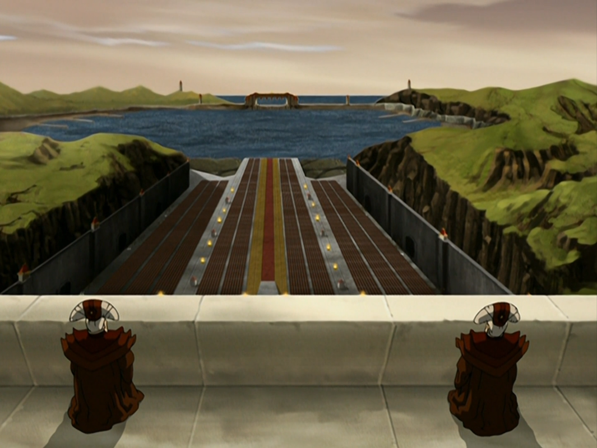

## *תקציר:*
- אנג מתעורר לאחר הקרב בבא סינג סה ומגלה שהוא נמצא על ספינה של אומת האש. הוא מבין שהיה מחוסר הכרה במשך שבועות, מאז שנפצע קשה מהתקפתה של אזולה בזמן מצב האווטאר. קטארה, סוקה, טוף וחברי ממלכת האדמה הבריחו אותו מהעיר יחד עם אביו של סוקה, האקודה, וכעת הם מתחזים לחיילים של אומת האש כדי להימנע מחשיפה.
- אנג מתקשה להשלים עם העובדה שהוא הובס ולא הצליח להגן על ממלכת האדמה. הוא חש שמעמדו כאווטאר התערער וכי העולם חושב שהוא מת, אך חבריו מנסים לשכנע אותו שזה דווקא נותן להם יתרון אסטרטגי. עם זאת, אנג חש אחריות אישית כבדה ובורח מהספינה בניסיון לפעול לבדו, אך קטארה משכנעת אותו לחזור ומזכירה לו שהוא לא חייב לשאת הכל לבד.
- במקביל, זוקו ואזולה חוזרים כמנצחים לאומת האש. זוקו מקבל יחס מכובד מאביו, פיירלורד אוזאי, לאחר שאזולה טוענת שהוא זה שהביס את האווטאר. למרות זאת, זוקו חש אי נוחות וחוסר שקט.
- הפרק מסתיים כאשר אנג מקבל עליו את הצורך להמתין, להתחבא במסווה, להישאר עם חבריו ולהיערך למאבק הבא. החבורה יוצאת למסע חדש באומת האש, לקראת ההזדמנות להכות בה בזמן ליקוי החמה.

## *סיכום במשפט:*  
קשה להתעורר

## *ראוי לציון:*  
- אהבתי את הפתיחה של הפרק – הדיסאוריינטציה מכוונת ומשקפת היטב את התחושה של התעוררות מקומה של שבועות מרובים: לאנג יש שיער! זה חלום? לא חלום? מה קורה פה?
- לכל הדמויות היה זמן לעכל את מאורעות בא סינג סה ולהשלים איתם – לאנג לא היה, ולכן הוא מרגיש כמו דג מחוץ למים, נסער יותר מהשאר. בנוסף, הקושי של אנג עם כך שהעולם חושב שהוא מת נובע גם מהאשמה שהוא נושא על כך שקפא בקרחון ולא מנע את תחילת המלחמה ואת הטבח בנוודי האוויר.
- כל הדמויות מרגישות בוגרות יותר – בהתנהגות, במשחק הקולי, ואפילו בעיצוב: לאנג יש שיער, גם לסוקה צמח שיער והוא מעוצב מעט שונה, וקטארה נשמעת כעת יותר מתמיד כמי שסוחבת ייאוש וכאב, אך בו בזמן גם תחושת אחריות ומנהיגות. אפילו סוקה וטוף פחות משתטים מהרגיל, כשבזמן הזה טוף הספיקה לפתח מאוד את כשפות המתכת שלה. עם תחילתו של ספר האש, טים אווטאר מרגיש מהודק מתמיד – הדינמיקה הקבוצתית הגיעה למצב אופטימלי, לכל דמות יש מקום מוגדר, וכולם עובדים בסינרגיה.
- וגם אני אוהב את השיער הארוך של זוקו.
- פיפסקוויק פה!!
- זוקו ומאי ביחד זו התפתחות מעניינת ומפתיעה. זה היה שם גם בפלאשבק ב-"זוקו לבדו", אבל זו לא התפתחות שציפיתי לה כבר בפרק הזה.
- סיקוונס קבלת הפנים של זוקו ואזולה חזרה לאומת האש מצוין. הסבתות מסכמות לנו בקולן הכפול, המהדד והמלחיץ, בפאתוס מושלם, את אירועי סיום העונה הקודמת ואת השלכותיהם - מפרספקטיבת אומת האש הפאשיסטית והמואדרת: ההדאי לי הפילו את חומת בה סינג סה וחיילי אומת האש משליטים בה משטר צבאי. תוך כדי אנחנו רואים את הדיכוי מגיע גם אל תושבים ספציפיים שאנחנו מכירים - משפחת מעבר הנחש, מנהל חנות התה והנערה שיצאה עם זוקו. זה מגביר מאוד את תחושת ההלם.
- התכנית של סוקה לפלוש לאומת האש ביום השמש השחורה עומדת בעינה – וזה מאוד לא מבשר טובות, כי כזכור, אזולה לגמרי יודעת על כך. אם ניסיון הפלישה אכן יקרה, זה יהיה כואב מאוד לטים אווטאר.
- בשיחה בין אזולה לזוקו, שבה עולה שאלת מותו של האווטאר, אנחנו למעשה מקבלים throwback לילדותם ולזיכרון שראינו בפרק "זוקו לבדו" – הסצנה מתרחשת ליד הבריכה בחצר הארמון, כשזוקו מביט בצבי-הברווז, והם בורחים ברגע שאזולה מתקרבת. הדינמיקה ביניהם לא השתנתה, אבל זוקו כן.
- זו הפעם הראשונה שאנחנו רואים את פניו של פיירלורד אוזאי – חשיפה דרמטית שמסמנת אותו כנבל המרכזי של עונה 3. דווקא כשאוזאי מתגאה בזוקו, זוקו מבין שזה עדיין לא ממלא את החור שבליבו. יש לו כעת את כל מה שאי פעם חשב שהוא רוצה – וזה לא עושה אותו מאושר.
- השיחה בין קטארה לאביה, האקודה, היא מהרגעים החזקים בפרק. קטארה לא כועסת עליו, כי היא מבינה את ההכרחיות שבעזיבתו לקרב, אך הקשיים והגעגוע שנבעו מכך מציפים אותה.
- זו הפעם הראשונה שאנחנו רואים כל כך הרבה מאומת האש – המבנים, היישובים ואיך נראית הממלכה. תמיד ידענו שהם ממוקמים במעין ארכיפלג בקצה המפה, אך עד כה ראינו רק את האי עם מקדש אווטאר רוקו (שעליו גם מסתיים הפרק הזה!).
- הפרידה של אנג מהדאון - סימבול מצוין של הקרבה והתקדמות, ובמובן מסוים התבגרות. אנג מקריב מהזהות שלו לטובת גורל העולם.

## *פחות התחברתי:*
- הדרך שבה הסדרה כותבת החוצה את מלך האדמה כל כך רעה ומגוחכת.
- הקרב על הספינה היה נחוץ מבחינה תסריטאית, אבל משהו בו הרגיש עייף ומשעמם – יותר עניין אותי לחזור לסיפור באומת האש.
- המונולוג של אנג שבו הוא מכריז שעליו להשיב את כבודו האבוד ולקבל גאולה הוא כמובן הקבלה מפורשת בינו לבין זוקו, כשמיד לאחר מכן אנחנו חותכים אל זוקו. זה רגע טוב, אבל הוא הרגיש לי קצת מאולץ ולא לגמרי התחבר לי. עבורי זה בעיקר עבר כבדיחת מודעות עצמית (מאוד מצחיקה) ופחות כאמצעי פיגורטיבי.
- תמיד כיף לראות את יואה, אבל אני מרגיש שהיא לא קשורה לפרק וההופעה שלה הייתה מיותרת מבחינה תמתית.
- בסדרה, לאיירו יש cue מוזיקלי ייחודי שמתנגן לפני שהוא עומד להופיע על המסך (tsungi horn). בפרק הזה הוא התנגן – ואיירו לא הופיע! איפה איירו??

## *ה-MVP של הפרק:*  
הסבתות

## *עתידות:*
לא נראה יותר את מלך האדמה עד שהוא יצוץ שוב לקראת פרקי הסיום.

## *דירוג הפרק:*  
אחלה