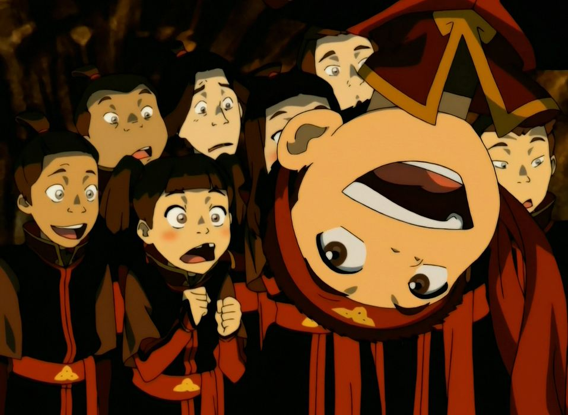

## *תקציר:*
- החבורה ממשיכה במסעם בתוך אומת האש כשהם מחופשים לאזרחים מקומיים כדי לא לעורר חשד. אנג, שלוקח בטעות סרט ראש של תלמיד, בטוח שהוא נרדף על ידי חיילים של אומת האש, אך למעשה הוא מזוהה בטעות כתלמיד בית ספר ונשלח ללמוד שם.
- בבית הספר, אנג מגלה את מערכת החינוך הקשוחה והמפחידה של אומת האש, שמטרתה לשטוף את מוחות התלמידים ולהפוך אותם לאזרחים צייתנים. מנגד, יש לו חסך גדול בחיים של ילד רגיל. לכן במקום להתנגד, הוא מחליט להפוך את בית הספר למקום שמח יותר, ומלמד את חבריו לכיתה לרקוד וליהנות. כדי להפיץ רוח חופשית, הוא מארגן מסיבה סודית שבה הוא והילדים יכולים להביע את עצמם באופן חופשי.
- במקביל, זוקו חש מתח וחרדה, למרות שחזר לאומת האש כמנצח. הוא מבקר בסודיות את איירו בכלאו, וכשזה מתעלם ממנו תחושות האשמה של זוקו רק מתעצמות, וביחד איתן הבלבול. בתוך סערת הרגשות הזו הוא גם חושש שהאווטאר עדיין חי, ולבסוף בחוסר שלמות עם ההחלטה הוא שולח צייד ראשים כדי לוודא זאת.
- הפרק מסתיים כשאנג נאלץ לברוח מבית הספר אחרי שזהותו כמעט נחשפת, אך הוא עוזב בתחושת סיפוק על כך שהעניק לילדים רגעים של חופש ושמחה. החבורה ממשיכה במסעה.

## *סיכום במשפט:*  
פוטלוס

## *ראוי לציון:*  
- מתחילתה הסדרה מבססת ומדגישה שבעברה הרחוק, לאומת האש הייתה תרבות עשירה ומפוארת שהודחקה על ידי השלטון הפאשיסטי של אזולון על מנת להפוך את האומה למדינת משטרה מטורללת. הפרק הזה לא שונה, כי בעוד אנחנו לומדים שמערכת החינוך של אומת האש לא מאפשרת לילדים להביע את עצמם, אוסרת חופש ושמחה (מלבד בקונטקסט של האדרת השלטון) ומשכתבת את הנראטיב ההיסטורי, אנג זוכר את העבר האמיתי של אומת אש דרך חברו משכבר הימים קוזון (שאת שמו הוא שואל כחלק מסיפור הכיסוי שלו).
- הסיפור של הפרק מאוד מהודק - כל האלמנטים מתחברים. אנחנו בשלב של הסדרה שבו אנחנו כבר מכירים טוב מאוד את הדמויות הראשיות ואוהבים אותן, והפרק מאוד מסתמך על הדינמיקה המבוססת של הדמויות. בגדול בפרק הזה אנחנו עושים פאן עם הדמויות שאנחנו אוהבים.
- מרגיש שהושקעה הרבה מחשבה בבניית העולם של אומת האש.
- אני שמח בשביל אנג שהוא קיבל עוד הזדמנות קצרה לחזור להיות ילד כמעט רגיל. זה משהו שהוא רצה מאוד כבר הרבה זמן, וכמובן שזו הסיבה האמיתית שהוא רצה להמשיך לבוא לבית הספר (ולא הרצאה על נהר סודי).
- "אין לך שום סיכוי לשנות את אומת האש ולסיים את המלחמה מבלי לשנות את החינוך של דור העתיד שלהם" - סוקה של שבט המים.
- בעלילה של זוקו אנחנו מקבלים ממנו מסרים סותרים - הוא מבין שהוא עדיין לא מרגיש שלם ושעדיין פעור בליבו חור, על אף השבת מעמדו כנסיך וההערכה מאביו. זה גורם לו בלבול עמוק, כי במשך שנים הוא חשב שזה כל מה שהוא רוצה, וכעת מתברר שזה לא מסב לו אושר. האשמה על נטישת איירו וההחלטה שקיבל בקטקומבות של בה סינג סה עדיין מכרסמת בו, ובתור מנגנון הגנה שנועד לדחות עוד קצת את ההשלמה שלו עם החרטה (והכאב וההשלכות הנלוות לה), הוא מנסה לאמץ נראטיב חדש: "אני עדיין לא מאושר בגלל שאני לא בטוח שהאווטאר מת". זה מניע אותו לשכור את המתנקש, מעשה שהוא לא שלם איתו. מצד שני, בתוך כל הלבטים והבלבול העמוק, בפרק הזה אנחנו רואים את זוקו גם בתור מאהב, חולק מערכת יחסים אינטימית. זה משהו שמאוד לא טיפוסי לדמות ומדגים את ההתקדמות הגדולה שהוא עבר למרות כל הבלבול.
- איירו משתוקק לעזור לזוקו, הוא לא באמת כועס עליו. הדמעה שאנחנו רואים על פניו מבטאת שהוא היה רוצה לחבק את זוקו ולהדריך אותו, אבל הוא גם איש חינוך נהדר ולכן הוא מבין שהמסע של זוקו כבר עבר את שלב הדיבורים, ובמצבו הנוכחי התשובות חייבות להגיע ממנו. איירו לא יכול להסביר לזוקו את הדברים, כי ככה לא יתרחש השינוי.
- אני אוהב את סצנת הריקוד של אנג וקטארה. פתאום אנחנו רואים את הצד השרמנטי והבטוח העצמו יוצא מתוך אנג, ובאופן מושלם הסצנה הזו מצליחה לעבור כריקוד של שני חברים קרובים שאוהבים זה את זו אבל שגם בעצם מתחילים להבין שיש שם יותר מזה.
- ובכלל, הסדרה התבגרה ובשלב הזה מתייחסת אל הדמויות יותר כנערים מאשר כילדים - בין היתר גם באופן שלא חף לגמרי ממיניות. דוגמה לכך היא הצגתה של קטארה בתלבושת אומת האש, וההתעכבות על כך למשך כמה שניות.

## *פחות התחברתי:*
- מרגיש קצת מוגזם שכל הילדים הגיעו למסיבה כל כך בקלות, אבל כמובן שבהינתן מגבלת הזמן של הפרק התהליכים מזורזים. ואולי הם עד כדי כך היו צמאים למסיבה.

## *ה-MVP של הפרק:*  
אנג

## *עתידות:*
אני לא כל כך יודע להגיד, בשלב הזה הסדרה עדיין משאירה את הקלפים צמוד לחזה.

## *דירוג הפרק:*  
מעולה