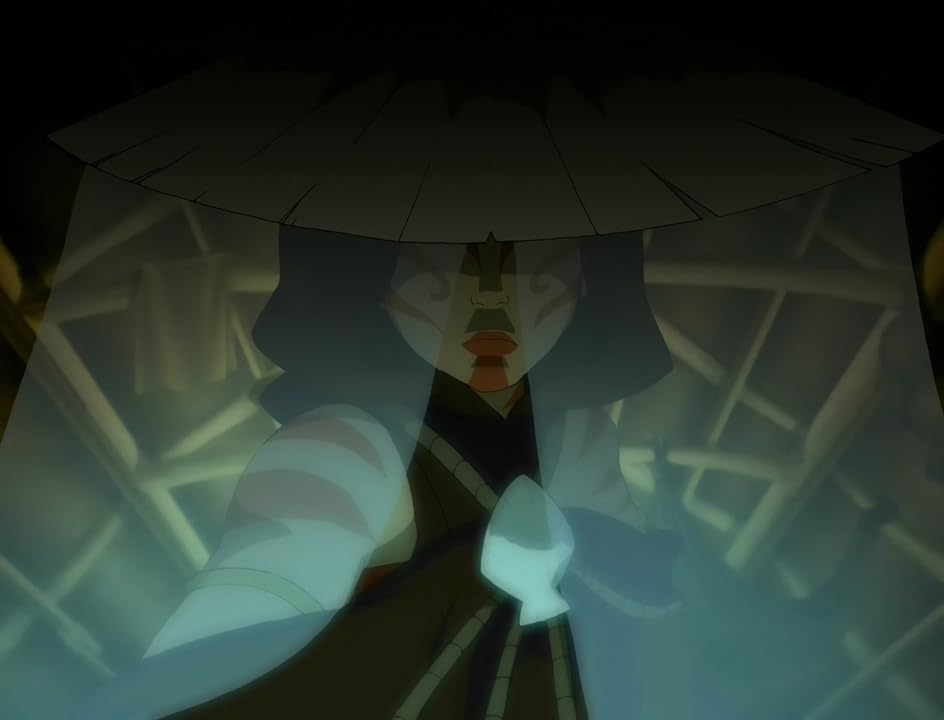

## *תקציר:*
החבורה מגיעה לכפר עני ומזוהם השוכן ליד נהר, שתושביו חולים בגלל מפעל נשק של אומת האש שמזהם את המים. אנג רוצה לעזור, אך סוקה מתעקש שהם צריכים להמשיך במסע ולא להסתבך.  
בלילה, דמות מסתורית המכונה "הגבירה הצבועה" מופיעה ומחלקת מזון ותרופות לתושבי הכפר. אנג והאחרים מגלים שזו למעשה קטארה, שהחליטה לעזור בסתר לכפריים. היא ממשיכה להתחזות לרוח המגינה של הכפר, משתמשת בכשפות המים שלה כדי לרפא את החולים, ובסופו של דבר מחליטה להשמיד את המפעל המזהם. אנג מצטרף אליה, והשניים מצליחים להרוס את המפעל.  
למחרת, כוחות אומת האש מגיעים לכפר, מאשימים את התושבים בהריסת המפעל ומתכוננים לתקוף. כדי להציל את הכפר, קטארה חושפת שהיא "הגבירה הצבועה" האמיתית ומגרשת את חיילי אומת האש.  
בסוף הפרק, הכפר מתחיל להשתקם, והנהר מתנקה בהדרגה.

## *סיכום במשפט:*  
ניסיון תיקון מוצלח לפרק 106.

## *ראוי לציון:*  
* מאוד וייב של עונה 1 - מגיעים לכפר אקראי, למקומיים יש בעיות וטים אווטאר עוזרים לפתור אותן. מעבר לכך הקונפליקט של קטארה שלא מסוגלת לעמוד מנגד ללא מעש כשהיא רואה אנשים במצוקה, טופל בעיר במהלך עונה 1, וכעת חזרנו אליו. בעיניי הפרק הוא ביצוע מוצלח יותר של הפרק "כלואים" בעונה 1.
* הפעם הטייק של הסדרה הוא שקטארה לא יכולה להיות שם תמיד כדי לעזור לאנשים עם הבעיות שלהם, ולכן הדרך הכי טובה שלה לעזור לאותם אנשים היא לתת להם את הכלים להתמודד עם הבעיות שלהם בעצמם. הגברת הצבועה לא עוזרת למי שלא עוזר לעצמו.
* אני אוהב את איך שסוקה מוצג בפרק הזה כאדם שאובססיבי בהגזמה ללוח הזמנים ומסתובב לכל מקום עם תרשים גאנט ענקי. אבל האובססיה הזו מעוגנת במציאות כי כפי שסוקה הסביר - ליקוי החמה נמשך בסך הכל 8 דקות תמימות. ולכן צריך להתייחס לזה במלוא הרצינות ולהגיע אליהן כמה שיותר מוכנים.
* כל הסיטואציה הזו של מפעל שמזהם נהר שלם בחסות המדינה לא תלושה מהמציאות, ואני אוהב שהסדרה מצליחה לשלב בעלילות שלה סיטואציות אמיתיות של אקטיביזם.
* אני אוהב שטוף עומדת לצד סוקה בתור הצד היותר פרקטי וריאלי בטים אווטאר, ואנג וקטארה עומדים יחד בצד ההומניסטי יותר.

## *פחות התחברתי:*
- נראה לי שאנג זרם עם קטארה קצת בקלות מדי?

## *ה-MVP של הפרק:*  
קטארה

## *עתידות:*
הידיעה על המפעל שננטש תגיע אל הנהגת אומת האש והם ישלחו תגבורת כדי להחזיר אותו לפעילות.

## *דירוג הפרק:*  
אחלה