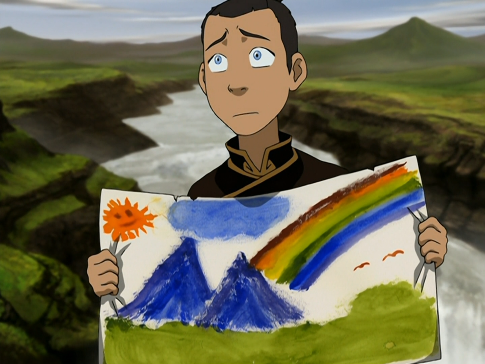

## *תקציר:*
- סוקה מתחיל להרגיש חסר תועלת בהשוואה לחבריו הכשפים החזקים. הוא מחליט להפוך ללוחם טוב יותר ומוצא מאסטר חרבות באומת האש, הידוע כחכם ומיומן. סוקה מרשים את המאסטר באומצו, ביצירתיותו ובחוכמתו. במהלך האימונים, הוא לומד לא רק להילחם בחרב, אלא גם להתמודד עם חוסר הביטחון שלו ולהכיר בערך שלו כחלק מהקבוצה.
- בסיום האימונים, הוא מחשל חרב משריד מטאוריט, מה שהופך אותה לייחודית במראה השחור-מבריק שלה. כשהוא מתוודה על כך ששיקר למאסטר לגבי זהותו (התחזה לאזרח אומת האש), המאסטר מגלה שהוא ידע כל הזמן, אך רואה בו לוחם ראוי בזכות אופיו ולא מוצאו. הוא מעניק לסוקה את החרב ומעביר לו מסר חשוב: כוחו האמיתי של לוחם טמון באינטליגנציה ובתושייה, לא רק בכוח פיזי.
- בזמן שסוקה במחנה האימונים, אנג, טוף וקטארה חשים היטב בהיעדרו — אין מי שירומם את מצב הרוח או יתכנן מה לעשות.
- במקביל, איירו עובר מונטאז' אימונים בכלא.

## *סיכום במשפט:*  
אחרי שקיבלנו פרק "פוטלוס" אנחנו מקבלים פרק "קראטה קיד".

## *ראוי לציון:*  
- פרק כיפי עם רעיון טוב וביצוע מוצלח.
- מגיע לסוקה לקבל פרק כזה, אבל זה מרגיש מעט מאוחר מדי. אם הפרק היה מגיע בעונה 2, היה לו פחות מגבלות.
- מצד שני, אנחנו מגיעים לפרק הזה כשאנחנו מכירים הרבה יותר טוב את סוקה ושאר הדמויות, ולפרק הרבה יותר קל לבסס את זה ששאר החבורה מרגישה בהיעדרו של סוקה - אין מי שיעשה צחוקים, ואין מי שיתכנן את סדר היום ומה הם צריכים לעשות.
- אני אוהב שהפרק שומר על אווירה קלילה, אבל מצליח להימנע מרוב ה-tropes הצפויים של הז'אנר — כמו שהמאסטר יכריח אותו לחכות שעות מחוץ לבית או יבקש ממנו לבצע מטלות.
- סוקה מצטרף לאגודת הסתרים של השש-בש לוטוס מבלי לדעת מזה — התפתחות מאוד מעניינת ולא צפויה. אני סקרן לראות לאן זה יוביל. בהינתן תקציר הפרקים הקודמים בכלל חשבתי שהשש בש לוטוס יבריחו את איירו מהכלא.
## *פחות התחברתי:*
- לדעתי הפרק נותן לסוקה קצת יותר מדי קרדיט. כל המעלות שהמאסטר ציין אכן קיימות בו, אבל זה מרגיש כאילו הוא קצת מגזים עם הסופרלטיבים. סוקה עבר מעט מאוד אימוני לחימה, ובתוך יממה כבר מוכרז כעילוי. אני מבין שהרעיון הוא שתכונות האופי שלו חשובות יותר מהמיומנות, אבל זה הרגיש מואץ. עם זאת, אפשר לסלוח לסדרה בגלל מגבלת הזמן של הפרק והעלילה — אי אפשר להשקיע יותר מיומיים בהכשרת סוקה כשליקוי החמה מתקרב.

## *ה-MVP של הפרק:*  
סוקה

## *עתידות:*
בדרך לליקוי החמה סוקה ישכנע את טים אווטאר לסובב את אפה ולעוף חזרה לכיוון ההפוך כי הוא שכח את החייל שש-בש לוטוס שלו מאחור.

## *דירוג הפרק:*  
אחלה