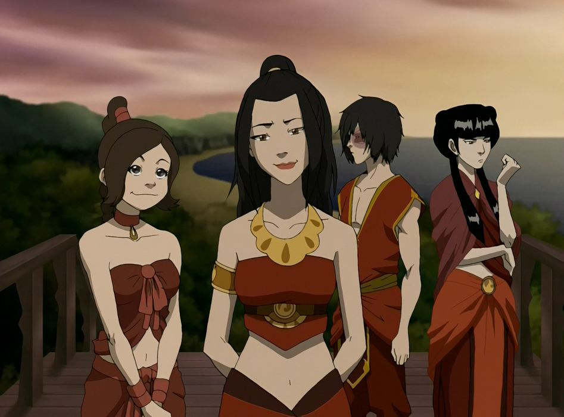

## *תקציר:*
- אזולה, זוקו, טיי לי ומאי נשלחים לחופשה כפויה באי החוף של אומת האש, מקום בו זוקו ואזולה נהגו לבלות כילדים. במהלך היום, הקבוצה מנסה להשתלב עם בני נוער רגילים — אזולה מגלה שהיא מתקשה להתחבר לאנשים בגלל אופייה המאיים, טיי לי מושכת המון תשומת לב, ומאי מראה את חוסר העניין שלה בכל דבר, פרט לזוקו, איתו היא מתחילה להעמיק את מערכת היחסים הרומנטית. זוקו, לעומת זאת, נאבק בזעם ובתסכול הפנימי שלו, ולא מצליח ליהנות כמו השאר.
- בערב, סביב מדורה, החבורה חושפת צדדים פגיעים שלה. טיי לי חושפת שהיא מרגישה כמו "עוד אחת מהשישייה" במשפחתה הגדולה מרובת האחיות, ולכן מחפשת להתבלט ולבדל את עצמה. מאי משתפת שהיא הייתה בת יחידה למשפחה עשירה שקיבלה כל מה שרצתה, אך הוריה לא אפשרו לה להתבטא או להביע רגש - ולכן גדלה להיות אדם ציני ומסוגר שמפחד שיהיה לו איכפת מדברים. אזולה משתפת בכנות נדירה על כך שאמה מעולם לא אהבה אותה, מה שהשפיע על הדרך שבה היא רואה את עצמה ואחרים. זוקו מתוודה על רגשות האשמה שלו — למרות שהשיג את מה שתמיד רצה (לחזור הביתה ולהיות מוערך על ידי אביו), הוא עדיין לא מאושר. הוא גועש מכעס בכל רגע נתון, כשהכעס הזה מופנה אל עצמו, על כך שאיכזב את דודו וברגע האמת בחר בדרך הקלה, על כך שהוא מבולבל ולא מצליח להבדיל בין טוב ורע.
- בינתיים, אנג והחבורה מתמודדים עם צייד הראשים שזוקו שכר, אך זה רק קו עלילה משני לפרק הזה, ששם את הזרקור על נבלינו הצעירים והמורכבים.

## *סיכום במשפט:*  
הפרק הזה שבו כל הדמויות הולכות לים

## *ראוי לציון:*  
-  הפרק לוקח השראה ברורה מהמסורת של פרקי חוף באנימות, ומרגיש כמו מחווה שלמה לשורשים של האנימות הקלאסיות עליהן הסדרה מבוססת — החל מהמעברים והעיצוב ועד לאווירה הכללית. יותר מזה, העובדה שדמויות הנבלים בהן מתמקד הפרק קצת יותר מבוגרות מצוות הגיבורים גורמת לאווירה להשתנות בהתאם — היא הופכת לבוגרת, מינית ודרמטית יותר, כמעט כמו דרמת תיכון. התחושה הכללית של הפרק שונה לחלוטין ממה שהתרגלנו אליו בסדרה, מה שהופך אותו למיוחד מאוד.
- זה לא עוד פרק רגיל על כוחות ואומות במלחמה, אלא יותר כמו הצצה לעולם הרגשי של הנבלים כשהם רחוקים מהמאבק המתמיד. הפרק הזה מציג אותם בצורה יוצאת דופן — לא ככוחות הרשע האדירים שאנחנו רגילים לראות, אלא כצעירים מבולבלים שמנסים למצוא את מקומם בעולם. הפרק מעלה שאלה חשובה — מי הם בכלל מחוץ לתבנית של בני מלוכה ולוחמים? והתשובות לא מאחרות לבוא. האי שבו הם נמצאים מדגיש את זה יותר, בהיותו מקום שבו אין מבוגרים (מלבד כמה סבתות קריפיות) ושאר הנערים לא מזהים אותם, מה שנותן להם הזדמנות ייחודית להיות פשוט בני נוער. 
- אזולה, הדמות שתמיד הצטיירה כשליטה קרה ואכזרית, מקבלת כאן עומק טרגי במיוחד. הניסיון שלה להיות נורמלית הוא מצד אחד מצחיק, אבל בעיקר עצוב — החברה בה גדלה עיצבה אותה כל כך חזק כלוחמת עד שהיא פשוט לא יודעת איך לתפקד בסביבה רגועה ושקטה. אפילו משחק כדורעף תמים הופך בעיניה לקרב גורלי. כל חייה היא הייתה עילוי באומנות הלחימה ואסטרטגיה, אבל הכישרון הזה התעוות על ידי השאיפות האכזריות של אביה. האישיות שלה היא תוצאה של החינוך של אוזאי, וקשה שלא לחוש מעט אמפתיה כשאנחנו עדים לחוסר המסוגלות שלה לקיים קשרים מכל סוג שהוא עם בני נוער אחרים. פתאום היא לא הנסיכה הבלתי מנוצחת, אלא נערה מבולבלת. בפרק הזה אנחנו רואים אותה כמו שמעולם לא ראינו — בחוסר נוחות מוחלט.
- זוקו ממשיך את המסע הרגשי שלו, והפרק הזה חושף צדדים חדשים במאבק הפנימי שלו. בפעם הראשונה אנחנו רואים איך באמת נראית מערכת היחסים שלו עם מאי: הוא מנסה להיות בן זוג טוב, אבל נראה שביהנתן אווירת המתבגרים על האי הוא בעיקר מאמץ קלישאות שמרגישות כאילו הוא ראה אותן בסרטי תיכון — מה שגורם לכל הסיטואציה להרגיש מאולצת ומגושמת. זוקו הוא אדם שבוערת בתוכו אש של סערת רגשות תמידית, וכשהוא לא מצליח להוציא ממאי רגש והיא שומרת על קור הרוח שלה, הוא רק נהיה מתוסכל עוד יותר. התסכול מניע אותו לאמץ בכוח וללא סיבה את משבצת החבר הקנאי, מה שרק מחמיר את המצב.
- גולת הכותרת של הפרק היא השיחה סביב המדורה, שבה כל אחד חושף את העבר שלו ומקבל אבחון פסיכולוגי על התנהגותו בהווה. השיא של הפרק הוא כמובן הרגע בו זוקו מודה שהוא כועס יותר מאי פעם, ובפעם הראשונה הוא מודה שהכעס הזה מופנה בעיקר כלפי עצמו. זה רגע נדיר של פגיעות, והוא קורה דווקא מול האנשים שהכי קרובים אליו — ובעיקר מול אזולה, מה שמוסיף עומק מיוחד לסצנה.
- בנוסף לאזולה וזוקו, גם שאר דמויות הנבלים מקבלות כאן ממד חדש ומפתיע. הדינמיקה ביניהם, יחד עם הרגעים האינטימיים סביב המדורה, נותנת לנו הצצה לאנושיות שמסתתרת מאחורי החזות הקשוחה של כל אחד מהם. זה פרק שמראה לנו שהם לא רק "הנבלים", אלא גם אנשים עם כאב, אכזבות, וחלומות שלא התממשו.

## *פחות התחברתי:*
- הסיפור של טים אווטאר לא התאים לפרק וסצנת האקשן הפריעה לפייסינג הדרמטי של עלילת הנבלים.
- מישהו החליט לעשות את זוקו קצת אימו בפרק הזה. זה עובר בכמה רגעים שונים כשהשיער שלו מכסה את הפנים והוא לא מישיר מבט אל המצלמה. אני יכול להבין איך כמשליכים את הקונפליקטים של זוקו על תבניות של תיכוניסטים זה אחד מהרעיונות שעולים, אבל בעיני זה זילות של הקשיים הקיצוניים שהוא עבר בחיים שלו.

## *ה-MVP של הפרק:*  
אזולה

## *עתידות:*
הפרק הזה לא יגרום לזוקו ואזולה להיות קרובים יותר.

## *דירוג הפרק:*  
אדיר