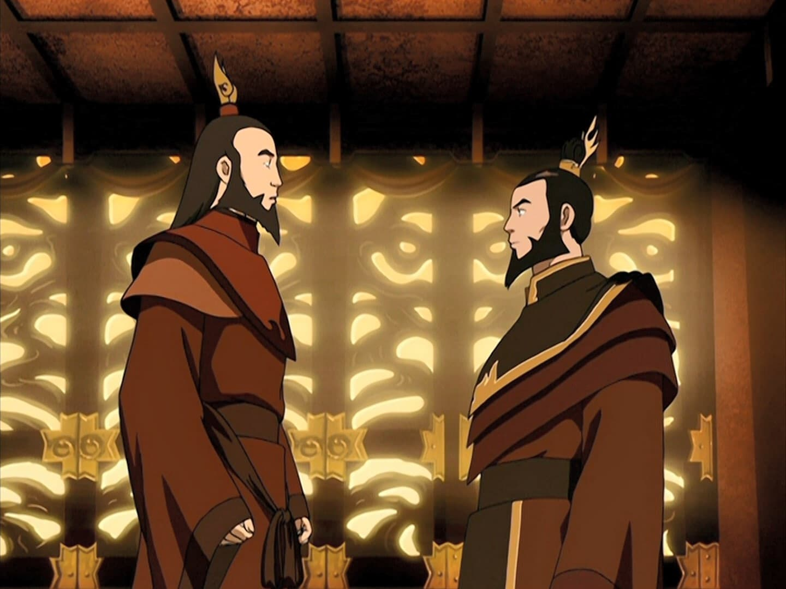

## *תקציר:*
- אווטאר רוקו מתגלה אל אנג בחלום ואומר לו שעליו ללמוד את סיפור תחילת המלחמה. זוקו מקבל מכתב סודי מאיירו, ובו כתוב שעליו לחקור את עברו של סבא רבא שלו, שכן הסיפור יחשוף את גורלו. אנג טס חזרה לאי של רוקו כדי שיוכל לדבר איתו בעולם הרוחות. במקביל, זוקו מוצא את האוטוביוגרפיה הסודית של סוזין בקטקומבות שמתחת לארמון – "סוזין: אלו הם חיי". כך אנו מגלים את סיפורם המשותף של אווטאר רוקו ופיירלורד סוזין דרך עריכה שזורה: זוקו קורא את סיפורו של סוזין, ואנג שומע מרוחו של רוקו את סיפורו.
- רוקו וסוזין היו חברי ילדות, ואף חלקו את אותו יום הולדת. ביום הולדתם ה-16 חשפו זקני אומת האש כי רוקו הוא האווטאר. בעקבות זאת, השניים נאלצו להיפרד, שכן רוקו היה חייב לעזוב את אומת האש כדי ללמוד לשלוט בשלושת היסודות האחרים. לפני עזיבתו, סוזין העניק לו מתנה – קישוט שיער מסורתי של נסיך הכתר, שאותו נשא רוקו עמו מאז.
- רוקו החל את מסעו במקדש האוויר הדרומי, שם התאמן בכשפות אוויר והתיידד עם גיאטסו, דבר שהפתיע ושימח את אנג. לאחר שלמד לשלוט באוויר, המשיך לשבט המים הצפוני, שם התמודד עם אתגר השליטה בכשפות המים, יסוד המנוגד לאופיו. לאחר מספר שנים הצליח לשלוט בו, והמשיך לממלכת האדמה כדי ללמוד את היסוד האחרון שלו.
- לאחר 12 שנות אימונים, רוקו חזר לאומת האש, שם קיבל אותו סוזין, שכעת היה לפיירלורד. רוקו נשא לאישה את אהובתו מילדות, כאשר סוזין שימש כשושבין הראשי. במהלך החתונה ניסה סוזין לשכנע את רוקו להצטרף אליו בהרחבת השפעת אומת האש, אך רוקו התנגד בתוקף.
- שנים מאוחר יותר גילה רוקו שסוזין התעלם מאזהרתו ופלש לממלכת האדמה. הוא התעמת עמו בארמון המלכותי ודרש ממנו לעצור את ההתרחבות. כשהוויכוח החריף, סוזין תקף את רוקו מאחור, אך רוקו חס על חייו והזהיר אותו שאם יעז שוב לחצות את הגבולות, הוא לא יהסס להרוג אותו.
- לאחר 25 שנה התפרץ הר געש ענק באי של רוקו. הוא סייע לתושבים ולמשפחתו להימלט וניסה להשתלט על האסון, אך ללא הצלחה. ההתפרצות הייתה כה עוצמתית שסוזין הרגיש אותה מהבירה. הוא הגיע רכוב על דרקונו הכחול כדי לסייע לרוקו, אך כאשר רוקו נשם גז רעיל והתמוטט, סוזין החליט לנצל את ההזדמנות ועזב אותו לגורלו. עם נשימתו האחרונה של רוקו, נולד אנג בקרב נוודי האוויר, ורוח האווטאר התגלגלה אליו.
- זוקו מסיים לקרוא את עדותו של סוזין, שבה מוסבר כי תקף את נוודי האוויר במטרה לחסל את האווטאר הבא – אך זה הצליח להימלט בדרך מסתורית. סוזין בילה את שארית חייו בחיפושים עקרים אחר האיום הגדול ביותר של אומת האש: "כשף האוויר האחרון".
- זוקו, מבולבל וכועס, אינו מבין איך הסיפור שזה עתה קרא קשור אליו. בזעם, הוא מגיע למגדל הכלא של אומת האש ומתפרץ לתאו של איירו. הוא מאשים את דודו בשליחת ההודעה ודורש לדעת את מטרתה. איירו מסביר כי המסר – "עליך ללמוד על העבר של סבך הרחוק" – לא התייחס לסבא של אביו, סוזין, אלא לסבא של אמו: אווטאר רוקו. זוקו נחרד מהגילוי, ואיירו ממשיך ומסביר כי המורשת המשולבת שלהם היא הסיבה לכך שזוקו עדיין קרוע לגבי גורלו – האם עליו להשמיד את האווטאר או לעזור לו.
- לבסוף, איירו מסיר לבנה מהקיר האחורי של התא, חושף חלל נסתר ומוציא ממנו חבילה קטנה עטופה בבד. הוא פותח אותה ומסביר כי זהו קישוט השיער האבוד של נסיך האש, אותו קישוט שסוזין נתן לרוקו. הוא מעניק אותו לזוקו ואומר לו כי רק בידיו הכוח לגאול את משפחתם ואת חטאי אומת האש – על ידי השבת האיזון לעולם.

## *סיכום במשפט:*  
סיפור המקור של המלחמה הוא בעצם טרגדיה על ברומאנס שהתפרק.

## *ראוי לציון:*  
- הסצנה שבה רוקו מגלה על היותו האווטאר מקבילה באופן ישיר לסצנה שבה אנג מגלה זאת. הסימפטומים זהים: ראינו כיצד אנג חש בודד כשייחודו הפך אותו לזר בקרב חבריו, וכך גם רוקו – אך מכיוון שהוא מבוגר יותר בשלב הזה, יש לו יותר כלים להתמודד עם הבדידות. בנוסף, לרוקו יש את סוזין – חבר קרוב שלא מוכן לוותר עליו. זה מנחם לראות שהקשיים שאיתם אנג התמודד הם למעשה חוויה סטנדרטית שכל אווטאר מתחיל עובר.
- אנו רואים שרוקו מצליח לנהל חיים די רגילים למרות היותו האווטאר – הוא מקים משפחה, חי בקהילה, ויש לו זוגיות יציבה. אני חושב שהגילוי הזה מעניק לאנג תחושת נחת מסוימת ומרגיע אותו לגבי עתידו.
- יש כאן התייחסויות ברורות לדברים טכניים שתהיתי לגביהם זמן רב, וזה מרגיש כמו אישור רשמי. למשל, מחזור האווטאר, שמתחלף בכל פעם בין האומות, והפעם קיבלנו רמז עבה ומפורש לגבי השאלה – אל מי מתגלגלת רוח האווטאר? התשובה ברורה: אל התינוק הראשון שנולד לאומה הבאה במחזור האווטאר, מרגע שהאווטאר הקודם מת.
- אני מרגיש שיש עוד הרבה מה לגלות בנושא הדרקונים. עד כה קיבלנו רמיזות שונות לגבי חשיבותם, אבל נראה שהמילה האחרונה עוד לא נאמרה. בחלום הדרקונים של זוקו בעונה 2, הדרקון האדום הוא איירו, והדרקון הכחול היא אזולה. בפרק הזה, הדרקון האדום שייך לרוקו והדרקון הכחול לסוזין. אנחנו מבינים שהשניים מסמלים את הקונפליקט הפנימי של זוקו, מאחר שהוא נצר לשניהם. כמו כן, איירו הולך בדרכו של רוקו, ואזולה הולכת בדרכו של סוזין. אבל מעבר להקבלה הזו, אני חושב שהמשמעות עמוקה יותר – בתוך כל כשף אש מתקיימים שני צדדים: האחד שבוערים בו זעם אצור וטינה, והשני שבוערות בו תקווה ותשוקה.
- נוסף על כך, ישנה גם שאלת החיות המקודשות. אף שזה לא נאמר במפורש, כבר ברור שלכל יסוד יש חיה מקודשת שממנה החלה הכשפות: לכשפי האוויר – הביזונים המעופפים, לכשפי האדמה – הגיריות-חפרפרות, לכשפי האש – הדרקונים, ולכשפי המים – דגי היין-יאנג. עם זאת, הסיפור המלא של החיות הללו עדיין לא נחשף במלואו, ואני מאמין שעוד נשמע על כך בהמשך.
- גולת הכותרת של הפרק היא ללא ספק סצנת הסיום עם איירו. קרייזי שיט. אנחנו מבינים שלא רק שאיירו רואה בזוקו פרויקט חינוכי, עליו הוא משליך את האבל על בנו שאיבד, או חניכה של נער מבולבל שבו הוא מזהה טוב לב ופוטנציאל. כל זה קיים, אבל בתוך קונטקסט הרבה יותר רחב. איירו כל הזמן דיבר עם זוקו על הגורל שלו, ועכשיו מתברר שזה לא סתם – זוקו באמת נולד לתוך גורל דרמטי, ודברים שרק נראו כהכוונה אבהית מתגלים כחלק מסיפור עמוק וגדול בהרבה. השתיקה של זוקו בסוף הסצנה מעוררת תקווה שסוף סוף משהו בתוכו הקליק עד הסוף, אבל אנחנו עדיין לא יודעים איך הוא יגיב לגילוי הזה. מסקרן מאוד.
- מאז תחילת הסדרה, שוב ושוב מציבים את אנג וזוקו זה מול זה – משווים ביניהם, מנגידים, מראים לנו אחד בצילו של השני. בכל פעם ההשוואה מניבה מסקנה מעט אחרת, ואין אמירה חד-משמעית או עקבית לגבי הדמיון והשוני ביניהם. לכן, במקום לקבוע מסר חד לגבי כל אחד מהם, הסדרה דווקא מדגישה שהגורלות שלהם שזורים זה בזה – שיש ביניהם שותפות גורל. בתחילת הדרך, זוקו מאמין שהייעוד שלו הוא לתפוס את האווטאר. כעת, לאט-לאט, הוא מתחיל להבין שהגורל שלו הוא (בין היתר) דווקא לעזור לאווטאר. בפרק הזה, ההבנה הזו עולה מדרגה – אנחנו רואים שגם בין אווטאר רוקו ופיירלורד סוזין התקיימה שותפות גורל מהסוג הזה, מהרגע שהם נולדו, עוד לפני שמישהו מהם היה הפיירלורד או האווטאר. כשמתבהר לנו שאנג הוא נצר למחזור האווטאר, וזוקו הוא גם צאצא של שושלת הפיירלורדים וגם נינו של סוזין עצמו, קשה שלא לתהות אם שותפות הגורל הזו אינה רק צירוף מקרים – אלא עיקרון קוסמי. האם יתכן שהאווטאר והפיירלורד תמיד נולדים מקבילים זה לזה, שזורים זה בגורלו של השני? האם אנג וזוקו נועדו להיות חברים טובים עוד לפני שנולדו, ושעל כתפיהם מוטלת האחריות לעתיד העולם?
- בסוף הפרק, אנג מסכם לנו את מוסר ההשכל, ואז טוף שואלת אותו: "אתה באמת חושב שחברות יכולה להתעלות על יותר ממשך חיים יחיד?" בהקשר הזה, אי אפשר שלא לחשוב על רוקו שהיה חבר קרוב של גיאטסו – חברות שהמשיכה בין גיאטסו ואנג. עכשיו אנחנו מבינים את העומק הנוסף שהיה במערכת היחסים הזו. זה גם מתחבר להשערה שכבר העלינו: שהחברות של רוקו וסוזין תמשיך דרך אנג וזוקו, ושעל שניהם נגזר להיות חברים טובים גם הם. מעבר לכך, אני לא חושב שהכותבים בחרו סתם לתת את השורה הזאת דווקא לטוף. זו סוגיה שבאמת מטרידה אותה – הרי אנג, קטארה וסוקה הם כנראה החברים האמיתיים היחידים שהיו לה אי פעם.
- כשאנג מסכם את מוסר ההשכל, הוא מסביר שבכל אדם יש טוב ורע. אני די בטוח שהוא אומר את זה דווקא בקונטקסט של אוזאי. הולכת ומתגבשת אצלי התחושה שאנג יתקשה מאוד להרוג את אוזאי בסוף. לאורך כל הסדרה, אנג מביע חשש מהעימות הסופי מולו. אבל בשלב הזה זה כבר לא נובע מחוסר ביטחון ביכולותיו – אלא מהעובדה שהוא פשוט לא רוצה להרוג את אוזאי. לא בגלל מי שהוא, אלא כי הוא בן אדם. אף אחד לא אמר זאת ישירות, אבל די ברור שזה מה שמצופה ממנו. ונראה שהוא מחפש לעצמו תירוצים כדי לא להגיע לשם – אולי לשכנע את עצמו שהוא יוכל לדבר עם אוזאי ולגרום לו להפסיק את המלחמה. בסדרות מסוימות זה אולי היה פתרון סביר, אבל בעולם של אווטאר זה יהיה אכזבה ענקית. סיום כזה לא יהיה נאמן לתמות של הסדרה. לכן, אני מאמין שלקראת הסוף, הקונפליקט הזה – חוסר הרצון של אנג להיות זה שמצופה ממנו להרוג את אוזאי – יעלה הילוך באופן משמעותי. הוא רוצה להתחמק מזה.
- הסיבה האמיתית לתחילת המלחמה: אימפריאליזם. סוזין מצדיק את עצמו בכוונות לכאורה חיוביות: "האומה שלנו שרויה בתור זהב ועושר תרבותי, ואני רוצה לחלוק את זה עם כל שאר העולם". באופן טבעי, אנחנו מבינים שזה רעיון רע מאוד. אבל הסדרה מציגה את זה כסוגיה מורכבת יותר: מצד אחד, רוקו מתנגד לזה בתוקף. לדעתו, ארבע האומות נועדו להיות נפרדות. מצד שני, איירו ופאטיק אומרים שההפרדה בין האומות היא השקר הכי גדול בעולם הזה – ושדברים שנראים נפרדים הם בעצם חלקים של אותו שלם. הסדרה מציעה שהאווטאר נועד לגשר בין האומות ולשמור על איזון והרמוניה – כלומר, הדרך הנכונה היא לאחד אותן, אבל לא בכוח. עם זאת, אנחנו רואים שבימי רוקו, האומות אולי לא היו במלחמה – אבל גם לא היו באמת באינטראקציה זו עם זו. כל קהילה הסתגרה בתוך עצמה ולא התעניינה באחרים. זו לא הרמוניה (כמו שקטארה מתארת בפתיח של כל פרק), אלא יותר מדיניות של חיה ותן לחיות. זה רעיון מורכב ומעניין: מצד אחד, המלחמה הנוכחית היא בהחלט לא איך שדברים אמורים להיות. מצד שני, גם לפני המלחמה, העולם לא באמת תפקד כמו שהוא אמור לתפקד. במילים אחרות – הסדרה לא שוללת לגמרי את הרעיון של מדינה מאוחדת לכל האומות. להפך, היא מרמזת שזה הפתרון האמיתי לשלום ולהרמוניה בין היסודות. אלא שהדרך של סוזין להשיג זאת היא קולוניאליזם בכפייה, והיא אינה דומה בשום צורה לאידיאל הנכון. בסופו של דבר, סוזין לא רוצה הרמוניה – הוא רוצה שליטה. הוא רוצה אימפריאליזם דרך קולוניאליזם. לעומתו, הסדרה מציעה פתרון של גלובליזם אמיתי, שבו אומות שונות מתקיימות יחד תוך איזון והרמוניה. זה יוצר דיון בוגר ומורכב, כזה שלחלוטין חולף מעל ראשו של הצופה הצעיר הממוצע – אבל עדיין מעלה שאלות כבדות משקל על הדרך שבה בני אדם חיים בקהילות, והבעיות שזה יוצר: מלחמות, כיבושים, אימפריאליזם, זנופוביה, פאשיזם, טוטליטריזם – והרשימה עוד ארוכה.

## *פחות התחברתי:*
- פחות אהבתי שאנג דחף לנו לגרון את מוסר ההשכל עם כפית של כסף, אבל הוא סיכם את זה יפה.

## *ה-MVP של הפרק:*  
הפרק הזה גרם לי להבין שללא שום עוררין, איירו הוא ה-MVP של הסדרה.

## *עתידות:*
השאלה העיקרית היא תוך כמה זמן זוקו עובר צד. בעבר חשבתי שזה יקרה בסוף עונה 2, זה קצת לא קרה עדיין ודחינו את זה מאז, ונראה שלטובה. אבל זה חייב לקרות, נכון? **זה חייב לקרות, נכון???** הרי לא מדובר פה באיזו תיאוריית מעריצים או משאלת לב, אלא קשת עלילתית שלמה ומתמשכת. **אז זה חייב לקרות בסוף, נכון??????** אנחנו ממש לקראת הסוף, נשארו רק עוד 15 פרקים. כרגע ההימור שלי הוא שזה יקרה בדיוק באמצע העונה, פרק 310, מתוך הבנה טכנית שהחזרה בתשובה של זוקו לא יכולה להישמר ממש עד הרגע האחרון. צריכים גם לבלות זמן עם זוקו החדש, לחקור איך זה נראה כשזוקו עם הטובים.

## *דירוג הפרק:*  
אדיר