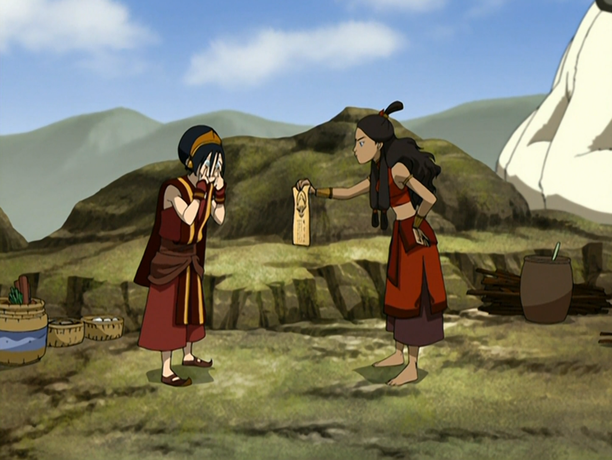

## *תקציר:*
- טים אווטאר מגיעים לעיירה נוספת באומת האש. אנג, סוקה וטוף יוצאים לעיר עם מטבע כסף אחד אחרון להוציא. טוף מציעה להרוויח עוד כסף ממשחק הימורים שמתנהל ברחוב. באמצעות כשפות האדמה שלה, היא מזהה שהסוחר מרמה אחרים ומגלה כיצד הוא עושה זאת. היא משתמשת בכשפות שלה כדי לרמות גם היא, וזוכה.
- כאשר הם חוזרים למחנה, קטארה מזהירה אותם מפני מעשיהם. אך גם כאשר אנג מבטיח שלא יעשו זאת שוב, הם לא מקשיבים. מאוחר יותר, טוף מרמה בעוד משחקים וזוכה ביותר כסף. היא גם מעמידה פנים שנדרסה על ידי כרכרה של אציל, כך שסוקה, המחופש לחייל אומה האש, יכול לרמות את האציל ולקבל כסף בתמורה לשתיקה. קטארה ממשיכה להזהיר כי התרמיות הללו מסוכנות ולא מוסריות. בזעם, טוף אומרת לה להפסיק להתנהג כמו אמא של הקבוצה. כאשר קטארה רומזת שטוף עושה מזה עניין כי בסתר ליבה היא מתגעגעת להוריה, טוף זועמת ונסערת עוזבת את המקום. לאחר שסוקה יוצא לעיר כדי לקנות בז שליחים, אותו הוא מכנה הוקי, הוא מוצא מודעת מבוקשת עבור טוף, שכונתה "הנמלטת". מזועזע, סוקה לוקח את המודעה ומראה אותה לטוף. להפתעתו, היא מתלהבת מהכינוי ומשווי הפרס שמוצע על החזרתה. טוף משחדת את סוקה לשמור את המודעה בסוד מקטארה, בכך שהיא נותנת לו כסף לשריון עבור אפה ולאטלסים יקרים.
- בעודה מחטטת בחפציה של טוף, קטארה מוצאת את מודעת המבוקשת ומתעמתת איתה. טוף מגיבה בזעם ואומרת לקטארה שהיא לא אמא שלה ושאין לה זכות לתת לה פקודות. מאותו רגע, השתיים מסרבות לדבר זו עם זו. סוקה משוחח עם טוף ומנסה לתווך בינה לבין קטארה. בזמן שהם מדברים על כך שלמרות האינסטינקטים האימהיים של קטארה, מתברר שהיא מתרחצת במים שמתחת לצוק שעליו הם יושבים ושומעת אותם בעל כורחה. סוקה מספר לטוף כיצד קטארה לקחה על עצמה את תפקיד האם לאחר מות אמם, עד כדי כך שעם הזמן, הוא החליף בזיכרונו את פניה של אמם בפניה של קטארה. טוף מודה שהיא מעריכה את הדאגה האימהית של קטארה, ואף מרגישה שקטארה דואגת לה יותר משהוריה האמיתיים אי פעם דאגו לה.
- מאוחר יותר, קטארה מתעקשת שהיא יכולה להראות את הצד הכיפי שלה, ופונה אל טוף ומציעה לה לעבוד יחד כדי לאסוף את הפרס שהצטבר על ראשה כ"תרמית האולטימטיבית". קטארה מעמידה פנים שהיא מסגירה את טוף לרשויות, כפי שנראה בסצנה הראשונה של הפרק. עם זאת, מתברר שכל הסיטואציה היא למעשה מלכודת. קטארה וטוף נכלאות בכלוב עשוי עץ – חומר שאף אחת מהן לא יכולה לכשף. בעוד אנג וסוקה נלחמים באיש הפיצוצים, טוף וקטארה מנסות למצוא דרך להימלט מהתא.
- מותשת, קטארה מנגבת את מצחה ומגלה שהוא מכוסה אגלי זיעה. היא משתמשת בכשפות מים על הזיעה שלה כדי לחתוך את כלוב העץ ולברוח מהתא, מה שזוכה להערכתה של טוף. קטארה וטוף ממהרות לעזור לאנג, ומגיעות בדיוק בזמן כדי להציל אותו מאיש הפיצוצים. טוף מצליחה לפגוע בקעקוע העין השלישית של איש הפיצוצים עם אבן קטנה, מה שגורם לו לאבד שיווי משקל. כשהוא קם ומנסה לירות פיצוץ נוסף לכיוונם, הוא מגלה כי הצ'י שלו חסום. הפיצוץ מתפוצץ סביבו, והקבוצה נמלטת.
- בסוף הפרק, טוף מגיעה למסקנה שהיא רוצה להתפייס עם הוריה. בעודה מכתיבה, קטארה כותבת עבורה מסר מרגש להוריה, אותו היא שולחת באמצעות הוקי.

## *סיכום במשפט:*  
grifting 101

## *ראוי לציון:*  
- אני אוהב את עיצוב הסאונד של הפיצוצים של ספארקי ספארקי בום מן.
- יפה שהסדרה עדיין משקיעה בלפתח את הדמויות והדינמיקה ביניהן למרות שאנחנו בשלב מתקדם של הסדרה. במובן הזה הפרק מאוד מזכיר לי את עונה 2.
- אני אוהב שהפרק הזה יחסית ריאליסטי: אנחנו עוקבים אחרי חבורה של ילדים עם כוחות על שחיים בנוודות, מתישהו סביר להניח שהם יהיו נואשים לכסף וישתמשו בכוחות שלהם כדי לעקוץ.
- לקטארה אין בעיה עם הקונספט של הסקאמים כמו שמבחינתה זה מסכן אותם, ולכן כדי לשכנע את טוף להפסיק עם זה היא משתמשת בכל טיעון שהיא מצליחה לחשוב עליו - גם כאלה פחות רלוונטים כמו להשליך את זה על מערכת היחסים שלה עם הוריה.
- בשעה טובה הסדרה מקדישה פרק שלם לתפקיד האימהי של קטארה בחבורה, הגורמים לכך וההשלכות. המונולוג של סוקה על כך שהוא לא זוכר תקופה בה קטארה לא שימשה עבורו כאמא היה עצוב מאוד ומרגש. כיף לראות את הכנות הרגשית הזו מדמויות שאנחנו פחות רגילים לקבל את זה מהן כמו סוקה וטוף.
- לרגע אחד אני ממש חשבתי שטוף וקטארה הולכות לעשות כשפות עץ על התא שלהן.
- מגניב שטוף מלמדת את אנג את טכניקת ראיית הסונאר שלה - ועד סוף הפרק הוא גם מצליח ליישם אותה.

## *פחות התחברתי:*
- איפה זוקו??

## *ה-MVP של הפרק:*  
סוקה

## *עתידות:*
שני הפרקים הבאים יהיו פילרים גם הם

## *דירוג הפרק:*  
מעולה