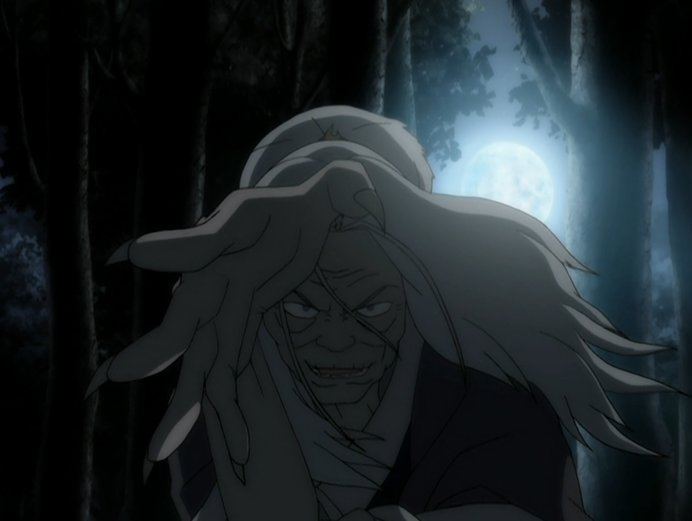

## *תקציר:*
- החבורה מגיעה לכפר מסתורי בו אנשים נעלמים בלילות. בזמן שהם מחפשים תשובות, הם פוגשים אישה זקנה בשם האמה, שבשלב מסוים מציגה את עצמה ככשפית מים שמקורה משבט המים הדרומי — כמו קטארה וסוקה.
- האמה מציעה ללמד את קטארה טכניקות כשפות מים מתקדמות, כולל שליטה על המים שבתוך צמחים ואפילו היכולת להוציא לחות מהאוויר. קטארה נלהבת מהאפשרות לשפר את יכולותיה, אך מתחילה להרגיש שמשהו מטריד במורה שלה.
- בליל ירח מלא, האמה חושפת את סודה האפל: היא פיתחה יכולת אימתנית בשם כשפות דם — שיטה שמאפשרת לה לשלוט בגוף של אנשים חיים כמו בובות. היא מספרת איך אומת האש לקחה אותה בשבי לפני עשרות שנים וכיצד היא פיתחה את הטכניקה הזו כדי לברוח. מאז, היא משתמשת בה כדי לחטוף אנשים מהכפר כנקמה.
- כאשר קטארה מסרבת להשתמש בכשפות הדם, האמה מאלצת אותה להילחם בה, ומדגימה את כוחה על אנג וסוקה. בלית ברירה, קטארה משתמשת בכשפות דם בעצמה כדי לעצור את האמה. לאחר שהיא מובסת, האמה צוחקת בשיגעון ואומרת לקטארה שהיא השיגה בדיוק מה שהיא רצתה - כעת גם קטארה הינה כשפית דם.
- הפרק מסתיים כשקטארה פורצת בבכי, מזועזעת מהכוח שהייתה חייבת להשתמש בו, בעוד חבריה מנסים לנחם אותה.

## *סיכום במשפט:*  
קריפיפסטה

## *ראוי לציון:*  
 - כל הפרק מתנהל כמו סיפור צ'יזבאט – הן מבחינת האווירה והן מבחינת האופן שבו הוא מסופר. נעשה שימוש בכל האלמנטים הקלאסיים של סיפורי צ'יזבאטים כדי לבנות את המתח והאימה.
- המטרה המרכזית בפרק היא לפתח עוד את הדמות של קטארה. מאחר שהיא כבר פחות או יותר הגיעה לשיא הכשפות שלה בסוף עונה 1, ההתפתחות שלה אינה יכולה להיות רק טכנית אלא גם רגשית. כאן נכנס האלמנט של האחריות: ככל שקטארה חזקה יותר, כך גם האחריות שלה לכוחותיה גוברת. הבחירה לתת לה כוח שהוא "גדול מדי" ושיש בו אפילו משהו "סוטה" היא דרך מתוחכמת להוסיף עומק וקונפליקט לדמותה. קטארה לומדת בפרק הזה טכניקות חדשות ועוצמתיות ביותר, אך מביימת את הפרק לא בתחושה של עוצמה, אלא דווקא בתחושה של בושה כלפי הכשפות שלה – היא אינה מתגאה בה עוד כפי שהרגישה בעבר.
- אם בוחנים את הסיפור עצמו, הוא לא יוצא דופן – הוא "בסדר". אך מה שבאמת מבריק בפרק הוא האופן שבו הוא בונה את הנרטיב ואת הרעיונות המרכזיים שלו. הפרק בנוי באופן הדרגתי ומדויק, כאשר כל שלב תורם לביסוס הנרטיב. לאורך הסדרה, הירח ייצג כוח טהור ומרפא, והוא קשור לדמותה של יואה. כשפות המים נתפסה עד כה ככשפות עוצמתית אך גם מרפאת ושלווה. עם זאת, כבר מתחילת הפרק נבנית תחושה של פחד ומתח הקשורה לנוכחות הירח המלא. בעוד שכשפות האש נתפסה תמיד כרעה, מכלה ומשחיתה – כאן אנו רואים כיצד גם כשפות מים יכולה להיות נצלנית (דרך השימוש המכלה במשאבי הטבע כמו הפרחים והעצים שמתייבשים) ואפילו מחללת גוף נפש. האמה אינה מונעת מהרצון לשמור על כוחה, אלא מהמטרה להעביר את הידע שלה הלאה. זו בעצם הנקודה המרכזית: קטארה הופכת לכשפית דם, בין אם היא רוצה בכך ובין אם לא.
- בסדרה אחרת או בהקשר שונה, כשפות הדם לא בהכרח הייתה מוצגת כמשהו כזה רע או סוטה. אני מאוד מעריך את הבחירה של הסדרה להציג אותה כמשהו "דפוק", כשזה נובע מהמשמעות המוסרית שבה – לקיחת האוטונומיה של אדם על גופו. כשפות הדם מרגישה מעט overpowered, אך העובדה שהיא אפשרית רק בזמן ירח מלא מאזנת זאת במידה מסוימת. אני גם אוהב שהפרק לא מתמקד רק בכשפות דם, אלא בשימוש נצלני בכשפות מים בכלל. הרי לפני גילוי כשפות הדם, האמה מדגימה גם טכניקות אחרות המבוססות על ניצול וכילוי של הסביבה. מעניין שקטארה לא הייתה צריכה ללמוד את הטכניקות של האמה בפועל – די היה בכך שתבין שהן אפשריות.
- בעיני הפרק לא מסתיים בסימן קריאה (כלומר, קטארה לעולם לא תשתמש בכשפות דם), אלא בסימן שאלה: מה יגרום לה בכל זאת להשתמש בה? זהו קונפליקט מוסרי עמוק ומעניין, במיוחד בשלב מתקדם זה של הסדרה, שבו בדרך כלל סוגרים קונפליקטים ולא מוסיפים חדשים. אם הסדרה רצתה להוסיף נדבך נוסף לדמות של קטארה, זו דרך מצוינת לעשות זאת.

## *פחות התחברתי:*
- למרות אווירת האימה, הפרק מנסה לתווך את הנושא מאוד בעדינות ובאיטיות. תוצר הלווי הוא שרגע החשיפה של האמה לא מפתיע במיוחד - רוב האנשים ינחשו לפחות חלק מאמנטי העלילה דקות רבות לפני שהפרק יחשוף אותם. בעיני זה לא מאוד מפריע לחווית הצפייה - זה לא פרק טוויסט שהאפקטיביות שלו קמה ונופלת על כמה הגילויים בו מפתיעים. עיקר הפרק הוא הקונפליקט שנובע מהיפוך המשמעויות של הירח וכשפות המים.

## *ה-MVP של הפרק:*  
קטארה

## *עתידות:*
 - מאז שאנג למד כשפות אדמה נכנסנו לכל סיפורי בה סינג סה ונהיינו מאוד מושקעים במלחמה עצמה, דבר שקצת השכיח מאיתו את העובדה שאנג עדיין לא באמת יודע כשפות אש ושהוא יצטרף למצוא מאסטר שיילמד אותו. וזאת כמובן בעיה למצוא מישהו כזה. התשובה היא די ברורה. אני מניח שכולנו הבנו שהרעיון הוא שבסוף זוקו ילמד אותו כשפות אש - עוד סיבה לכך שמעבר הצד של זוקו לא יכול להישמר עד הרגעים האחרונים של הסדרה. לכן אני נוטה להאמין שזה יקרה איפשהו באמצע. ואנחנו ממש ממש שם. זה ממש מעבר לפינה. לפי שיקולים טכניים של מבנה הסדרה והפרקים, והשוואה לעונות קודמות, זו התחזית שלי לעתיד: 
 - אני יודע שפרקים 10-11 באמצע העונה הם פרק כפול. אני יודע שליקוי החמה מעבר לפינה בטווח המיידי. לכן אני מניח שפרקים 10-11 יהיו אירוע ליקוי החמה, ומכך אני מנחש שפרק 9 יהיה פרק הפילר האחרון של העונה ואחריו נתחיל את הרצף העלילתי והאקשני שמיועד לסיים את הסדרה.
 - אני חושב שניסיון הפלישה באירוע ליקוי החמה יכשל, בגלל שאזולה יודעת שהם באים. זה יהיה כואב, השאלה היא כמה כואב. אני לא יודע לחזות בדיוק מה יקרה אבל יהיו לזה השלכות לא נעימות. בנוסף, אני חושב שעד סוף הפרק זוקו יחליט שהוא עובר צד. אפשרות סבירה מאוד היא שהוא יבוא לעזור לטים אווטאר ברגע האחרון ויציל אותם. וגם אם לא באופן אקטיבי, לדעתי עד סוף הפרק הכפול הוא יבהיר את הנכונות שלו לעבור לטובים.
 - אח"כ אני צופה שפרקים 12-17 יעסקו בהתאקלמות של זוקו בטים אווטאר ובלימודי כשפות האש של אנג. בנוסף אני מניח שברגע שזוקו יערוק לטובים, אזולה ואוזאי יחזרו לרדוף אותו, ונראה שיהיה גם איזשהו עימות בין זוקו ובין איש הפיצוצים אותו הוא שכר.
 - הפרקים שמגיעים אח"כ הם כבר השביט של סוזין - אירוע סיום הסדרה המרובע.
 - לא ברור מה יקרה עם איירו בזמן הזה. עוד שאלה מעניינת היא מה יקרה למערכת היחסים של זוקו ומאי ברגע שהוא יצטרף אל אנג וחבריו. וכמובן שאנחנו עדיין לא יודעים מה עלה בגורלן של לוחמות הקיושי, שאני מאמין שעוד ישחקו תפקיד משמעותי בסיפור ובפעם האחרונה שראינו אותן מצבן לא נראה מבטיח במיוחד.

## *דירוג הפרק:*  
אדיר