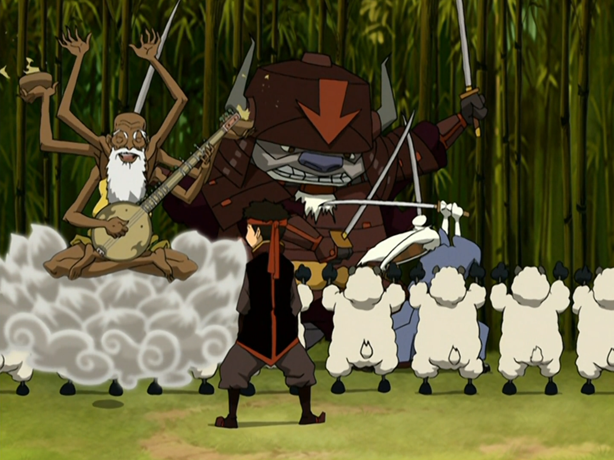

## *תקציר:*
- אנג מתחיל להילחץ לקראת העימות הגדול עם שליט האש, שצפוי להתרחש בליקוי החמה המתקרב. ככל שהיום הגורלי מתקרב, הוא נעשה חרד יותר ויותר – עד כדי כך שהוא מפסיק לישון לחלוטין. חבריו מנסים לעזור לו להירגע: סוקה מנסה לבנות עבורו לוח זמנים לאימונים ולהציע לו "טיפול פסיכולוגי", טוף מציעה לו להתמודד עם הלחץ בגישה ישירה, וקטארה מנסה להרגיע אותו ברכות – אך שום דבר לא מצליח. כתוצאה מחוסר השינה, אנג מתחיל לחוות הזיות מוזרות וחלומות ביזאריים, כולל קרבות מדומיינים עם הפיירלורד שבהם הוא שוכח את מכנסיו, ודיאלוגים סוריאליסטיים עם דמויות שונות.
- במקביל, אנו עוקבים אחרי שגרת יומו של זוקו בארמון כנסיך האש. לכאורה, יש לו כעת כל מה שאי פעם רצה: הכרה מאביו ומאחותו, זוגיות, חיי נסיך עם כל ההטבות והפינוקים, ומעמד של גיבור בעיני אומת האש. אך ככל שהפרק מתקדם, אנו מלווים את זוקו בתהליך ההשלמה עם כך שאלה אינם החיים שהוא רוצה באמת.

## *סיכום במשפט:* 
"אתה בכלל אין לך מכנסיים בעצמך!"

## *ראוי לציון:* 
- הפרק הצליח לשלב בצורה מוצלחת בין קלילות והומור לבין נושאים עמוקים יותר. מצד אחד, הייתה תחושת אס"ק קלה — הרבה רגעים קיצוניים ושבירה של דיסטנס ופאסון מצד הסדרה. הבדיחות היו מוצלחות, הקרב בין אפה למומו היה רגע היסטרי, והחלומות של אנג הוסיפו המון הומור סוריאליסטי. כל אלו יצרו חוויה כיפית ומצחיקה, שמצליחה מצד אחד לבדר, ומצד שני לשקף את הלחץ הפסיכולוגי שאנג חווה.
- אהבתי את האופן שבו הסדרה מציגה את הפחד של אנג לפני הקרב מול הפיירלורד. זה לא מובן מאליו לראות גיבור שמראה פחד אנושי כל כך בסיסי — וזה מוסיף לו עומק. עוד יותר יפה לראות את החברים שלו שם עבורו: כל אחד בדרכו מנסה לתמוך ולעזור לו להתמודד. כולם מביאים חלקים שונים של תמיכה רגשית, גם אם זה לא תמיד עוזר. נראה שהחלק הקומי בסיפור של אנג נועד בעיקר לאזן את הסיפור הדרמטי והכבד יותר של זוקו. ועדיין, התחושות שאנג עובר – החרדה, העייפות, חוסר האונים – הן אמיתיות, ומורגשות מאוד מתחת לשכבת ההומור.
- העלילה המרכזית והמהותית בפרק היא זו של זוקו. כאן אנחנו רואים את השיא של תהליך ההפנמה שזוקו עבר לאורך העונות. זו הפעם הראשונה שאנחנו באמת נחשפים לאורח החיים היומיומי של בן מלוכה באומת האש, עם כל הפינוקים המוגזמים שמוצגים בצורה מגוחכת: אפריונים למרחקים קצרצרים, משרתים שמבצעים כל גחמה, חיי מותרות מוחלטים. דווקא מתוך ההקצנה הזו, מתחדדת ההבנה של זוקו שאלה לא החיים שהוא רוצה. לדעתי, מאי מוצגת כאן בצורה קצת שטחית – בעיקר דרך ההנאה שלה מחיי המלוכה. אני חושב שזה נעשה בכוונה – כדי שזוקו יוכל להבין שהוא מאס בכל אספקט ואספקט של החיים הנוכחיים שלו. ובכל זאת, אני מאמין שיש עוד עתיד לזוג הזה.
- מה שיפה במיוחד בפרק הוא איך שזוקו מתמודד עם ההבנה הזו. הוא לא נכנס לטנטרום, לא מתפרץ. להפך – זו אחת הפעמים הראשונות שבהן הוא מגיב באיפוק, בשקט. זו לא אפאתיות – זה שקט של השלמה. הרגש עדיין קיים, אבל הוא לא סוחף אותו כמו בעבר. הוא כבר לא בריב עם עצמו, לא מבולבל או חסר כיוון. הוא יודע מה הוא רוצה ומה הוא צריך לעשות. הוא לא מונע מתסכול או מכעס – אלא מצלילות מחשבה. כשהוא אומר למאי שזה לא החיים שהוא רוצה – אין בזה דרמה, אין התמסכנות. רק עצב, ואמת. זה רגע שקט אבל עמוק, שמעיד על שינוי פנימי אמיתי.

## *פחות התחברתי:*
בשלב מסוים הרגשתי שהפרק לקחה את הביזאר קצת רחוק מדי

## *ה-MVP של הפרק:*  
אנג

## *עתידות:*
מעניין מה יקרה בין זוקו ומאי כשהוא יחליט להצטרף אל טים אווטאר.
- בתרחיש הראשון (והסביר יותר לדעתי) הוא נפרד ממאי באופן בוגר, מסביר לה למה הוא חייב לעזוב ומתנצל. לדעתי עברו הימים בהם זוקו נעלם בהחלטה של הרגע מבלי להסביר (כמו שהוא עשה לאיירו מספר פעמים בעונות הקודמות) ובלי לשאת באחריות ובהשלכות של המעשים שלו. אם הפרידה שלו ממאי לא קורית באיזשהו סממן של גדלות נפש, מבחינתי זו רגרסיה של הדמות.
- בתרחיש השני (והפחות סביר לדעתי) מאי מצטרפת אל זוקו והם עורקים מאומת האש ביחד. הרי אם הסדרה מעוניינת להעניק איזושהו סוג של גאולה עבור מאי וטיי לי (ואני חושב שהיא אכן מעוניינת), יצטרך להגיע הרגע שבו הן מפסיקות להיות עושות דבריה של אזולה ו-"בוגדות" בה. כבר ראינו את מאי מסרבת לפקודה של אזולה (בפרק 213 "המקדח") ובכל זאת אני לא חושב שהיא הבשילה עדיין לכדי מהלך כזה. לכן מבחינתי זה תרחיש פחות סביר. אבל אני מאמין שזה אכן יקרה במתכונת כלשהי מאוחר יותר בסדרה, ולכן אני גם חושב שזוקו ומאי הם זוג שיש לו עתיד.

## *דירוג הפרק:*  
אחלה