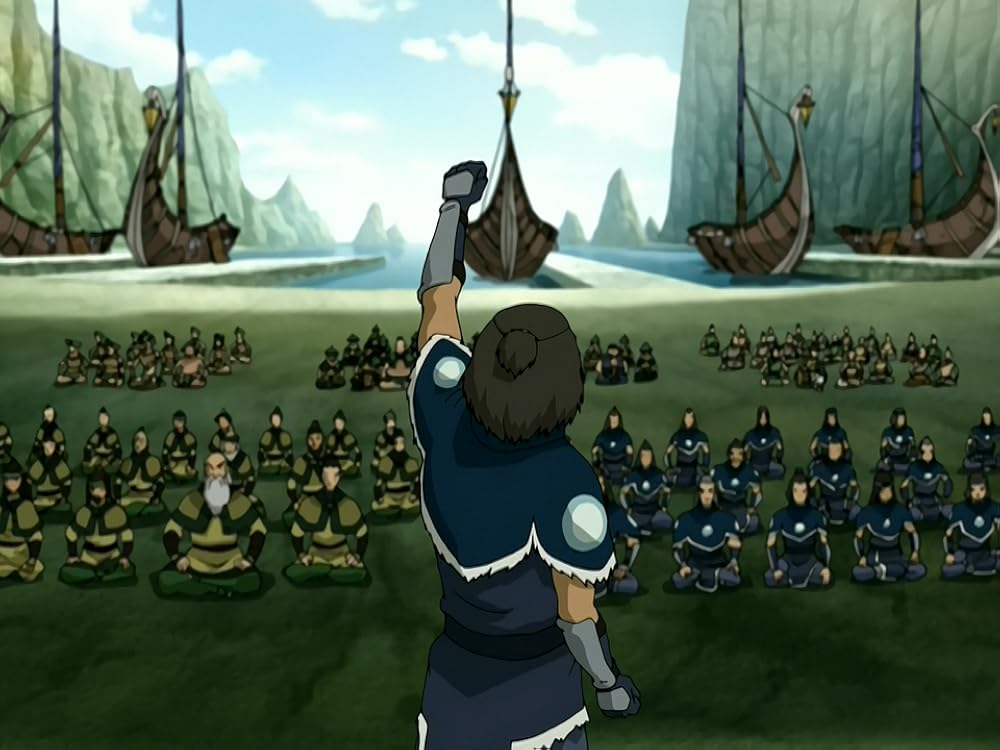

## *תקציר:*
- הרגע לו חיכינו זמן כה רב מגיע סוף־סוף  – ליקוי החמה שבו כשפי האש מאבדים את כוחם. זהו הזמן המתוכנן לפלישה נועזת של טים אווטאר יחד עם שאר בני בריתם לעומק אומת האש, בניסיון להפתיע את הפיירלורד ולהביס אותו כשהוא חסר אונים.
- הפרק נפתח כשאנג וחבריו מתאחדים עם דמויות רבות מהעונות הקודמות – כולם משתתפים בפלישה אמיצה שנעה ביבשה, באוויר ובים, תוך שימוש בטכנולוגיה חדשנית ומכונות מלחמה שפותחו על ידי סוקה ונבנו על ידי הממציא ממקדש האוויר הצפוני.
- בינתיים, איירו בכלאו מזהיר את הסוהרת החביבה עליו שכדאי לה לא להימצא באיזור בצהרי היום. 
- במקביל, זוקו כותב למאי מכתב בו הוא מצהיר על כוונותיו לעשות את הדבר הנכון, ומתנצל. הוא הולך לתמונה של אימו ומתוודה בפניה על הטעויות שהוא עשה ועל הכוונה שלו לתקן אותן
- הכוחות חודרים בהצלחה לעיר הבירה ומגיעים אל תוך הארמון בדיוק עם תחילת הליקוי. אנג נחוש למצוא את אדון האש ולהביס אותו, אך כאשר הוא מגיע לחדר הכס – הוא מגלה שאוזאי איננו שם. הפרק מסתיים במתח גבוה: ברור שהפלישה הייתה מלכודת, ושאומת האש צפתה אותה מראש. בזמן שכוחותינו מבינים שהם נפלו לתוך תוכנית מתוכננת היטב, השעון מתקתק – והליקוי עומד להסתיים.

## *סיכום במשפט:* 
אני לא מאמין שהארו חזר.

## *ראוי לציון:* 
* סוקה לוקח על עצמו תפקיד פיקודי, אך תחילה נכשל בנאום הקרב שלו ומתמודד עם חוסר ביטחון עצמי. לאורך הקרב, הוא מצליח לגבור על חששותיו ומוכיח את עצמו כלוחם ומנהיג ראוי, סגירה משמעותית של קשת עלילתית שסוקה עבר לאורך כל הסדרה.
- הפתיחה של הפרק הרגישה כמו מסיבת מחזור - איחוד מצופה עם דמויות שהתגעגענו אליהן (הממציא ובנו, דיוק ופיפסקוויק) וגם כמה שלא ממש (אנשי הביצה, הבולדר), כשמעל כולם מתבלט הארו אחד (אי אפשר להתעלם מהשפם).
- הדאון החדש שאנג מקבל (מגניב!) וגילוח הראש כמובן מציינים את לידתו מחדש של האווטאר. הוא מפסיק להתחבא. תקופת השיער הייתה מעניינת ונתנה לנו לחקור אספקטים נוספים בדמותו של אנג, אבל עכשיו לקראת סוף הסדרה הגיע זמנו לחזור.
- סצנות האקשן פשוט אדירות. הכיאורוגרפיה והאנימציה מושקעות מאוד, הלחימה לא אקראית אלא מלחמה אסטרטגית ומחושבת, וזה דבר שעוד לא ראינו בסדרה. זה גם הפרק האלים ביותר בסדרה עד כה. הלחימה משתמשת בהמצאות רבות ומגניבות - אמצעי הלחימה שסוקה תכנן מבוססים על הכשפויות של לוחמיו, וכמעט כל דמות מקבלת פה רגע לזרוח ולעשות משהו. אפה צולל באמצעות בועת אוויר שקטארה מייצרת זה פשוט אדיר. יוצא מן הכלל.
- בנוסף, תענוג לראות סוף כל סוף אויב שקול (או לפחות לא נחות לגמרי) לאומת האש מבחינה טכנולוגית. כל הכבוד לסוקה ולממציא.
- הנשיקה של אנג וקטארה הייתה רגע מתבקש ועשוי היטב. לדעתי הם לא ידברו על זה ויתכחשו אליה עד סוף הסדרה.
- קצת באסה שזוקו "נפרד" ממאי במכתב. אני די רציתי סצנה פרידה פרונטלית ביניהם כדי להדגים את ההתקדמות של זוקו כאדם, אבל אני גם קצת יכול להצדיק את זוקו שהוא לא ידע לחזות את התגובה שלה לזה והעדיף לא לערב אותה בבגידה שלו.
- זוקו החליט. הוא הולך לעשות את זה. זה קורה let's go אהההההעאעאאעעעעע. 

## *ה-MVP של הפרק:*  
זוקו וסוקה

## *דירוג הפרק:*  
מגה זורד