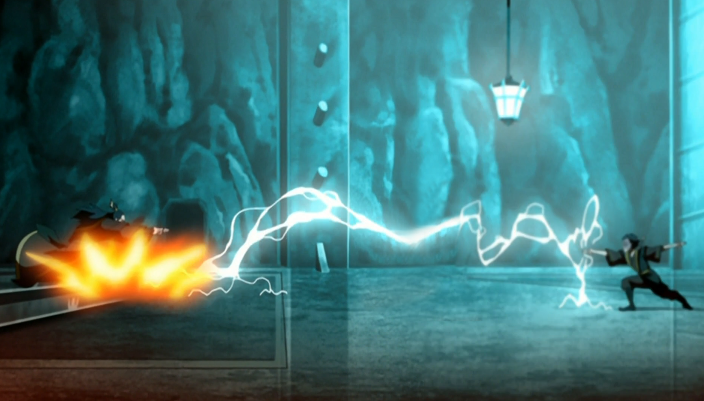

## *תקציר:*
* הפלישה לאומת האש מגיעה לשיאה – אך מתגלה ככישלון מר. אנג, סוקה וטוף חודרים לעומק הארמון בניסיון לאתר את פיירלורד אוזאי ולשים קץ למלחמה. הם נתקלים באזולה, שמצליחה למשוך זמן עד תום הליקוי ובכך לסכל את משימתם.
- במקביל, זוקו מתעמת לראשונה עם אוזאי, כשאביו אינו מסוגל לתקוף אותו. הוא מאשים אותו בהיותו אב אכזרי, ומצהיר על כוונתו להצטרף אל האווטאר ולעזור לו להביא לסיום המלחמה. זוקו מצליח להימלט מידי אביו וממהר לחלץ את דודו, איירו – אך מגלה שאיירו כבר ברח בכוחות עצמו.
- אנג, סוקה וטוף נאלצים לסגת כשהם מבינים שאין להם סיכוי לנצח. מחוץ לעיר, כוחות הפלישה מבינים שלא יוכלו לעמוד מול צבאה העצום של אומת האש. בלית ברירה, הכוחות נסוגים, אך הדרך היחידה החוצה היא על גבו של אפה. בהחלטה קשה, המבוגרים מחליטים להישאר מאחור וליפול בשבי אומת האש, בעוד טים אווטאר ושאר הצעירים נמלטים בעזרת אפה.
- הפרק מסתיים כשאנג מציע לטוס אל מקדש האוויר המערבי, ואנו רואים את זוקו טס בעקבותיהם בתוך בלון מלחמה.
## *סיכום במשפט:* 
וואו

## *ראוי לציון:* 
 * המחיר ששילמנו על ידיעתה של אזולה על הפלישה אכן היה כואב וזה מעלה הרבה שאלות לגבי חצי העונה הקצר שנותר לפנינו
* אהבתי שאנחנו יודעים לאן אנחנו טסים
* סימנו וי על כל הדברים שהיו צריכים
* לא חשבתי שזוקו יטרח להתעמת עם אוזאי ועכשיו אני לא יכול לדמיין דרך אחרת שזה יקרה. והרעיון לעשות את זה בליקוי החמה מבריק - זוקו לוחם חרב הרבה יותר טוב מאוזאי ולכן אין לאוזאי מה לעשות.
* אם אזולה לא הייתה יודעת שהם באים זה אשכרה היה עובד. התכנית שלהם הייתה טובה.
* הפרק בנוי טוב ויש לו קצב טוב
* אני חושב שהם למדו מאוד טוב מהפינאלה של עונה 1, שגם הוא היה כפול אבל עמוס למוות. הפרק הזה אמנם היה אינטנסיבי אבל היה בקצב טוב והיה מרווח לנשימה. רוב ההכנות בוצעו לפני שהגענו לפרק, כך שהפרק בשלמותו יכל לעסוק כמעט אך ורק בהתפתחויות ולא בסטאפ.
* לדעתי מבחינת כתיבה זו הייתה בחירה נכונה לא להראות את הבחירה של איירו. גם כדי להשאיר לנו לדמיין מה כבר איירו יכל לעשות, וגם כי זה היה מסיח מהאקשן הרלוונטי של הפרק שזה הפלישה.
* הגילוי שסוקי שבויה והנפנוף של אזולה בזה, היה מאוד כואב. אזולה עשתה את המחקר שלה וידעה בדיוק מי זה מי ומה החוטים שגורמים לכל אחד מטים אווטאר לרקד. 
* זה פאקינג קרה. זוקו הולך להצטרך לטים אווטאר! 

 - הפרק בנוי מצוין – קצב טוב, מתח, רגעים מרגשים. סימנו וי על כל מה שהיה צריך. התקדמות של העלילה, סגירת קצוות, פיתוח דמויות, רגעים עוצמתיים – הכל היה פה, והכל נעשה כמו שצריך. הפרק אינטנסיבי, אבל גם נותן רגעים לנשום. היה איזון טוב בין אקשן לדרמה, בין התקדמות עלילתית לרגעים אישיים. אפשר לראות כמה הפיקו לקחים מהפינאלה של עונה 1. גם היא הייתה כפולה, אבל צפופה ועמוסה. כאן נתנו מקום להכנות בפרקים שלפני, כך שהפרק עצמו התמקד כמעט לחלוטין בהתפתחויות עצמן ולא בסט-אפ. החלטה חכמה שהשתלמה.
- המחיר ששילמנו על כך שאזולה ידעה על הפלישה היה כואב.  כל הכוחות, כל התקוות, כל ההשקעה – ירדו לטמיון בגלל דליפה אחת מטופשת. וזה מעלה המון שאלות לגבי מה שצפוי בחצי העונה הקצר שנותר לפנינו.
- זה עוד יותר כואב כשמבינים שאם אזולה לא הייתה יודעת שהם באים – זה אשכרה היה עובד. התכנית של הפלישה הייתה חכמה. הם חשבו על הכל – תזמון, הסחת דעת, חלוקה לצוותים. זה היה מהלך מתוכנן היטב שיכול היה להצליח, אלמלא ההדלפה.
- זו בחירה חכמה לא להראות את הבריחה של איירו. זה משאיר מקום לדמיון – מה הוא עשה, איך זה קרה – וגם לא מסיח מהאירוע המרכזי של הפרק. ברגע שאתה רואה את איירו מצליח לבד, זה מוסיף לו כבוד ותחושת מסתורין, בלי לגנוב פוקוס.
- הגילוי שסוקי שבויה, והאופן שבו אזולה הציגה את זה – היה כואב.  אזולה, כרגיל, שלטה במצב. היא ידעה בדיוק איך לתמרן את סוקה ואת טים אווטאר, ואיך למשוך זמן עד שהליקוי ייגמר. היא עשתה את שיעורי הבית שלה, והראתה לנו שוב שהיא יריבה מסוכנת לא פחות מהפיירלורד.
- לא חשבתי שזוקו יתעמת עם אוזאי – ועכשיו אני לא יכול לדמיין דרך אחרת שזה היה קורה. הרעיון לעשות את זה בדיוק בזמן ליקוי החמה הוא פשוט מבריק – בזמן שאוזאי חסר כוחות, כשהיתרון של זוקו בחרבות בא לידי ביטוי. זה עימות שהרגיש מתוזמן להפליא, גם מבחינה רגשית וגם מבחינה אסטרטגית.
 * זה פאקינג קרה – זוקו הולך להצטרף לטים אווטאר! אני עדיין לא מאמין שזה קורה. במשך שתי עונות בנו לנו את הדמות שלו, את ההתלבטויות, את הכאב, את הדרך. והנה, סוף-סוף, הוא עושה את הצעד שכולנו קיווינו שיגיע – מצהיר על כוונתו להצטרף לאווטאר ולעזור לסיים את המלחמה.

## *פחות התחברתי:*
כלום

## *ה-MVP של הפרק:*  
אנג

## *עתידות:*
הפרק נגמר בכך שגיבורינו טסים למקדש האוויר המערבי וזוקו טס אחריהם. זה מצחיק כי זה היה עשוי קצת כמו בעונה 1 כשהוא רדף אחריהם. בפרק הבא טים אווטאר יהיו בדאון כי הם הרגע הפסידו והשאירו מאחור את כל המבוגרים. ופתאום זוקו יופיע, וזה יהיה הזיה כי אין להם שום סיבה לסמוך עליו. מה הוא בכלל הולך להגיד להם?? "שלום"?. אני חושב שהסדרה תקדיש פרק שלם לזה. למה בדיוק הוא יגיד להם, ואיך הם יקבלו אותו וילמדו לסמוך עליו.
בפרק אחריו כנראה זוקו ילמד את אנג כשפות אש. לדעתי אלו יהיו שני פרקים נפרדים.
לגבי הפרקים שנשארו - אין לי מושג. אני חושד שנקבל פרק מהפרספקטיבה של אבא של סוקה בכלא. צריך גם להבין כמה זמן ייקח לאיירו למצוא את זוקו ומה יקרה איתו. ולדעתי צריך גם לדבר על נושא החיות שיצא לגמרי משליטה.
זו התחלה של פאזה שונה ואחרונה בסדרה הזו. זו ממש ההתחלה של הסוף. ואני לגמרי מושקע.

## *דירוג הפרק:*  
מגה זורד