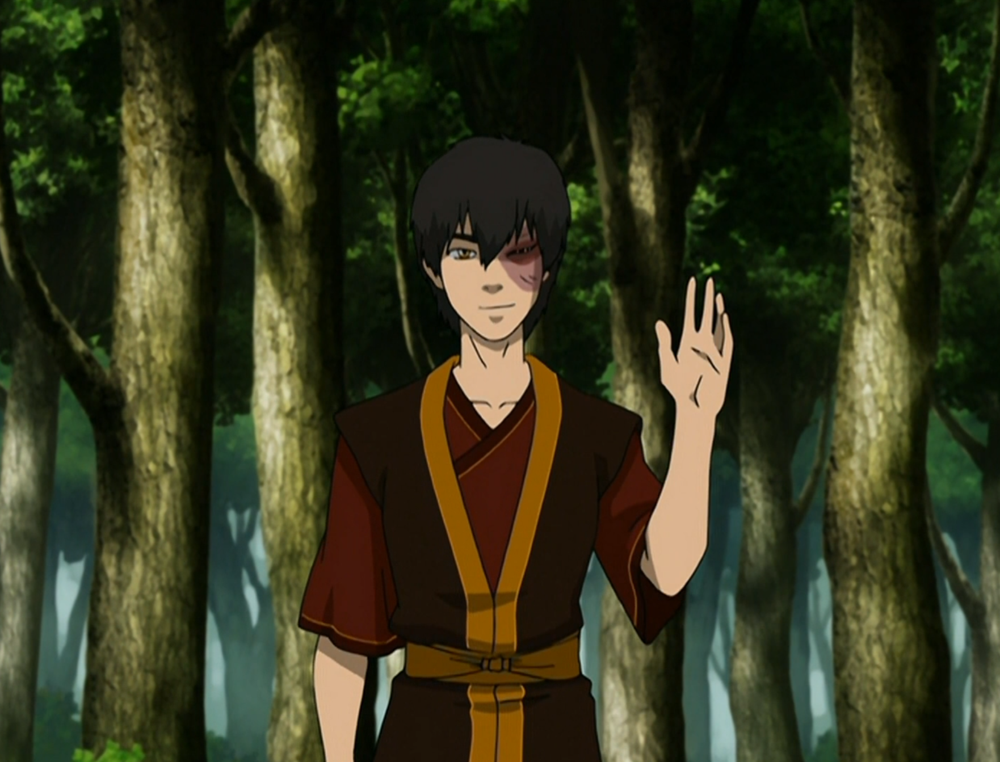

## *תקציר:*
* החבורה (+ הארו + דיוק + תאו) נמלטים לאחר כישלון הפלישה ביום השמש השחורה ומגיעים למקדש האוויר המערבי – מקדש נסתר, הבנוי מתחת לצוקים ומעולם לא נראה קודם לכן בסדרה. זהו מקום בטוח לעת עתה, אבל טים אווטאר מתוחים ומותשים.
* במקביל, זוקו מגיע אף הוא אל המקדש, נחוש להצטרף אל אנג ולעזור לו להביס את אביו. הוא מנסה לפנות אליהם בדרכי שלום, אך מעיבה על כך ההיסטוריה האישית שלו איתם כנבל חסר רחמים שרדף אחריהם והתנכל להם. כולם חושדים בו, במיוחד קטארה. הניסיון שלו להסביר את השינוי שחל בו מתקבל באי־אמון, והמפגש מסתיים בעימות.
* מאוחר יותר, זוקו מנסה להוכיח את כוונותיו בכך שהוא מתעמת עם איש הפיצוצים, שהוא עצמו שלח לרדוף אחר אנג בתחילת העונה. זוקו עוזר להרחיק את האיום ובכך רוכש מעט אמון.
* הפרק מסתיים בכך שאנג מקבל אותו רשמית כמורהו לכשפות אש. זוקו סוף־סוף מצטרף לחבורה – אבל עדיין ניצב בפני משימה קשה: לזכות באמון של חברים חדשים, במיוחד של קטארה, שעדיין אינה סולחת לו.

## *סיכום במשפט:* 
"Hello, Zuko here"

## *ראוי לציון:* 
* העיצוב של מקדש האוויר המערבי מרהיב.
* הפרק עשיר בפרטים קטנים שמוסיפים עומק והמשכיות. למשל, חיבתו של אפה לזוקו נובעת מכך שהוא זוכר שזוקו היה זה ששחרר אותו,  או אפילו האזכור של הרוקחת, הצפרדעים ופרק הרוח הכחולה – מה שמעניק תחושת המשכיות ותגמול לצופים המסורים.
 * אני אוהב את הבחירה להציג לנו את הפלאשבקים של זוקו - אנחנו מקבלים הצצה לימים הראשונים של זוקו כמנודה, מעין תזכורת מאיפה באנו. זוקו של ההווה מתקרנג'ג' כשהוא נזכר בעצמו של פעם, דרך מצוינת להראות לנו גם את המסע שהוא עבר, וגם את תחושת האשמה שהוא חש כלפי דוד איירו. אם בזמנו הוא חיפש כבוד, היום הוא מבין שהתנהגותו דאז לא כיבדה את עצמו ואת דודו.
 * הפרק מצליח לספק פאן סרוויס מטורף. הדיאלוגים העצמיים של זוקו עשויים בחסד, ולראות אותו נבוך ממעשיו זה מאוד מספק. השיא מבחינתי הוא סבב החיקויים שלו לאיירו ולאזולה. אי אפשר שלא לאהוב את זוקו ולהיות בעדו.
 * מאוד הגיוני שטוף תהיה הכי פתוחה לקבל את זוקו - היא לא ממש נכוותה ממנו באופן אישי, היא שמעה מאיירו את הסיפור שלו, היא מרגישה שהוא דובר אמת, והיא אדם פרקטי וריאלי.
 * וכמובן שקטארה עדיין לא סומכת על זוקו, בעיקר כי היא פגועה ממנו באופן אישי. בבה סינג זה היא באמת האמינה לו שהוא רוצה להשתנות, והבחירה שלו להצטרף לאזולה פגעה בה באופן אישי. 
 * הבחירה לחבר בין אנג וזוקו באמצעות הצורך של שניהם ללמוד להיות כשפי אש זהירים ולהימנע מלפגוע באנשים, היא מאוד חכמה. החיבור הזה מעניק עומק נוסף ליחסים ביניהם ומבהיר סופית עבור אנג שהחיבור עם זוקו הוא אכן גורלי ומשמעותי.
 
## *פחות התחברתי:*
* קצת מוזר שמי שהביס בסוף את איש הפיצוצים זה בכלל סוקה ולא זוקו

## *ה-MVP של הפרק:*  
זוקו

## *עתידות:*
* פרק הבא לומדים כשפות אש
* אני מצפה לראות איזה מין ברומאנס הולך להתפתח בין זוקו וסוקה

## *דירוג הפרק:*  
אדיר