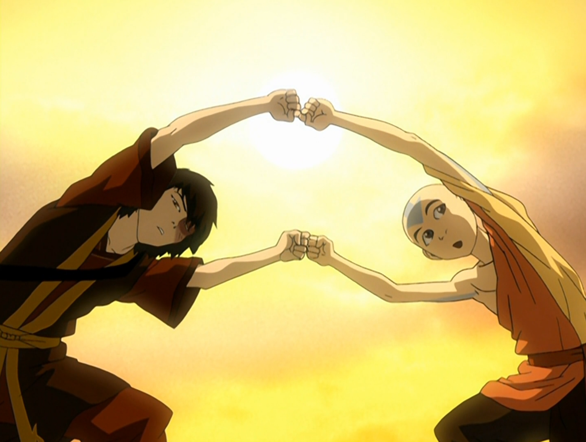

## *תקציר:*
- זוקו מנסה ללמד את אנג כשפות אש, אך מהר מאוד אנחנו מגלים שהוא איבד את הכשפות שלו. אנג חושד שזה בגלל שהכשפות של זוקו הסתמכה על זעם ושנאה, וכעת כשהם כבר לא קיימים אצלו אין לו אנרגיות לתעל אל הכשפות. טוף מציעה להם ללמוד מחדש את הכשפות מיסודה, דרך המקור – הדרקונים.
- זוקו ואנג יוצאים לחקור את חורבות ציוויליזציית לוחמי השמש – ציוויליזציה נכחדת שסגדה לדרקונים, וממנה התפתחה אומת האש כפי שאנחנו מכירים אותה. מהר מאוד מתברר שאותה ציוויליזציה לא ממש נכחדה, אלא חיה בסתר במשך מאות שנים כדי להגן על עצמה ועל הדרקונים. לוחמי השמש מסכימים להביא את אנג וזוקו אל מאסטרי כשפות האש שמנהיגים אותם – רן ושו – כדי שאלו ישפטו אותם ויחליטו אם ללמדם.
- המאסטרים רן ושו מתבררים כדרקונים, ואלו מראים לאנג ולזוקו חיזיון – האש שלהם מורכבת מכל צבעי הקשת. ודי בזה כדי ללמד אותם את האמת היסודית שבכשפות האש. היכולות של זוקו חוזרות אליו, ובפעם הראשונה אנג מבין שאש היא לא רק הרס, אלא גם אנרגיית החיים.

## *סיכום במשפט:* 
אש המכבייה

## *ראוי לציון:* 
- אני אוהב שאנחנו עדיין באותו מקום, במקדש האוויר המערבי. אני מקווה שנישאר פה למשך עוד כמה פרקים ושהמקום הזה יהפך למעין בית / בסיס המבצעים של טים אווטאר.
- זוקו החדש הוא דמות חדשה, ונשאלת השאלה: מי הוא בכלל? איך הוא בתור בן אדם, איך הוא עם אנשים, איך הוא מדבר ואיך הוא מתנהג? אלו דברים שהפרק הזה עוסק בהם ובהצלחה ובהחלט נראה גם בפרקים הבאים
- הפרק מרחיב מאוד את הדמות של איירו, ומוסיף לו המון עומק. יפה לראות שזוקו פתאום מבין שגם איירו הוא דמות עם עבר מורכב. הסדרה גם רומזת שזוקו מאמץ לאט-לאט את המניירות של איירו: החיקוי שעשה בפרק הקודם, והאמירה בפרק הזה על "לתהות על מקומנו ביקום" – זה לא סתם גאג, יש שם ניחוחות ברורים של איירו. בפרק הזה, זוקו מסתכל על איירו ברטרוספקטיבה – הוא בצד השני של התהליך שאיירו ניסה להעביר אותו. הוא פתאום מבין את הדמות של דוד שלו מחדש, מעריך אותו יותר, וזה רק מגביר את האשמה שהוא חש.
- גם בלי להגיד את זה במפורש, הפרק הזה בהחלט מראה את הקשר החדש שמתהווה בין אנג וזוקו. מספיקים חילופי דברים קטנים כמו "אתה בעצם די חכם" או "אני מאמין בך, אתה ילד מוכשר" כדי להעביר את המסר. זה חשוב, כי אנג הוא לא סתם עוד דמות בחיים של זוקו. הסדרה ביססה שותפות גורל בין השניים – העתיד שלהם שזור זה בזה. ההחלטה שאנג ילמד כשפות אש דווקא מזוקו היא לא מקרית: כשפות האש של זוקו הייתה מושרשת ברצון שלו לתפוס את אנג. -מבחינה נראטיבית זה מאוד חכם. הכותבים יודעים מה הם עושים – תכנון הסיפור ברמת המאקרו פשוט יוצא מן הכלל.
- הפרק מוסיף הרבה עומק למושג כשפות האש, ומבסס את הרעיון שאומת האש המודרנית עיוותה את יסודות האמנות הזו. חלק חשוב מהשיבוש הזה הוא איבוד הכבוד לדרקונים. הסצנה של האש הצבעונית מאוד חזקה – גם ויזואלית מרהיבה וגם מעבירה בצורה אלגנטית את הרעיון הבסיסי של מהות כשפות האש, בלי מילים מיותרות.
- הסיקוונס של הריקוד עם הדרקונים פשוט מגניב בטירוף.
- בשעה טובה הפרק הזה סידר לי את עניין החיות, גם אם הוא לא אמר על זה הרבה במפורש.
- בשלב הזה כל משפט, כל דיאלוג וכל רפליקה – הם פאן סרוויס. וזה טבעי, ככה זה תמיד כשמגיעים ליישורת האחרונה של סיפור שחלק גדול מהלב שלו הוא דינמיקה בין דמויות.
 
## *פחות התחברתי:*
- חבל לי על הארו, תיאו ודיוק. בהתחלה מאוד התלהבתי מזה שטים אווטאר מתרחב – זה מגניב בטירוף. אבל משום מה, הסדרה לא בקטע של זה: בשני הפרקים האחרונים היא דחקה את הדמויות האלו הצידה בכוח. אז למה מלכתחילה? אני בכלל חשבתי שהרעיון הוא להראות איך טים אווטאר מתפתחים מקבוצת חברים שמסתובבת סתם ככה לכוח לחימה משמעותי שסוחף אחריו אנשים. רציתי לראות את טים אווטאר נהיים שחקן הנהגתי חשוב במלחמה, לא רק ארבעה ילדים – אלא הנהגה משמעותית במלחמה הזו.
* האמת שחשבתי שהסצנה שבה זוקו ואנג דבוקים ולא יכולים לזוז תתפתח למעין שיחת נפש עמוקה ביניהם, כי זה הרגיש כמו סטאפ קלאסי לסצנה כזו, שגם מאוד מתבקשת מבחינה תמתית וסיפורית. חבל שזה לא קרה בסוף.
* זוקו לא חייך בסוף של הפרק.

## *ה-MVP של הפרק:*  
זוקו ואנג

## *עתידות:*
* המבט המחודש של זוקו על דוד איירו גורם לי להבין שהאיחוד של איירו וזוקו יגיע מאוד מאוחר. הסדרה תמשוך את תחושת האשמה של זוקו כלפי איירו עד הקצה.
* אני מאוד מצפה לראות איך הסדרה תבנה את מערכת היחסים של סוקה וזוקו לאורך הפרקים הבאים. יש וייב שזה הולך להיות ברומאנס.
* סביר להניח שעד פרקי הסיום של הסדרה יהיה פרק שלם שמתמקד באיך זוקו רוכש את האמון של קטארה. לדעתי הגיוני שזה יהיה פרק שעוסק גם בכשפות דם, ומעניין איך זוקו יגיב לזה. אולי למשל קטארה תאלץ להשתמש בכשפות דם כדי להגן על זוקו, ואולי זה איכשהו יצית משהו. או שאולי החיבור בין זוקו וקטארה יהיה דרך הצדדים האפלים שבשניהם.
* הסדרה מתנהגת כאילו היא מעוניינת לאפשר גאולה לכל דמות שהיא מסוגלת לתת לה. אנחנו הולכים להתעמק הרבה ביותר בדילמה של אנג כשהוא יצטרך לעמוד מול אוזאי – האם הוא צריך להרוג אותו? האם הוא צריך לחוס עליו? אני לא יודע עדיין מה תהיה הפסיקה של הסדרה לגבי זה, אבל אני כן מאמין שמבחינת הסדרה לאוזאי אין תקנה. אבל לדעתי דווקא עבור אזולה הסדרה תשאיר פתח לגאולה קטנה – ככל הנראה בצורה של שיקום מערכת היחסים שלה עם זוקו. אני לא חושב שהיא תמות, אבל עדיין יצטרכו להביס אותה ולהתעמת איתה. בעיני גם טיי לי ומאי יצטרכו לקבל גאולה, וכנראה על ידי כך שהן יתנגדו אל אזולה. הכי הגיוני לי שזה יקרה בצורה של עימות ישיר של זוקו מול אזולה, שבו מאי תחליט שהיא מצדדת בזוקו במקום באזולה בגלל שהיא אוהבת אותו, וטיי לי כנראה תלך בעקבותיה ותעזור להם גם.
* אני לא חושב שנזכה לקבל סגירה לעניין של אמא של זוקו בתחומי הסדרה הזו. אני כן חושב שהסדרה תסתיים כשזוקו יהיה הפיירלורד והוא ירצה ללכת לחפש אותה או לברר מה קרה לה. אבל אני לא מאמין שנראה את זה. לדעתי אין לזה מקום בסיפור של הסדרה
* יש גם את עניין המבוגרים שנשארו בכלא ואני לא יודע כמה הסדרה תטרח להקדיש לזה זמן ומחשבה. כנ"ל לגבי סוקי.
* מבחינת טוף הדבר היחידי שלא הסתיים זה מערכת היחסים שלה עם ההורים שלה. ראינו שהיא רוצה להתפייס איתם ושהיא שלחה להם מכתב, אבל לא ראינו מה קורה עם זה. אז אולי נזכה לראות את זה קורה.
* הפרק הבא הוא פרק כפול. אין לי מושג למה לצפות ואיזה מין איבנט הוא עשוי לגולל. הימור שלי – נקבל פרק על ימיו האבודים של בוסקו.

## *דירוג הפרק:*  
אדיר