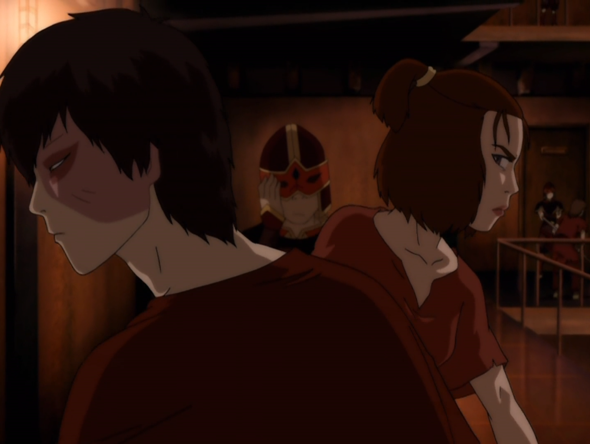

## *תקציר:*
- זוקו וסוקה יוצאים יחד למשימה מסוכנת – לפרוץ לכלא השמור ביותר של אומת האש, המכונה "הסלע הרותח", במטרה לשחרר את אביו של סוקה, האקודה, שנשבה לאחר הפלישה ביום השמש השחורה.  
- השניים משתמשים בבלון מלחמה כדי להגיע לאי הכלא, המוקף באגם רותח שהופך את הבריחה לכמעט בלתי אפשרית. הם מתחזים לסוהרים ומצליחים להסתנן פנימה, אך לא מוצאים את האקודה.  
- במהלך השהות בכלא מגלה סוקה לתדהמתו שסוקי נמצאת שם – היא נשבתה בעבר על ידי אזולה.  
- לקראת סוף הפרק, כשנראה שהתוכנית להבריח את סוקי ואת עצמם כמעט מצליחה, מתגלה בעיה: קבוצה נוספת של אסירים מגיעה – ייתכן שבתוכה נמצא גם אביו של סוקה. כעת סוקה ניצב בפני דילמה קשה – לברוח מיד ולהציל את סוקי, או להישאר ולנסות לשחרר גם את אביו, תוך סיכון האפשרות לחלץ את סוקי.  
- לבסוף מחליטים סוקה, זוקו וסוקי להישאר לילה נוסף בסלע הרותח, בעוד מספר אסירים אחרים – שגילו על ניסיון הבריחה – בורחים במקומם. הבריחה נכשלת, ולמזלם, סוקה, זוקו וסוקי לא השתתפו בה. הפרק מסתיים כאשר האסירים החדשים מגיעים, והאקודה אכן אחד מהם.

## *סיכום במשפט:* 
"That's rough, buddy."

## *ראוי לציון:* 
* אהבתי מאוד את הפתיחה, שבה זוקו מגיש תה לחבריו ומנסה לספר בדיחה של דודו איירו – עוד ניסיון מצדו לאמץ את דרכיו של דודו. כפי שכבר דיברנו בעבר, תחושת האשמה והבגידה שזוקו חש כלפי איירו הולכת ומעמיקה, ונועדה להעצים את סצנת האיחוד המרגשת ביניהם בעתיד.
* זוקו לא היה חייב להצטרף לסוקה. הוא בחר בכך – לא רק כדי להוכיח את עצמו בפניו, אלא מתוך דאגה כנה. הוא מבין שלמרות הסכנה, סוקה לא יוותר על המשימה, ולכן מחליט להצטרף אליו כדי לעזור ולהגן עליו.
* גם הפרק הזה עוסק במסע ההתבגרות של סוקה והפיכתו למנהיג. לא במקרה, כבר בשלב מוקדם של הפרק, זוקו הופך בעצמו לאסיר – והאחריות על כל יתר הדמויות מוטלת בלעדית כמעט על סוקה. כולם נותנים בו אמון, והוא היחיד שנמצא בעמדת כוח.
* הברומאנס בין זוקו לסוקה מתפתח ומקבל התייחסות – גם אם בצורה מעט שונה מהמצופה. הדיאלוג ביניהם על גבי אפה מצליח להיות גם מצחיק וגם מרגש, ונותן לשניהם רגע של הזדהות הדדית סביב ההקרבות שנאלצו לעשות במערכות היחסים שלהם.
* מעבר לכימיה החברית, הפרק מציג גם כימיה טקטית ומבצעית חזקה ומפתיעה ביניהם. האמון ביניהם מתפתח במהירות רבה, ולעומק מתפיע.
* עוד מימד של השוואה בין השניים הוא האיזון בין תכנון קדימה לאימפולסיביות: אם בעבר זוקו היה פועל מתוך דחף וסוקה מתוך מחשבה, הרי שכאן נדרשים שניהם למצוא איזון בין שני הסגנונות. 

## *ה-MVP של הפרק:*  
זוקו

## *דירוג הפרק:*
אדיר