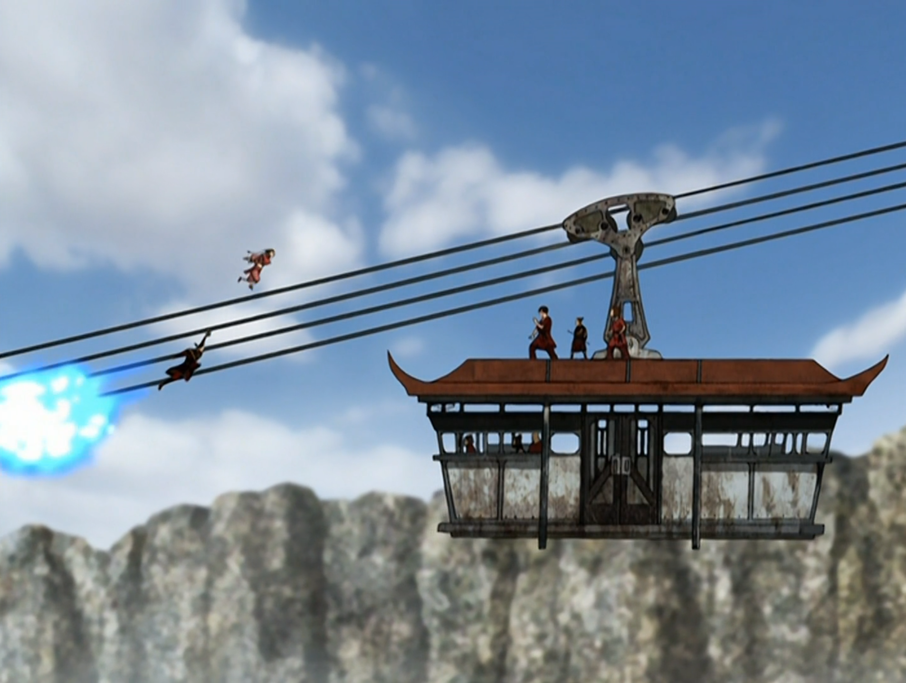

## *תקציר:*
- סוקה וזוקו ממשיכים במשימה המסוכנת בתוך כלא "הסלע הרותח", לאחר שגילו שאביו של סוקה, האקודה, נשלח לשם. סוקה מתכנן ניסיון בריחה חדש, הפעם יחד עם סוקי, האקודה, וצ'יט סאנג.
- התוכנית מסתבכת כשמאי מגיעה לכלא כדי לבקר את זוקו, והיא מתעמתת איתו לגבי עזיבתו. יחד איתה מגיעות גם אזולה וטאי לי.
- סוקה מוכיח את עצמו כמנהיג מתוחכם שמצליח לבנות תוכנית בריחה חכמה תוך כדי תנועה – על ידי חטיפת רכבל האסירים והסעתו אל מחוץ לכלא.
- במהלך ניסיון ההימלטות, מתפתח קרב דרמטי בין הקבוצה לבין אזולה. אך דווקא מאי, שנקרעת בין נאמנותה לאזולה לבין אהבתה לזוקו, בוגדת באזולה ומצילה את הקבוצה. כשאזולה מתעמתת איתה בזעם, טאי לי מפתיעה את כולם ובוגדת גם היא – היא משתקת את אזולה ומצילה את מאי. בעקבות זאת, אזולה מאבדת שליטה, שוקעת בזעם קר ומצווה על כליאתה של שתיהן כבוגדות.
- הפרק מסתיים בהצלחה של הבריחה: סוקה וזוקו חוזרים עם סוקי, האקודה וצ’יט סאנג, ומביאים ניצחון מורלי חשוב לחבורה.

## *סיכום במשפט:* 
הרכבל של צוק מנרה יותר שווה

## *ראוי לציון:* 
- לדעתי ההחלטה לעשות פרק כפול היא טובה. לראות ניסיון בריחה ראשון שנכשל מגדיל את תחושת הסיכון, ומאפשר לטפל טוב יותר בקונפליקטים של סוקה כמנהיג.
- הביצוע היה טוב ומפתיע ומותח ומרגש. וזה כל מה שצריך.
- זוקו קיבל הרבה טיפול בפרק הזה, בין אם זו מערכת היחסים שלו עם מאי או היכולת שלו לתת אמון באנשים אחרים ולהתמסר אליהם.
- אהבתי איך שזוקו וסוקה נלחמים בסינרגיה מול אזולה. כל פעם שאזולה תוקפת, אחד מהם מגן על השני, בין אם זה זוקו שמפנה את הברקים שלה או סוקה שמונע ממנה להתקרב אליהם בעזרת החרב שלו.
- העימות של מאי וטאי לי מול אזולה בסוף הפרק היה מתבקש. אנחנו רואים בפעם הראשונה את אזולה כועסת ומרגישה נבגדת. מעניין לראות אותה מאבדת שליטה. היא ממש עמדה לתקוף את מאי קשות. ובדיוק בשלב הזה טאי לי מראה שאיכפת לה יותר מחברות ומסולידריות מאשר נאמנות לאזולה
- בסוף הפרק הצטרפו עוד שלושה אנשים אל טים אווטאר ואנחנו עדיין במקדש האוויר המערבי. אז אני מתחיל לחשוב שהסדרה באמת רוצה להתחייב לתהליך של אנשים שמתאספים סביב טים אווטאר לאורך הדרך, והפיכתו לנחלת הכלל.
 
## *פחות התחברתי:*
הלהביורים של אזולה הופכים אותה למנוע סילון וזה קצת מוגזם בעיני

## *ה-MVP של הפרק:*  
מאי

## *עתידות:*
- אנחנו בעיצומה של טרילוגיה בארבעה פרקים: הפרק הראשון היה הרפתקה של אנג וזוקו. הפרקים השני והשלישי היו הרפתקה של סוקה וזוקו. הפרק השלישי יהיה הרפתקה של קטארה וזוקו - פרק שבו הוא רוכש את האמון של קטרה ויש התייחסות משמעותית לנושא כשפות הדם. לדעתי, הפרק יחבר בין זוקו וקטארה על ידי הצדדים האפלים שקיימים בשניהם. לדעתי טוף וזוקו לא יקבלו פרק ביחד, כי אין ממש תמות שמחברות ביניהם. הקצה הפתוח היחידי בדמות של טוף הוא האיחוד שלה עם הוריה לאחר ששלחה להם מכתב, אבל אני לא כל כך מבין איך אפשר לבנות פרק שלם סביב זה. במיוחד לאור העובדה שאני לא מאמין שנושא היעלמותה של אמא של זוקו ייפתר בתחומי הסדרה. לדעתי פרק 317 והאחרון לפני פרקי סיום הסדרה יעסוק במשהו אחר. 

## *דירוג הפרק:*
אדיר