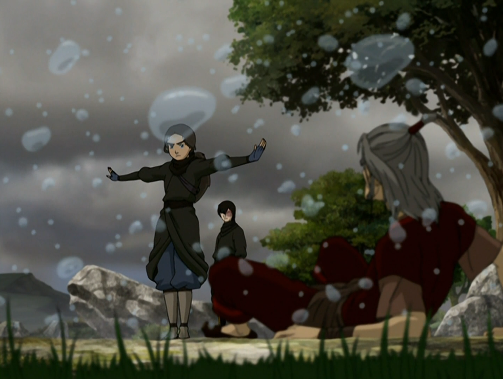

 
## *תקציר:*
- קטארה עדיין זועמת על זוקו, והוא מוכן לעשות הכל כדי לפייס אותה. לאחר שהוא מתייעץ עם סוקה, זוקו מבין שקטארה עדיין מתמודדת עם זיכרון אובדן אימה שנרצחה בידי חיילי אומת האש, ומקשרת את הטראומה אליו. הוא מחליט לעזור לה למצוא את האיש שרצח את אימה, בתקווה לאפשר לה סגירת מעגל.
- השניים יוצאים יחד למסע כדי לאתר את המפקד של הפושטים הדרומיים – היחידה של אומת האש שתקפה את שבט המים הדרומי. הם מתחקים אחר פעילות צבא האש ומצליחים לאתר את האיש – קצין זקן שכבר פרש מהצבא וחי חיים שקטים וחסרי השפעה.
- במהלך המסע, קטארה מתמודדת עם רגשות קשים של כעס, כאב ורצון לנקמה. היא שוקלת להרוג את מפקד הפושטים הדרומיים, אך ברגע האמת, כשהיא עומדת מולו, היא מבינה שהוא כבר אדם מרוקן, חלש ופחדן – לא דמות רבת עוצמה כמו שזכרה מהעבר. לבסוף, קטארה מחליטה לחוס על חייו – לא מתוך מחילה, אלא כי היא מבינה שנקמה לא תרפא את הכאב. זוקו מכבד את ההחלטה שלה, והקשר ביניהם מתחזק. כשהם חוזרת למחנה, היא פונה לאנג ומביעה את הכרת התודה שלה על כך שהוא תמך בדרך של חמלה.
- הפרק מסתיים כשזוקו מאמת את אנג עם שאלת מיליון הדולר, זו שאנו הצופים תוהים לגביה כבר זמן רב: בבוא העת, כיצד יתמודד אנג בפני אוזאי, נוכח דגילתו בגישה אנטי-אלימה?

## *סיכום במשפט:* 
איפה gran gran?

## *ראוי לציון:* 
- פרק טוב מאוד – זו הייתה דרך חזקה ורגשית לקרב בין זוקו לקטארה. שניהם אנשים שמתקשים לבטא רגשות, והמפגש ביניהם נעשה מתוך הבנה עמוקה של כאב אישי.
- סצנת האקשן בתחילת הפרק מטורפת: זוקו מתגלה כיריב שקול לאזולה, מצליח להילחם באש הכחולה שלה, ונראה שהכוחות ביניהם מתאזנים – הוא מתחזק, והיא הולכת ומתפרקת.
- בכל פרק שעובר, אנחנו רואים החמרה במצבה המנטלי של אזולה. לדעתי הבגידה של מאי וטיי לי בסוף הפרק הקודם היא הטריגר לכך. לא רק שהיא פחות יציבה, אלא שעכשיו היא גם מונעת משנאה גלויה כלפי זוקו ורצון לחסל אותו, לעומת הזלזול שראינו ממנה בעבר.
- נראה שיכולות הקפיצה לרוחק של זוקו הופכות לאבסורדיות מפרק לפרק
- סצנת הכשפות של קטארה (לא רק כשפות דם) מאוד אפקטיבית – האווירה לחוצה, מאיימת, כמעט אימתנית. היכולות שלה לא מוצגות ככוח מגניב אלא כמשהו שמעורר יראה ורתיעה.
## *פחות התחברתי:*
- רעיונית, זה פרק חזק מאוד – אבל משהו בקצב או בביצוע הכולל לא התחבר לי עד הסוף.
- היה לי רגע של אכזבה מהאופן שבו הסדרה בחרה לסכם את נושא כשפות הדם. קטארה משתמשת בכשפות הדם על האדם הלא נכון, וזה מספק לה רגע של הארה – כמה הנקמה מכלה, אפילו כשהיא מוצדקת.
- בנוסף, אני מרגיש שזוקו לא הגיב בצורה מספקת לחשיפת הכוח הזה – הייתה לו שנייה של הלם, אבל הוא התאושש ממנה מהר מדי.
- לא חבל על המקדש? אלפי שנים…
- הרגע שבו קטארה סולחת לזוקו הרגיש לי חפוז מדי. נכון שהוא הרוויח את הסליחה שלה, אבל החיבוק היה מעט מוגזם. מחווה אחרת או בחירה אחרת של מילים היו עדיפות לטעמי.
- רציתי לראות יותר כימיה וחילופי מילים משמעותיים ביניהם – מעבר לחיבור על בסיס כאב משותף.

## *ה-MVP של הפרק:*  
קטארה

## *עתידות:*
- לדעתי, אזולה תסיים את דרכה בהתמוטטות עצבים קשה. היא הולכת ומאבדת אחיזה, ולדעתי הכיוון הוא שהסדרה מתכוונת לסיים את הקשת העלילתית שלה בהתמוטטות עצבים קיצונית.
- לדעתי ברגע האחרון, בהתאם למגמת ההדרדרות הנפשית של אזולה, היא הולכת להתהפך ממש. לדעתי ברגעי הסיום אזולה ואוזאי ילחמו ממניעים שונים: אזולה תילחם כדי לשבת על כס הפיירלורד, ואוזאי יביע חוסר נכונות להוריש לה אותו. לדעתי הסדרה לא יכולה להסתיים בלי שאזולה תילחם בשביל עצמה ולא בשביל אבא שלה. אולי אפילו היא בעצמה תהרוג את אוזאי והקרב הסופי של אנג יהיה בכלל מולה.
- אני עדיין חושב הדרך היחידה להביס את אזולה תהיה על ידי שיתוף פעולה של כשפים מכל היסודות.
- השערה לחלוקת פרקי הסיום:
	- 318 - סגירת קצוות: איחוד בין זוקו ואיירו, חזרה של מאי וטיי לי (שייתכן שיצטרפו לצד "שלנו"), וכן הופעת דמויות מהעבר כמו בומי, הרוקחת, מגדת העתידות. כנראה גם רגעים נוסטלגיים שמסכמים את הדרך.
	- 319 - אנג מגיע להחלטה: לדעתי יהיה פרק שלם שמוקדש להתחבטות של אנג בסוגיה כיצד להתעמת מול אוזאי. יהיה מעין דיאלוג פנימי, ואני לא מופתע אם תהיה גם גיחה לעולם הרוחות באיזושהי קונסטלציה.
	- 320 - השביט: הקליימקס אליו חיכינו במשך כל הסדרה. יהיו קרבות מרהיבים, ולבסוף יגיע סיום מפתיע ולא צפוי בכלל שיוביל אותנו אל קליימקס אלטרנטיבי שונה ממה שהסדרה הכינה אותנו אליו
	- 321 - אקורד הסיום: קליימקס אלטרנטיבי שלא נוגע אל אוזאי. לדוגמה: 
		- אזולה מאבדת את זה סופית, מוציאה את אוזאי מחוץ לתמונה ומביאה לשולחן איום הרבה יותר חמור מהאיום של אוזאי (נגיד החרבה טוטאלית של העולם)
		- אוזאי מובס אבל אנג נתקע במצב האווטאר, זורע הרס, והחברים מנסים להוציא אותו מזה
		החצי השני של הפרק מוקדש לסגירת קצוות ולפרידות.
## *דירוג הפרק:*
מעולה