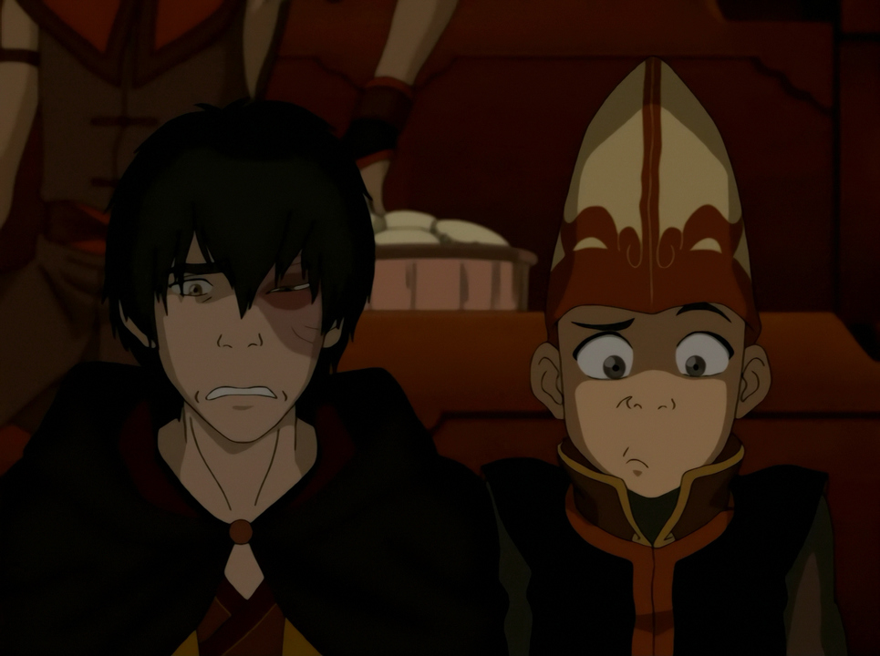

 
## *תקציר:*
- החבורה מחליטה להשתלט על בית הקיץ הישן של משפחתו של זוקו באמבר איילנד. זוקו טוען שזה המקום האחרון שבו אזולה ואוזאי יחשבו לחפש אותם. סוקה מגלה על קיומה של הצגה מקומית שמבוססת על עלילותיהם — כפי שהן נתפסות בעיני תושבי אומת האש. החבורה מסוקרנת ומחליטה בתור בילוי ללכת לצפות בהצגה.
- ההצגה, שמבוצעת על ידי להקת שחקנים מוגזמים ומגוחכים, מציגה את כל מה שקרה לאורך הסדרה, אך בצורה מעוותת, שטחית ולעיתים מביכה. אנג מגולם על ידי שחקנית, סוקה מדבר בעיקר על אוכל, קטארה בוכה כל הזמן, וטוף מתוארת כגבר גדול וחטוב. החבורה מגיבה בצחוק, גיחוך ולעיתים בתסכול כשהם רואים כיצד אחרים תופסים אותם.
- מעבר להומור, הפרק מעורר מתחים רגשיים ישנים: אנג מתמודד עם רגשותיו הלא פתורים כלפי קטארה, קטארה מתלבטת לגבי מה שהיא באמת מרגישה, זוקו מתעמת עם רגשות האשמה שלו על עברו, וטוף פשוט נהנית מהכאוס.
- הפרק מסתיים כשהשחקנים מציגים סוף "אלטרנטיבי" שבו האווטאר מפסיד, מה שמטלטל את אנג ואת שאר החבורה. למרות הכול, הם מבינים שההצגה אולי שטחית, אבל המאבק האמיתי עוד לפניהם – ואין מקום לספקות.

## *סיכום במשפט:* 
אווטאר – דברי הימים

## *ראוי לציון:* 
- איזה פרק אדיר ומקורי. אני חושב שזה פרק מבריק, שבעצם מנסה להשיג שני דברים: הראשון הוא לספק לנו הצופים סיכום של הדרך שעברנו, וגם לדמויות עצמן רטרוספקטיבה על המסע שלהן; השני הוא לספק חוויה קלילה, מצחיקה ומהנה רגע לפני הפינאלה האפית של הסדרה. לדעתי הפרק מצליח באופן מושלם בשתי המטרות.
- לדעתי הרעיון להציג את כל זה דרך מחזה שבו הדמויות צופות בעצמן הוא מקורי, מרענן ומצוין.
- בפרק יש הרבה הומור עצמי ומודעות עצמית. הסדרה מסתלבטת על האלמנטים היותר חלשים שבה, כמו הפרק של השבר הגדול או על זה שלא ברור מה עלה בגורלו של ג'ט.
- הפרק מדגיש את הפער בין איך שאנשים רואים את עצמם, איך שאחרים רואים אותם – ואיך ההיסטוריה (או הזיכרון הקולקטיבי) מציגה אותם. יש כאן ביקורת על האופן שבו היסטוריה נכתבת: היא לא תמיד נאמנה למציאות, ולעיתים מגמתית – משרתת נרטיב מסוים, בהתאם לערכים של ההיסטוריון או של המדינה (כמו אומת האש). מבחינת האינטרפרטציה של אומת האש, מעניין לראות איך אזולה מוצגת לא כלוחמת חזקה אלא כמישהי רגילה שמנצלת את הטיפשות של "טים אווטאר" שמוצגים כאן באופן מגוחך. לפעמים העיוותים בהיסטוריה הם רק כדי להפוך אותה לסיפור שיותר נוח לספר – לדוגמה הפאתוס שבו קטארה מדברת או ההפיכה של סוקה לפארודיה על איך שחשבתי שהוא יהיה בתחילת הסדרה. ולפעמים, העיוותים נובעים אך ורק מטעויות או מחוסר היכרות עם התמונה השלמה – הדוגמה הכי בולטת לכך היא הסצנה בין זוקו לרוח הכחולה, שמוצגים כדמויות נפרדות.
- מכל הדמויות דווקא זוקו מוצג באופן יחסית נאמן – זה הגיוני, כי הוא דמות מוכרת באומת האש. מספק לראות אותו מתקרנג'ג' על עצמו של פעם, אבל גם קצת כואב לראות איך הסדרה מתאמצת להביא את תחושות האשמה שלו אל הקצה רק כדי לפתור אותן באופן אדיר בפרקי הסיום. הפורקן הולך להיות מרגש מאוד.
- אהבתי את הרגע של זוקו וטוף – הוא מפצה קצת על היעדר פרק דואט שלהם, ומתחבר עם ההיכרות של טוף עם איירו.
- מאוד אהבתי איך ראיית כשפות האדמה של טוף מוצגת פשוטו כמשמעו כמו סונאר שפועל על צרחות. זה גם מתחבר לצד הקולני שלה וגם בדיחה טובה.
- העיסוק ביחסים של אנג וקטארה עולה שלב: כבר לא מדובר בסאבטקסט אלא בדיאלוג ישיר. אנחנו רואים את הילדותיות של אנג: הוא לא מבין שהיא מבולבלת, ודורש ממנה תשובה מיידית.

## *ה-MVP של הפרק:*  
פועל הבמה

## *עתידות:*
הסדרה הולכת להסתיים 🥲

## *דירוג הפרק:*
מגה זורד